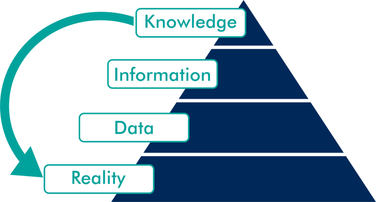

```{r setup, include=FALSE}
knitr::opts_chunk$set(echo = FALSE)
```

## Información 

### [Web](https://albarran.github.io/CursoBigData/)

### [Pedro Albarrán](https://sites.google.com/site/pedroalbarran)

* Despacho 19, Segundo (último) piso, Edificio 31
[(Facultad de Ciencias Económicas y Empresariales)](https://www.google.es/maps/@38.3835237,-0.5130815,17z)

* e-mail: [albarran@ua.es](mailto:albarran@ua.es)


* Tutorias: Martes de 15:30 a 17:30h y Jueves de 11 a 13h

    (solicitada previamente con al menos 24 horas de antelación, por UACloud o email)

* También podéis usar UACloud


### Alberto Pérez 

* os dará sus datos mañana

## Requisitos

-   Para el seguimiento habitual de las clases y para la realización de ejercicios, prácticas, etc. es **imprescindible** un ordenador con R y RStudio instalados.
    
   <!-- +   Instrucciones en anuncio UACloud  -->
    
-   Una alternativa [online](https://rstudio.cloud/)
    

-   Más adelante (dependiendo del tiempo e intereses de los alumnos) se considerará software adicional
    


## Objetivos

- Aprender a **extraer información** de los datos

<center>

{ width=40% }

</center>


- Usando técnicas computacionales y estadísticas

<center>

{ width=45% }

</center>


## “Datificación” de la vida diaria

{ width=70% }


## Importancia de los datos


-   Neelie Kroes (European Commissioner for Digital Agenda): “Data is the oil of the new economy, [...], the new oil for the digital era”


-   Mark Garrett, director financiero de Adobe [en WSJ](https://www.wsj.com/articles/stop-using-excel-finance-chiefs-tell-staffs-1511346601)
    

-   “No quiero que mi equipo de financieros pierda tiempo importando, exportando y manipulando datos, quiero que se centren en lo que los datos nos dicen”


- Si caben en tu ordenador, NO es "Big Data"
    


<!--    
-   Análisis de Datos y Business Intelligence


{ width=70% }


-->


## Aprendiendo a analizar datos

- Aprender técnicas de análisis de datos es una inversión de futuro  [en el trabajo](http://www.eleconomista.es/empleo/noticias/8592679/09/17/Cientifico-de-datos-la-profesion-mas-atractiva-del-siglo-XXI-por-el-auge-del-Big-Data.html)

- Pero esto NO es magia

{ width=70% }


## Aprendiendo a analizar datos (y 2)

- Y requiere saber lo que sé hace


- [Dan Ariely](https://es.wikipedia.org/wiki/Dan_Ariely) sobre Big Data: [aquí](https://twitter.com/observer1896/status/725596722257367040)


## Contenido

<center>    


</center>   

- Enfoque práctico: aprenderemos técnicas y cómo aplicarlas para posteriormente usar la información en crear valor


- Tres Componentes: 

    1. Programación
    
    2. Obtención y Procesamiento de Datos
    
    3. Modelos de Aprendizaje Estadístico


<!--
-   Podéis consultar la ficha de la asignatura, [para Ecoaquí (Economía)](`r params$address`)
-->

-   Podéis consultar la ficha de la asignatura, [para **Economía** ](https://cvnet.cpd.ua.es/Guia-Docente/GuiaDocente/Index?wcodasi=35047&scaca=2020-21) o [para **ADE**](https://cvnet.cpd.ua.es/Guia-Docente/GuiaDocente/Index?wcodasi=22036&scaca=2020-21)


## Evaluación 

### Continua:

* Ejercicios teórico-prácticos durante el periodo de clases (30%)

    - preguntas y pequeñas prácticas en clase
    
    - ejercicios (más largos) a entregar

* Trabajo empírico final (45%)

* Examen final (25%)

* Requisito: asistir al menos a un 80% de las clases.


### No Continua:

* Trabajo empírico final (50%)

* Examen final (50%)


## Ejemplos de Proyectos

* Ejemplos de la importancia del análisis de datos en economía ([aquí](https://elpais.com/elpais/2017/03/24/ciencia/1490358953_071638.html#?ref=rss&format=simple&link=link) y [aquí](https://elpais.com/economia/2017/04/30/actualidad/1493562507_239457.html)) y en la [empresa](https://www.thoughtspot.com/data-chief/5-ways-machine-learning-can-make-your-bi-better) 

*   Construir un modelo predictivo o de clasificación para conocer las ventas de cada producto en una tienda concreta de "Big Mart".

* Black Friday en “ABC Private Limited” : un modelo para clasificar compras de gran volumen del cliente y crear una oferta personalizada.

* Concesión de préstamos: automatizar el proceso de elegibilidad del préstamo a partir de datos del cliente  (segmentación de clientes)

* Servicio de bicicletas de “Capital BikeShare” : dónde van sus usuarios, cuándo viajan, qué paradas son las más populares.

## Ejemplos de Proyectos Finales (y 2)

*  Modelo predictivo de la renta con información del Censo de EE.UU. sobre varias características demográficas (detección de fraude)

* Predicción del precio de las casas con información sobre el parque de viviendas y las circunstancias económicas de cada área.

* Determinantes de las propinas de taxis en NY en función del lugar de origen, destino, etc.

* Determinantes de la satisfación de los usuarios de Airbnb

* Predicción de Respuesta del Cliente en caso de ser contactados

<!--

* Delitos. Tenemos información de los crímenes cometidos en Chicago desde 2001. Se puede utilizar para predecir el tipo de crimen, incidencia de crímenes por tipo y zona, etc.


    Precio de las acciones. Usando información sobre fundamentales de las acciones, se puede predecir el valor o determinar (clasificar) si están sobrevaloradas o infravaloradas.

    Stock pairs es un estrategia de “trading” desarrollada por “Morgan Stanley” en los años 1980 (ver aquí). Si dos precios de acciones o índices bursátiles como Dow Jones y S&P 500 están históricamente correlados, la ratio de precios tiene un valor estable. Si la ratio de precio se desvía significativamente de ese valor indica que una está infravalorada y deberá subir. El objetivo es desarrollar un modelo que prediga una subida en función de valores pasados de la ratio.
-->


## Programación y pensamiento algorítmico

* Pensamiento algorítmico son un conjunto de habilidades que se relacionan con con la construcción y comprensión de [algoritmos](https://es.wikipedia.org/wiki/Algoritmo)

* Estas capacidades son un componente necesario pero no suficiente del "pensamiento computacional" y de la ciencia de datos.

## Capacidades para el pensamiento algorítmico
 
1. Capacidad de analizar un problema dado
2. Capacidad de especificar con precisión un problema
3. Capacidad de encontrar las acciones básicas que son adecuadas para resolver un problema
4. Capacidad de construir un algoritmo correcto para un problema dado utilizando acciones básicas
5. Capacidad de pensar en todos los posibles casos especiales y normales de un problema
6. Capacidad de mejorar la eficacia de un algoritmo


## Empezando el curso con R ...

* Además de durante las clase, vamos a aprender los fundamentos de R siguiendo este [curso interactivo online](https://www.datacamp.com/community/open-courses/introduccion-a-r)

* Por favor, inscribiros en la plataforma usando vuestras cuentas de @alu.ua.es

* Deberéis haber terminado el curso después de la clase de prácticas de la próxima semana.


## Recursos de Ayuda sobre R

* Además de la ayuda incorporada en R y RStudio, existen muchos recursos "online" con información sobre R, en general en inglés

    + un gran recurso es la plataforma Stackoverflow

* Usar con CUIDADO: existen muchas (demasiadas) formas de hacer las cosas en R y hay que ENTENDER qué se pregunta y qué solución se ofrece

* Un recurso útil son las "chuletas" disponibles [aquí](https://rstudio.com/resources/cheatsheets/)

