```{r setup, include=FALSE}
knitr::opts_chunk$set(echo = FALSE)
library(tidyverse)
#setwd("~/Archivos/teaching/MAD/0Slides/stat1291")
library(rmarkdown)
#render("filename.Rmd")     
#browseURL("filename.html")
#[//]: # (Comment: rintro.r)
```

## Introducción

* La visualización de datos es una forma de obtener información valiosa de nuestros datos, que no se vería en los datos en bruto (en una hoja de cálculo). Los objetivos básicos de la visualización son la presentación y el análisis exploratorio de datos.

* En el nivel más básico, los gráficos proporcionan una buena idea de cómo las variables cuantitativas se comparan en términos de su centro (donde los valores tienden a estar localizados) y su dispersión (cómo varían alrededor del centro). También ayudan a identificar patrones y valores extremos en nuestros datos.

* IMPORTANTE: los deben ser creados para hacer obvio a la audiencia los resultados y las ideas que queremos transmitir. Debemos ponderar nuestro deseo de destacar tantas relaciones y hallazgos interesantes como sea posible con no incluir demasiadas para abrumar a la audiencia.

* Usaremos el paquete `ggplot2`, que proporciona una manera de personalización y está enraizada en la teoría de visualización de datos conocida como *Gramática de Gráficos* (Wilkinson, 2005). Este paquete está incluido en el meta-paquete `tidyverse` que usaremos durante todo el curso.


### ¿Por qué `ggplot2`?

Comparado con la biblioteca base de gráficos, `ggplot2`

  * necesita especificar más opciones para los gráficos simples 

  * necesita especificar menos opciones para gráficos complejos o personalizados

<!--
  * no tiene métodos (los datos siempre deben estar en un archivo data.frame) 
-->

  * utiliza un sistema diferente para agregar elementos de trama

Cargamos unos datos para realizar un histograma
```{r, echo=F, eval=F}
# Fuente original de los datos
housing <- read.csv("http://www.science.smith.edu/~jcrouser/SDS192/landdata-states.csv")
```

```{r, echo=TRUE, eval=T}
housing <- read.csv("data/landdata-states.csv")
```

con la biblioteca base sería
```{r, echo=TRUE, eval=F}
hist(housing$Home.Value)
```

y con `ggplot2`
```{r, echo=TRUE, eval=F, warning=FALSE, message=FALSE}
library(tidyverse)      # incluye  library(ggplot2)
ggplot(housing, aes(x = Home.Value)) +
  geom_histogram()
```

Sin embargo, veremos que en gráficos ligeramente más complejos y profesionales `ggplot2` nos ofrece más facilidades y sencillez de composición.
<!--
Sin embargo, en un gráfico ligeramente más complejo con la biblioteca base tenemos
```{r, echo=TRUE, eval=TRUE}
plot(Home.Value ~ Date,
     data=subset(housing, State == "MA"))
points(Home.Value ~ Date, col="red",
       data=subset(housing, State == "TX"))
legend(1975, 400000,
       c("MA", "TX"), title="State",
       col=c("black", "red"),
       pch=c(1, 1))
```
mientras que con `ggplot2`
```{r, echo=TRUE, eval=TRUE, warning=FALSE, message=FALSE}
ggplot(subset(housing, State %in% c("MA", "TX")),
       aes(x=Date,
           y=Home.Value,
           color=State))+
  geom_point()
```

Las principales ventajas de `ggplot2` son:

  * especificación del gráfico a un alto nivel de abstracción
  
  * muy flexible
  
  * sistema de temas simple para una apariencia pulida
  
  * sistema gráfico maduro y completo
  
  * muchos usuarios
-->

Con `ggplot2' se pueden repoducir gráficos de calidad profesional como este publicado en "The Economist"

<center>
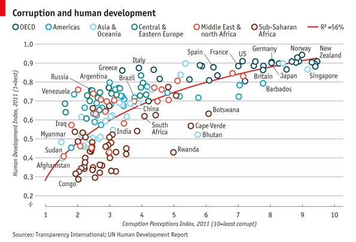
</center>


Dicho esto, hay algunas cosas que no se puede (o no se debería) hacer con `ggplot2`:

  * Gráficos tridimensionales (ver el paquete `rgl`)
  
<!--  * Gráficos de teoría de grafos (diseño de nodos / bordes, ver el paquete `igraph`) -->
  
  * Gráficos interactivos (ver el paquete `ggvis`)
  

## Una taxonomia para gráficos de datos

* ¿Qué hace efectivo a un gráfico? El texto clásico "The Visual Display of Quantitative Information" (1983) de Edward Tufte responde a esta pregunta.

<!--
* Primero se debe [elegir un tipo de gráfico.](http://extremepresentation.typepad.com/blog/files/choosing_a_good_chart.pdf) Después debemos pensar de manera sistemática sobre los diferentes componentes del gráfico, la información que aportan y cómo se pueden mejorar.

[//]: # (www.stat.pitt.edu/sungkyu/course/pds/material/DataVis-Supp.pdf)

[//]: # (Nathan Yau, http://flowingdata.com/)
-->

* Los elementos básicos de un gráfico de datos son:

  1. **Señales visuales**:  posición, longitud, área, etc.
  2. **Sistema de coordenadas** (¿cómo se organizan los puntos de datos?): cartesiano, polar, geográfico.
  3. **Escala** (¿cómo se traduce la distancia en algo con significado?): numérica lineal, numérica logarítmica, categórica, de tiempo.
  4. **Contexto** (¿en relación con qué?): títulos, leyenda, etiquetas de ejes, puntos o líneas de referencia
  5. Otros


<center>
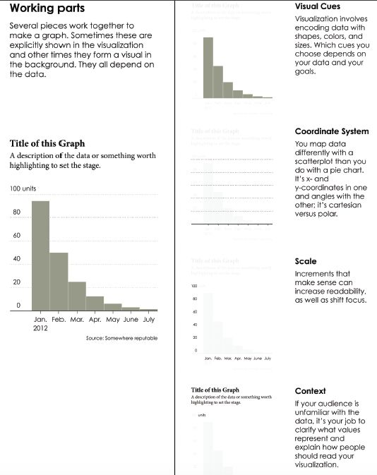{width=55%}
</center>

<!-- ### 1. Señales visuales -->
### Señales visuales

<center>
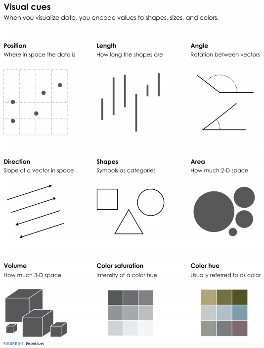{width=50%}
</center>


#### 1. Posición (numérica): ¿dónde se encuentra en relación a otras cosas?

<center>
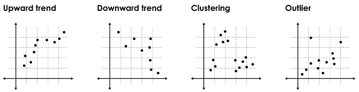{width=50%}
</center>

#### 2. Longitud (numérica): ¿cómo es de grande (en una dimensión)?

<center>
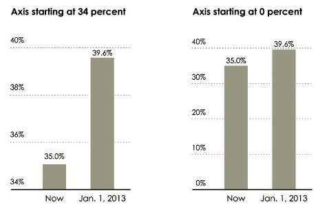{width=50%}
</center>

#### 3. Ángulo (numérico): ¿cómo de ancho? ¿paralelo a que otra cosas?

<center>
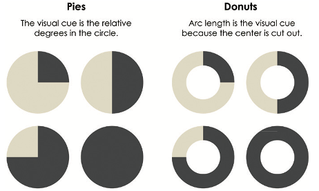{width=50%}
</center>

#### 4. Dirección (numérica): ¿en qué pendiente? En una serie temporal, ¿subiendo o bajando?
<!--
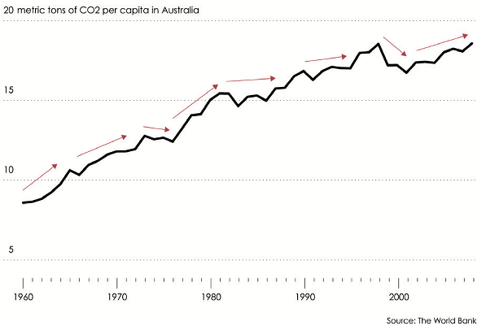
-->

#### 5. Forma (categórica): ¿a qué grupo pertenece?

<center>
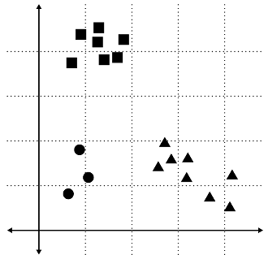{width=35%}
</center>

#### 6. Área (numérica): ¿cómo de grande (en dos dimensiones)?
#### 7. Volumen (numérica): ¿cómo de grande (en tres dimensiones)?
<!--
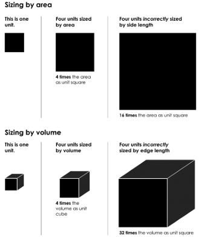
-->

#### 8. Sombra/matiz y color (saturación de color y tonalidad de color): ¿hasta qué punto? ¿Cómo de intenso? Cuidado con la [discromatopsia](https://es.wikipedia.org/wiki/Discromatopsia) (especialmente, ceguera a rojo y verde).
<!--
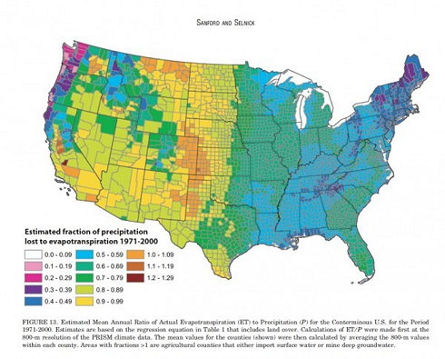

Los colores pueden representar tanto variables cuantitativas como categóricas, usando las siguientes pautas

  * **Secuencial**: El orden de los datos tiene sólo una dirección.

  * **Divergente**: El orden de los datos tiene dos direcciones. Ej.: en elecciones, rango desde rojo hasta azul. 

  * **Cualitativo**: No hay orden de los datos (color solo diferencia categorías)

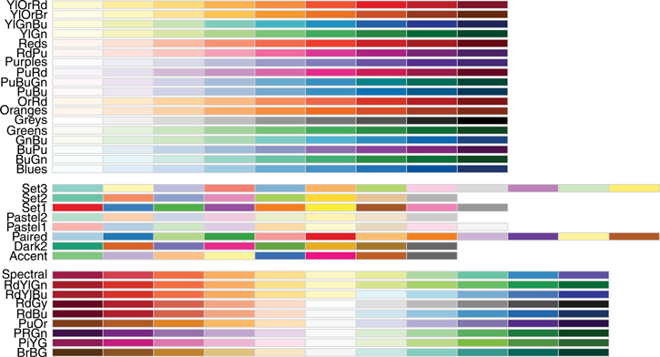
-->

####  ¿Qué señales visuales son más efectivas?

<center>
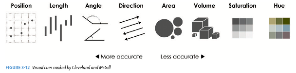
</center>

El ser humano percibe mejor diferencias en posición que en ángulo: por eso, mucha gente prefiere gráficos de barras a gráficos de tarta. Nuestra relativamente pobre percepción de diferencias en colores explica que se utilicen poco los mapas de calor.

[//]: # (pic/taxonomy01.F.2.png)

<!--
### 2. Sistema de coordenadas
¿Cómo se organizan los puntos de datos? Existen muchos sistemas de coordenadas posibles, pero los tres más comunes son:

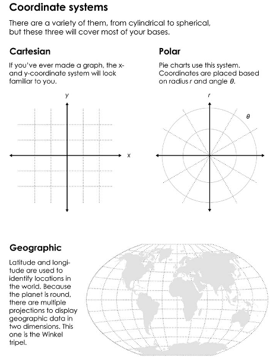

Una elección apropiada para un sistema de coordenadas es crítica para representar con exactitud los datos, ya que, por ejemplo, la visualización de datos espaciales como rutas aéreas en un plano cartesiano plano puede dar lugar a graves distorsiones de la realidad


### 3. Escala

Las escalas traducen los valores en señales visuales. La elección de la escala es a menudo crucial. La pregunta central es: ¿cómo la distancia en el gráfico de datos se traduce en diferencias significativas en cantidad? Cada eje de coordenadas puede tener su propia escala, para lo cual tenemos tres opciones diferentes:

  1. **Numérica**: Una cantidad numérica utiliza comúnmente en una escala lineal, logarítmica o de porcentaje.

  2. **Categorica**: Una variable categórica puede no tener orden (por ejemplo, Coche, Bús, o Trend), o puede ser ordinal (por ejemplo, nunca, ex, o fumador actual).

  3. **Tiempo**: El tiempo es una cantidad numérica que tiene algunas propiedades especiales. En primer lugar, debido al calendario, puede ser demarcado por una serie de unidades diferentes (por ejemplo, año, mes, día, etc.). En segundo lugar, puede considerarse periódicamente como una escala envolvente.

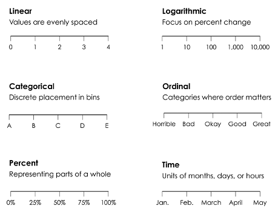

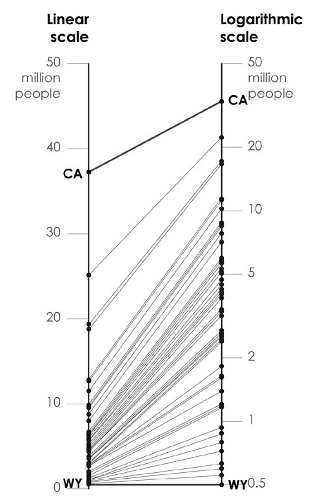

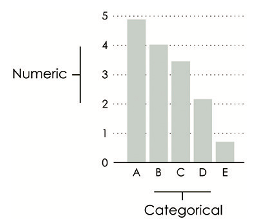

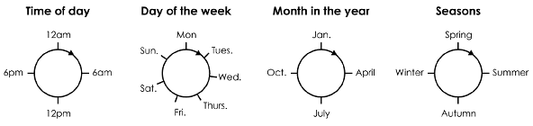

A veces, se necesita probar diferentes transformaciones para elegir la escala más efectiva.

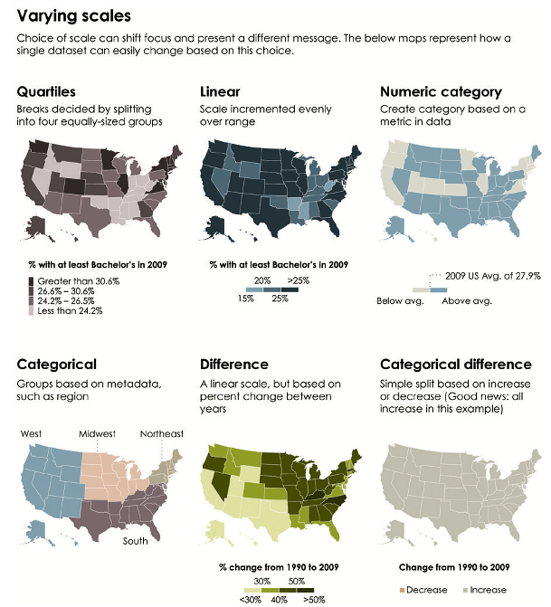


### 4. Contexto

El propósito de los gráficos de datos es ayudar a la audiencia a hacer comparaciones significativas. El contexto se puede agregar en forma de

  * títulos o subtítulos
  * etiquetas del eje
  * puntos o líneas de referencia

Aunque debemos evitar llenar el gráfico de excesivas anotaciones, se debe ofrecer un contexto apropiado.

### 5. Otros

Un desafío fundamental de la creación de gráficos de datos es condensar información multivariante en una imagen de dos dimensiones (las imágenes tridimensionales son ocasionalmente útiles, pero en general confusas). Hay tres formas principales de incorporar más variables en un gráfico de dos dimensiones:

    * Facetas o múltiples pequeños: un sólo gráfico puede estar compuesto de varios (pequeños) gráficos del mismo tipo en los cuales una variable discreta cambia en cada sub-imagen.

    * Capas: una capa por encima del gráfico existente puede ayuda a ofrecer un contexto o comparación, pero existen límites a cuantas capas puede analizar un ser humana.

    * Animaciones: si el tiempo es la variable adicional, una animación puede informar sobre cambios en la variable. Pero no funciona en documentos impresos y no permite ver todos los datos de una vez.
      
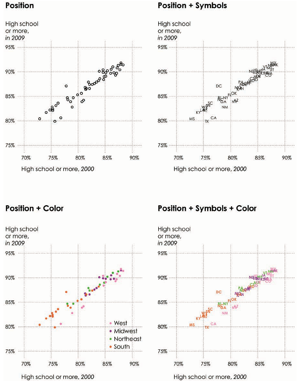

### Poniéndolo todo junto

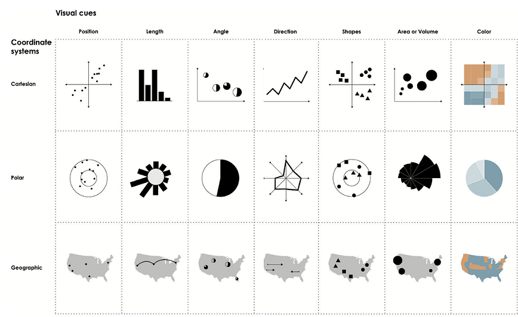
-->

## La "Gramática de Gráficos"

* El paquete `ggplot2` se basa en la denominada "Gramática de Gráficos", un marco desarrollado por Wilkinson (2005) para especificar los componentes de un **gráfico estadístico** de manera similar a la forma en que se construyen las frases en cualquier idioma mediante el uso de una gramática lingüística (nombres, verbos, temas, objetos, etc.).

* La idea básica es especificar de forma *independiente* bloques de construcción del gráfico y combinarlos para crear prácticamente cualquier tipo de visualización gráfica que se desee.

* Los cuatro elementos de gráficos discutidos anteriores (señales visuales, sistema de coordenadas, escala y contexto) también se encuentran en la gramática de los gráficos, aunque con diferentes términos. Por lo tanto, es esencial para entender la taxonomía de los gráficos con el fin de utilizar `ggplot2`.

### Bloques de construcción de un gráfico

* Datos

    * `data`

* Objeto geométrico (lo que dibujamos en el gráfico: líneas, puntos, barras, etc.) 

    * `geom_*()`

* Atributos estéticos (del objeto geométrico, como posición, color, forma, tamaño) que transmiten información de una variable
  
    * `aes()`

* Escalas (rango of valores, colores, etc.)
  
    * `scale_*()`

* Sistema de Coordenadas
  
* Facetas (pequeños múltiples)

    * `facet_wrap()`, `facet_grid()`
  
* Transformaciones estadísticas

* Ajustes de posición


## Ejemplo básico con `ggplot2::mpg`

La base de datos `mpg` contiene observaciones recopiladas por la Agencia de Protección Ambiental de EE.UU. para 38 modelos de automóviles.

```{r, echo=TRUE, eval=FALSE}
class(mpg)
head(mpg)
```

Vemos que `mpg` es un objeto de tipo "tibble"", que es un "data.frame" simplificado y adaptado para manejar mejor datos grandes. Entre las variables en `mpg` se encuentran:

  * `displ`, el tamaño del motor de un coche, en litros.

  * `hwy`, la eficiencia de un coche en carretera, en millas por galón (mpg). Un coche con bajo eficiencia consume más combustible que uno con alta eficiencia de combustible cuando recorren la misma distancia.

[Más información sobre `mpg`, ejecutando `?mpg`.]


### Creando un "ggplot"
Con este simple código ponemos `displ` en el eje horizontal ('x') y `hwy` en el eje vertical ('y'):

```{r, echo=TRUE, eval=FALSE}
ggplot(data = mpg, aes(x = displ, y = hwy)) + 
  geom_point()
```
o este código
```{r, echo=TRUE, eval=FALSE}
ggplot(data = mpg) + 
  geom_point(mapping = aes(x = displ, y = hwy))
```


Con `ggplot2`, el gráfico comienza una con la función `ggplot()`, que crea un sistema de coordenadas al que se pueden agregar capas. 
a. El primer argumento de `ggplot()` es el conjunto de datos que se usará en el gráfico. Así, `ggplot (data = mpg)` crea un gráfico vacío.

  Para completar el gráfico se agregan una o más capas a `ggplot()`. 

b. La función `geom_point()` agrega un objeto geométrico del tipo puntos al gráfico. Así creamos un gráfico de dispersión. 

  `ggplot2` viene con muchas funciones `geom_*()`, cada una de las cuales agrega un tipo diferente de capa.

c. Cada función `geom_*()` en `ggplot2` tiene un argumento `mapping` (correspondencia). Esto define **cómo las variables del conjunto de datos son asignadas a propiedades visuales**. El argumento `mapping` siempre está emparejado con `aes()`, y los argumentos 'x' e 'y' de `aes()` especifican qué variables asignar a los ejes respectivos. 

  `ggplot2` busca la variable asignada en el argumento `data`, en este caso, mpg.


NOTA: aunque ambos códigos anteriores producen el mismo código, por ahora, debéis notar que en el primero se define tantos los datos como la estética de posición para *todas* las capas que siguen, mientras que en el segundo los datos son para todas las capas, pero solo se define la estética de posición `x` e `y` para el objeto geométrico de puntos.


En relación con los cuatro elementos de gráficos de datos:

1. `ggplot()` (por defecto) establece el sistema de coordenadas como el sistema de coordenadas cartesianas;

2. La señal visual usada es la posición, definida por `mapping = aes (x = ..., y = ...)`, emparejada con el uso de `geom_point()`;
<center>
{width=55%}
</center>

3. La escala se elige automáticamente de la forma más apropiada posible;

4. El contexto está (mínimamente) dada por las etiquetas del eje.


## Objetos geométricos y Elementos Estéticos

### Objetos geométricos

Los objetos geométricos o `geoms` son las marcas que ponemos en un gráfico. Por ejemplo:

  * puntos (`geom_point`, para diagramas de dispersión, diagramas de puntos, etc.)
  * líneas (`geom_line`, para series de tiempo, líneas de tendencia, etc.)
  * diagrama de caja (`geom_boxplot`)
  
  ... ¡y muchos más!

Un gráfico debe tener al menos un `geom`, pero no hay un límite superior. Se puede agregar un `geom` a un gráfico usando el operador +.

Puede obtener una lista de objetos geométricos disponibles usando el código a continuación:
```{r, echo=TRUE, eval=FALSE}
help.search ("geom_", package = "ggplot2")
```

o simplemente escribien `geom_<tab>` en RStudio para ver una lista de funciones que comienzan con `geom_`.

### Elementos Estéticos (`aes`)

In `ggplot2`, los elementos estéticos significan "algo que se puede ver". Cada elemento estético es un asociación ("mapping") entre una señal visual y una **variable**. Por ejemmplo:

  * posición (p.e., en los ejes x e y)
  * color (color "exterior")
  * relleno (color "interior")
  * forma (de los puntos)
  * tipo de línea
  * tamaño

Es decir, hablamos de señales visuales
<center>
{width=25%}
</center>


Cada tipo de `geom` acepta solo un subconjunto de todos los elementos estéticos. Se pueden consultar las páginas de ayuda de cada `geom` para ver qué asignaciones acepta. Las asignaciones estéticas se establecen con la función `aes()`.

### Puntos (diagráma de dispersión)

Ahora que sabemos acerca de los objetos geométricos y la asignación estética, podemos hacer un `ggplot`. Para hacer un gráfico que represente una variable 'y' frente a otra 'x' (que puede ser el tiempo, identificador de individuo u obseración, etc) usamos `geom_point`. 

Para `geom_point` sólo dos asignaciones ("mapping") estéticos son requisitos obligatorios, para 'x' e 'y', todos los demás son opcionales.

``` {r, echo=TRUE, eval=FALSE}
housing <- read.csv("data/landdata-states.csv")
glimpse(housing)

hp2001Q1 <- subset(housing, Date == 2001.25) 
#hp2001Q1b <- housing[housing$Date == 2001.25,] 
  
ggplot(hp2001Q1,
         aes(y = Structure.Cost, x = Land.Value)) +
    geom_point()
```

### Gráficos como objetos

La salida de la función `ggplot()` es un objeto de R. Puesto que podemos modificar el gráfico que hemos creado antes, resulta útil guardar el gráfico como un objeto.

```{r, echo=TRUE, eval=FALSE}
base_plot <- ggplot(hp2001Q1, 
                    aes(x = Land.Value, y = Structure.Cost))
```

Podemos ver que `base_plot` es un objeto de tipo lista (con nueve elementos que R sabe tratar internamente). Para mostrar realmente el gráfico, simplemente lo imprimimos. Por ahora este gráfico no muestra nada porque aún no hemos agregado ningún `geom`. Aun así, el mapa estético está definido, y cualquier `geom` posterior que se agregue usará esa trama.

```{r, echo=TRUE, eval=FALSE}
str(base_plot)
base_plot
```


### Líneas 

Un gráfico construido con `ggplot` puede tener más de un `geom`. En ese caso, las asignaciones establecidas en la llamada `ggplot ()` son valores predeterminados del gráfico, a los que pueden agregarse otro o ser cambiados. 

Por ejemplo, podríamos conectar todos los puntos usando `geom_line()`. Tened en cuenta que ahora vemos los puntos **y** las líneas.


```{r, echo=TRUE, eval=FALSE}
base_plot +
  geom_point() + 
  geom_line()
```

Pero ¿tiene sentido conectar las observaciones con en este caso? Las líneas no nos ayudan a comprender mejor las conexiones entre las observaciones, no representan nada en realidad.

Nuestro gráfico también podría usar una línea de regresión:

```{r, echo=TRUE,eval=FALSE}
  hp2001Q1$pred.SC <- 
    predict(lm(Structure.Cost ~ Land.Value, data = hp2001Q1))
 
  base_plot +
    geom_point() + 
    geom_line(aes(y = pred.SC))
```

Notad que NO hace repetir la estetica de posición `x` para `geom_line` porque ya está definida en `base_plot`: si no cambia, se toma la previa. Aunque obviamente, se podría escribir de nuevo explícitamente.

Incluyendo un poco de color (una señal visual adicional)...

```{r, echo=TRUE,eval=FALSE}
  base_plot +
    geom_point(aes(color = Home.Value)) + 
    geom_line(aes(y = pred.SC))
```

El objetivo de introducir color no ha sido "embellecer" el gráfico. Lo que hemos conseguido es representar la información de una variable adicional en este gráfico. En lugar de con una señal visual de posición, con una señal de color. Esta representación adicional puede ser relevante o no, puede añadir información útil o simplemente saturar el gráfico.

### "Smoothers"

No todos los objetos geométricos son formas simples: el `geom_smooth` incluye una línea y una área.

```{r, echo=TRUE,eval=FALSE}
  base_plot +
    geom_point(aes(color = Home.Value)) +
    geom_smooth()
```


Por defecto los `smoothers` utilizan un método de suavizado no lineal (consultar la ayuda para ver las opciones) y los errores estándar del ajuste no-lineal a los datos (el área). Si queremos un método más conocido (lineal) sin errores estándar: 
```{r, echo=TRUE,eval=FALSE}
  base_plot +
    geom_point(aes(color = Home.Value)) +
    geom_smooth(method = lm, se = FALSE)
```


### Texto (puntos "etiqueta")

Cada `geom` acepta un conjunto particular de asignaciones, por ejemplo `geom_text()` acepta un mapping de etiquetas ("labels").

``` {r, echo=T,eval=FALSE}
  base_plot +
    geom_text(aes(label=State), size = 3)
```


Si queremos el punto **y** la etiqueta de texto debemos usar dos `geoms`. Además necesitamos una biblioteca adicional.

``` {r, echo=F, eval=FALSE}
  install.packages("ggrepel") 
  library("ggrepel")
  base_plot + 
    geom_point() + 
    geom_text_repel(aes(label=State), size = 3)
```

``` {r, echo=TRUE, eval=FALSE}
  #install.packages("ggrepel") 
  library("ggrepel")
  base_plot + 
    geom_point() + 
    geom_text_repel(aes(label=State))
```

Como ya se anticipado antes, cada objeto geométrico puede tener características propias. Esto puede puede ser útil en distintos contextos: usar datos distintos para diferentes objetos, utilizar diferentes estéticas en distintos objetos, etc.. Por ejemplo, podemos utilizar solo un subconjunto de los datos para el objeto geométrico de texto, mientras que utilizamos todos para el resto...


``` {r, echo=TRUE, eval=FALSE}
base_plot + 
  geom_point() + 
  geom_text_repel(
    data=subset(hp2001Q1,State %in% c("NY","NJ","KY")),
    mapping=aes(label=State), size = 3)

```

``` {r, echo=T, eval=FALSE}
base_plot + 
  geom_point() + 
  geom_text_repel(
    data=subset(hp2001Q1, State=="NY" | State=="NJ"| State=="KY"),
    mapping=aes(label=State))

```


### Asociación ("mapping") estética y Asignación de opción fija.

A las variables se asocia una estética con la función `aes ()`, mientras que una opción estética fija se establece fuera de la llamada `aes()`. Esto a veces conduce a confusión, como en este ejemplo:

```  {r, echo=TRUE, eval=FALSE}
  base_plot +
    geom_point(aes(size = 2), # ¡incorrecto! 2 NO es una variable
               color="red")   # ¡bien! -- todos los puntos son rojos
```

#### Asociación de Variables a Otros Elementos Estéticos

Otros elementos estéticos se asocian a variables de manera similas a como lo hemos visto antes para 'x' e 'y'

```  {r, echo=TRUE, eval=FALSE}
  base_plot +
    geom_point(aes(color=Home.Value, shape = region))
```

Mientras que
```  {r, echo=TRUE, eval=FALSE}
base_plot +
  geom_point(shape = "cross", 
             color="red")   
```
o
```  {r, echo=TRUE, eval=FALSE}
base_plot +
  geom_point(aes(shape = region, 
                 color=Home.Value))   
```


¿Por qué la diferencia entre las dos últimas estéticas? Los factores atacan de nuevo... (Nota: aunque `region` sea carácter, recordad que R intenta siempre aproximar al tipo de dato más cercano que tenga sentido.)

De nuevo, cuidado con saturar el gráfico tanto de estéticas fijas innecesarias como de información de variables innecesarias. En el siguiente gráfico, representamos cuatro variables, pero ¿aportan alguna información las dos últimas estéticas?
```  {r, echo=TRUE, eval=FALSE}
base_plot +
  geom_point(aes(size = Home.Price.Index, 
                 color=Home.Value))   
```


## Transformaciones Estadísticas

### Transformaciones Estadísticas

Algunos tipos de gráficos (como los diagramas de dispersión) no requieren transformaciones: cada punto se grafica en coordenadas x e y iguales al valor original. Aunque R nos permite aplicar funciones transformaciones a las variables al ser asociadas:
```{r, echo=TRUE, eval=FALSE}
  ggplot(hp2001Q1, 
      aes(x = log(Land.Value), y = Structure.Cost)) + 
    geom_point()
```


Otros gráficos, como diagramas de cajas, histogramas, líneas de predicción, etc. requieren transformaciones estadísticas. No se representan las variables originales, sino unas transformaciones de ellos:

- para "smoother", los datos deben transformarse: obtener coeficientes de regresión y obtener en valores predichos.

- para un diagrama de caja los valores y deben transformarse para calcular la mediana y 1.5*IQR (rango intercuartílico)

```{r, echo=T, eval=F}
ggplot(hp2001Q1, aes(y = Home.Value/1000)) + 
  geom_boxplot()
```
 

Cada `geom` tiene una estadística predeterminada, pero estos pueden cambiarse. Por ejemplo, la estadística predeterminada para `geom_bar` es `stat_count`:

```{r, echo=TRUE, eval=FALSE}
  args(geom_histogram)
  args(stat_bin)
```


### Estableciendo los argumentos de la transformación estadística

Los argumentos a las funciones `stat_` pueden pasarse a través de las funciones` geom_`. Esto puede ser un poco molesto porque para cambiarlo primero debe determinar qué estadística usa el geom, luego determinar los argumentos para esa estadística.

Por ejemplo, aquí está el histograma predeterminado de Home.Value:

```{r, echo=T, eval=F}
  p2 <- ggplot(housing, aes(x = Home.Value))
  p2 + geom_histogram()
```

El número de grupos ("bins") por defecto parece razonable, pero podemos cambiarlo pasando el argumento `binwidth` a la función `stat_bin`:

```{r, echo=T, eval=F}
  p2 + geom_histogram(stat = "bin", binwidth=4000)
```

Este `geom` está orientado a variables discretas. Divide la posición (estética) `x` en `bins` (grupos) para los que calcula el número de casos (conteo) que se representan en la posición `y`. Alternativamente se pueden representar en `y` la frecuencia relativa de casos:
```{r, echo=T, eval=F}
p2 + geom_histogram(stat = "density", binwidth = 60000)
```

### Más sobre transformaciones estadísticas

A veces, la transformación estadística predeterminada no es lo que necesitamos. Este es a menudo el caso con datos tratado previamente, como los obtenidos con la función `aggregate` para resumir una base de datos:

```{r, echo=T, eval=F}
  housing.sum <- aggregate(housing["Home.Value"], housing["State"], FUN=mean)
  rbind(head(housing.sum), tail(housing.sum))
```
Utilizamos `geom_bar`, que es similar a `geom_histogram`, pero con variables discretas:
```{r, echo=T, eval=F}
  ggplot(housing.sum, aes(x=State, y=Home.Value)) + 
    geom_bar()
```


```{r, echo=T, eval=F}
ggplot(housing.sum, aes(x=State, y=Home.Value)) + 
  geom_bar()
#Error: stat_count() must not be used with a y aesthetic.
```

¿Cuál es el problema con el gráfico anterior? Básicamente tomamos datos agrupados y resumidos y pedimos a `ggplot` que los agrupes (en "bins") para la posición `x` y los resuma nuevamente (`geom_bar` tiene un valor predeterminado para `stat = stat_count`). Obviamente, esto no funcionará. Podemos arreglarlo diciendo a `geom_bar` que use una función de transformación estadística diferente:

```{r, echo=T, eval=F}
  ggplot(housing.sum, aes(x=State, y=Home.Value)) + 
    geom_bar(stat="identity")
```
Nota: se pueden representar columnas horizontales con `geom_col`.


## Escalas

### Escalas: control de la asociación estética

La asociación estética (es decir, con `aes()`) solo dice que una variable debe ser asignada a una estética. No dice *cómo* eso debería suceder. Por ejemplo, cuando se asocia una variable con la *forma* con `aes(shape=x)` no se dice *qué* formas se deben usar. Del mismo modo, `aes(color=z)` no dice *qué* colores deben usarse. Describir qué colores/formas/tamaños etc. usar se realiza modificando la *escala* correspondiente. En las escalas `ggplot2` se incluyen

- posición
- color y relleno
- tamaño
- forma
- tipo de línea

Las escalas se modifican con una serie de funciones utilizando un esquema de nombre `scale_<estética>_<tipo>`. Escribir `scale_<tab>` para ver una lista de funciones de modificación de escala.

### Argumentos habituales para la escala

Los siguientes argumentos son comunes a la mayoría de las escalas en ggplot2:

* name: el primer argumento da el título de eje o leyenda
* limits: el mínimo y el máximo de la escala
* breaks: los puntos a lo largo de la escala donde deberían aparecer las etiquetas
* labels: las etiquetas que aparecen en cada "break"

Funciones específicas de escala  pueden tener argumentos adicionales; por ejemplo, la función `scale_color_continuous` tiene argumentos `low` y `high` para configurar los colores en el extremo alto y bajo de la escala.

### Ejemplos de modificación de escala

Comenzamos por construir un diagrama de puntos que muestre la distribución de los valores de las casas por fecha y estado.


```{r, echo=F, eval=F}
p3 <- ggplot(housing,
               aes(y = State,
                   x = Home.Price.Index)) + 
           geom_point(aes(color = Date),
                         alpha = 0.5,
                         size = 1.5,
                         position = position_jitter(width = 0.25, height = 0))
p3
```

```{r, echo=T, eval=F}
p3 <- ggplot(housing,
               aes(y = State,
                   x = Home.Price.Index)) + 
           geom_point(aes(color = Date))
p3
```

[//]: # (Comment: 
        theme(legend.position="top",
                axis.text=element_text(size = 6)) )
                
Cambiamos las etiquetas para el eje vertical

```{r, echo=T, eval=F}
p3 <- p3 + scale_y_discrete(name="Abrev. Estado")
```
Modificamos los "breaks" y las etiquetas para el eje 'x' y la escala de colores

```{r, echo=T, eval=F}
p3 <- p3 + scale_color_continuous(breaks = c(1975.25, 1994.25, 2013.25),
                                    labels = c(1971, 1994, 2013))
p3
```

A continuación, cambiamos los valores bajo y alto a azul y rojo:

```{r, echo=T, eval=F}
p3 <- p3 +
        scale_color_continuous(breaks = c(1975.25, 1994.25, 2013.25),
                              labels = c(1971, 1994, 2013),
                              low = "blue", high = "red")
p3
```

### Usando diferentes escalas de color

En `ggplot2` tenemos una amplia variedad de escalas de color; aquí, por ejemplo, usamos `scale_color_gradient2` para interpolar entre tres colores diferentes.


```{r, echo=T, eval=F}
  p3 +
    scale_color_gradient2(breaks = c(1975.25, 1994.25, 2013.25),
                        labels = c(1971, 1994, 2013),
                        low = "blue",
                        high = "red",
                        mid = "gray60",
                        midpoint = 1994.25)
```


#### Ejercicio

Dado que el valor 1 del índice de precios de la vivienda es un punto de referencia importante, habría que destacarlo como referencia contextual en nuestro gráfico. Usar `geom_vline()` para agregar una línea negra al gráfico que creamos arriba.

```{r, echo=F, eval=F}
  p3 +
    geom_vline(aes(xintercept = 1), linetype = 3, color = "black") + 
    scale_color_gradient2(breaks = c(1975.25, 1994.25, 2013.25),
                        labels = c(1971, 1994, 2013),
                        low = "blue",
                        high = "red",
                        mid = "gray60",
                        midpoint = 1994.25)
```

Recuerdar que las capas en `ggplot2` se agregan secuencialmente. ¿Cómo pondrías la línea vertical punteada detrás de los valores de datos?


### Escalas disponibles


Aquí tenéis una matriz de combinaciones de escalas disponibles

| **Escala**        | **Tipos**  | **Ejemplos**              |
|-------------------|------------|---------------------------|
| scale\_color\_    | identity   | scale\_fill\_continuous   |
| scale\_fill\_     | manual     | scale\_color\_discrete    |
| scale\_size\_     | continuous | scale\_size\_manual       |
|                   | discrete   | scale\_size\_discrete     |
| scale\_shape\_    | discrete   | scale\_shape\_discrete    |
| scale\_linetype\_ | identity   | scale\_shape\_manual      |
|                   | manual     | scale\_linetype\_discrete |
| scale\_x\_        | continuous | scale\_x\_continuous      |
| scale\_y\_        | discrete   | scale\_y\_discrete        |
|                   | reverse    | scale\_x\_log             |
|                   | log        | scale\_y\_reverse         |
|                   | date       | scale\_x\_date            |
|                   | datetime   | scale\_y\_datetime        |

Notar que en RStudio se puede escribir `scale_` seguido de TAB para obtener una lista completa de las escalas disponibles.


## Facetas

### Facetas

Una forma de agregar variables adicionales es con la estética. Otra forma, particularmente útil para las variables categóricas, es dividir el gráfico en facetas, subgráficos que muestran cada una un subconjunto de los datos.

Las facetas son la jerga de `ggplot2` para **pequeños múltiplos**.  La idea es crear gráficos separados para subconjuntos de datos.

En `ggplot2` tenemos dos funciones para crear pequeños múltiplos:
     1. `facet_wrap()`: define los subconjuntos como los niveles de una sola variable de agrupación
     2. `facet_grid()`: define subconjuntos como el cruce de dos variables de agrupación
     
Esto facilita la comparación entre gráficos, no solo de objetos geométricos dentro de un gráfico.

### ¿Cuál es la tendencia en los precios de la vivienda en cada estado?

Empezamos usando una técnica que ya conocemos: asociar el atributo estético color con la variable de estado, "State":

```{r, echo=T, eval=F}
housing <- read.csv("data/landdata-states.csv")

state_plot <- ggplot(housing, aes(x = Date, y = Home.Value))

state_plot + 
  geom_line(aes(color = State)) 
```

Tenemos dos problemas aquí: 
1. demasiados estados para distinguir cada uno por color
2. las líneas se oscurecen entre sí.

### Facetas al rescate

Podemos remediar las deficiencias del gráfico anterior haciendo facetas por estado en lugar de asociar estado a color.

```{r, echo=T, eval=F}
state_plot + 
  geom_line() +
  facet_wrap(~State, ncol = 10)
```

El primer argumento de `facet_wrap()` debe ser una fórmula, que se crea con ~ seguido de un nombre de variable (aquí "fórmula" es el nombre de una estructura de datos en R, no sinónimo de "ecuación"). La variable que pase a `facet_wrap()` debe ser discreta.

También hay una función `facet_grid()` para facetas en dos dimensiones. Se añade la función `facet_grid()` a la llamada del gráfico. El primer argumento también es una fórmula. Esta vez, la fórmula debe contener dos nombres de variable separados por un ~.

```{r, echo=T, eval=F}
hp <- subset(housing, Year>=2005)
hp <- hp[complete.cases(hp),]

g1 <- ggplot(data = hp)

g1 + 
  geom_histogram(aes(x=Home.Value))

g1 + 
  geom_histogram(aes(x=Home.Value)) +
  facet_grid(region ~ Year)

```

Finalmente, podemos usar `facet_grid()` para componer facetas en columnas (o filas) basadas en "Region".

```{r, echo=T, eval=F}
g1 + 
  geom_histogram(aes(x=Home.Value)) +
  facet_grid(region ~ .)

g1 + 
  geom_histogram(aes(x=Home.Value)) +
  facet_grid(. ~ region)
```

##  Añadiendo contexto mediante etiquetas

El lugar más fácil para comenzar cuando se convierte un gráfico exploratorio en un gráfico expositivo es con buenas etiquetas. Se pueden añadir etiquetas con la función `labs()`. Este ejemplo agrega un título al gráfico:

```{r, echo=T, eval=F}
hp2001Q1 <- subset(housing, Date == 2001.25) 
ggplot(hp2001Q1,
         aes(y = log(Structure.Cost), x = log(Land.Value))) +
    geom_point() +
    geom_smooth(method = "lm", se = FALSE)+
    labs(
      title = "Relación entre el coste de la construcción y el valor del terreno",
      subtitle = "Datos del Primer Trimestre de 2001",
      caption = "Fuente: Elaboración propia con datos de http://www.science.smith.edu/~jcrouser/SDS192/landdata-states.csv"
    )

```

También puede usar `labs()` para reemplazar los títulos de las leyendas y del eje. Por lo general, es una buena idea reemplazar los nombres de las variables cortas con descripciones más detalladas e incluir las unidades.

```{r, echo=T, eval=F}
 ggplot(hp2001Q1,
         aes(y = Structure.Cost/1000, x = Land.Value/1000)) +
    scale_x_log10()+
    scale_y_log10()+
    geom_point(aes(color = region)) +
    geom_smooth(method = "lm", se = FALSE) +
    labs(
      x = "Valor del terreno (miles de $)",
      y = "Valor de la construcción (miles de $)",
      colour = "Region"
    )
```    

```{r, echo=T, eval=F}
 ggplot(hp2001Q1,
         aes(y = Structure.Cost/1000, x = Land.Value/1000)) +
    geom_point(aes(color = region)) +
    geom_smooth(method = "lm", se = FALSE) +
    scale_x_log10()+
    labs(
      x = "Valor del terreno (miles de $)",
      y = "Valor de la construcción (miles de $, escala logarítmica)",
      colour = "Region"
    ) +
    scale_y_continuous(breaks=seq(80,200,40),labels=as.character(seq(80,200,40)) )
```    
    
El contexto también lo proporcionan las guías (más comúnmente llamadas leyendas). Al asociar una variable discreta a una de las señales visuales de forma, color o tipo de línea, `ggplot2` de forma predeterminada crea una leyenda. Las funciones `geom_text()` y `geom_annotate()` también pueden usarse para proporcionar anotaciones textuales específicas en el gráfico.

## Colores

Existen dos formas principales de personalizar el aspecto general de la visualización del gráfico: los colores y, de forma, más general, los temas. 

### Cambiar colores manualmente

Los colores predeterminados que R selecciona están bien, pero quizás podamos hacerlo mejor. Intentemos usar colores eligiendo su código hexadecimal HTML, por ejemplo,  [aquí](https://html-color-codes.info/codigos-de-colores-hexadecimales/) o eligiendolo de una paleta de colores , por ejemplo, [esta](https://www.smith.edu/about-smith/interactive-style-guide/color-palette) es la paleta oficial de una Universidad en EE.UU.. Podemos especificar los valores de color que queremos usar `scale_fill_manual()`.

```{r, echo=T, eval=F}
graf <- ggplot(hp2001Q1[complete.cases(hp2001Q1),], aes(x = region, y = Home.Value/1000, fill = region)) + 
  geom_boxplot()
graf
```

```{r, echo=T, eval=F}
graf +
  scale_fill_manual(values = c("#004f71", "#465a01", "#981d97", "#00FFFF"))
```
### Cambiar colores con `RColorBrewer`

Podríamos pasar una gran cantidad de tiempo haciendo pequeños retoques para colorear las paletas. Por suerte, existe una bibiloteca `RColorBrewer` donde la autora Cynthia Brewer ([ver aquí](http://www.colorbrewer2.org)) ha incorporado algunas muy buenas paletas, bien pensadas según estándares de diseño y visualización de la información, que podemos usar. 

```{r, echo=T, eval=T}
library(RColorBrewer)
display.brewer.all()
```

Disponemos de muchas opciones para hacer gráficos optimizados perceptivamente. Podemos usar estas paletas con `scale_fill_brewer()`:

```{r, echo=T, eval=F}
graf +
   scale_fill_brewer(palette = "Set3")
```

Podemos probar otras paletas:
```{r, echo=T, eval=F}
graf +
   scale_fill_brewer(palette = "Dark2")
```

Una alternativa `RColorBrewer` es el paquete `viridis` (ver [aquí](https://cran.r-project.org/web/packages/viridis/vignettes/intro-to-viridis.html)) que replica la biblioteca 'matplotlib' de Python.

## Temas

Si queremos un control aún mayor, podemos usar los temas de `ggplot2` para definir no solo la paleta de colores, sino también el estilo general del gráfico.

### Temas básicos

El sistema de temas de `ggplot2` maneja elementos del gráfico no relacionado con los datos como:

- Etiquetas de los ejes
- Fondo del gráfico
- Fondo de las etiquetas en las facetas
- Aparicencia de las leyendas

Los temas incorporados incluyen:

- `theme_gray()` (valor predeterminado)
- `theme_bw()`
- `theme_classc()`
- `theme_wsj()`


```{r, echo=T, eval=F}
graf
graf + theme_linedraw()
graf + theme_light()
```

### Reemplazando los valores por defecto del tema

Ciertos elementos epecíficos del tema pueden ser cambiados usando`theme()`. Por ejemplo:

```{r, echo=T, eval=F}
  graf + theme_minimal() +
    theme(text = element_text(color = "turquoise"))
```

Todas las opciones sobre los temas están documentadas en `?theme`.

### Crear y guardar nuevos temas

Se pueden crear nuevos temas, como en el siguiente ejemplo:

```{r, echo=T, eval=F}
  theme_new <- theme_bw() +
    theme(plot.background = element_rect(size = 1, color = "blue", fill = "black"),
          text=element_text(size = 12, family = "Serif", color = "ivory"),
          axis.text.y = element_text(colour = "purple"),
          axis.text.x = element_text(colour = "red"),
          panel.background = element_rect(fill = "pink"),
          strip.background = element_rect(fill = "orange"))

  graf + theme_new
```

### Usando `ggthemes`

La biblioteca `ggthemes` incorpora una serie de temas creados y usado por otros usuarios o profesionales. Por ejemplo, si queremos replicar el estilo utilizado por el equipo de diseño gráfico en "The Economist"", podríamos decir:

```{r, echo=T, eval=F}
#install.packages("ggthemes")
library(ggthemes)
graf + 
  theme_economist() + 
  scale_fill_economist()
```

Observar cómo ha cambiado los colores del fondos, los ejes se rediseñaron y la leyenda cambió de posición. Más sobre los `ggthemes` y `scales` en la ayuda del paquete, por ejemplo, [aquí](https://cran.r-project.org/web/packages/ggthemes/vignettes/ggthemes.html).

## Comentarios Finales

### Guardar los gráficos

Simplemente usar el comando `ggsave`

```{r, echo=T, eval=F}
ggsave("my-plot.pdf")
```

### Fuentes de información adicionales

¿Qué `geom` usarías para dibujar un gráfico lineal? ¿Un cuadro de caja? ¿Un histograma? ¿Un cuadro de área? ¿Qué estética puedes usar para cada geom?

Para obtener respuestas en RStudio, Help > Cheatsheets > Data Visualization with ggplot2. También se pueden encontrar online esta y otras chuletas de R y RStudio (aquí)[https://www.rstudio.com/resources/cheatsheets/]; recordad que existen versiones en castellano de algunas de ellas.


### Asociación estética a columas diferentes

Una pregunta muy frecuente es: *Tengo dos variables en mi data.frame, y me gustaría trazarlas como puntos separados, con diferente color dependiendo de qué variable sea. ¿Cómo puedo hacer eso?*

* Incorrecto

```{r, echo=T, eval=F}
  housing.byyear <- aggregate(cbind(Home.Value, Land.Value) ~ Date, data = housing, mean)
  ggplot(housing.byyear,
         aes(x=Date)) +
    geom_line(aes(y=Home.Value), color="red") +
    geom_line(aes(y=Land.Value), color="blue")
```

* Correcto

```{r, echo=T, eval=F}
  library(tidyr)
  home.land.byyear <- gather(housing.byyear,
                             value = "value",
                             key = "type",
                             Home.Value, Land.Value)
  ggplot(home.land.byyear,
         aes(x=Date,
             y=value,
             color=type)) +
    geom_line()
```

### Poniendolo todo junto

Ahora estamos en condiciones de recrear el gráfico de `The Economist` que vimos al empezar la discusión sobre gráficos:


Podéis ver el gráfico original en <http://www.economist.com/node/21541178>


