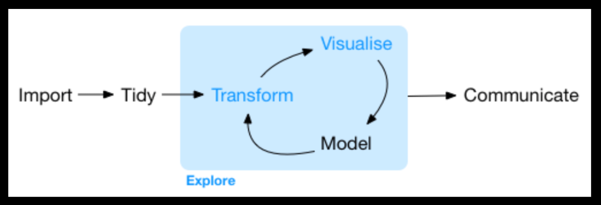

```{r setup, include=FALSE}
knitr::opts_chunk$set(echo = FALSE)
library(tidyverse)
#setwd("~/Archivos/teaching/MAD/0Slides/stat1291")
library(rmarkdown)
#render("filename.Rmd")     
#browseURL("filename.html")
#[//]: # (Comment: rintro.r)
```

## De los datos en bruto a la información

<!--
* Objetivo: convertir datos en bruto en información<!--, conocimientos y valor-->


:::: {style="display: grid; grid-template-columns: 1fr 1fr; grid-column-gap: 10px; "}

::: {}

* AED es una fase inicial importante:  

    + **conocer nuestros datos**
    + diagnosticar su calidad 
    + encontrar escenarios de análisis
<!--    + derivar nuevas variables -->

:::

::: {}

<center>

{width=95%}

</center>
:::

::::


* NO es proceso formal con un conjunto estricto de reglas: **NO hay una "receta"**

    + distintos datos u objetivos requieren diferentes tratamientos
  
<!--  
    + distintos datos requieren diferentes tratamientos y análisis
    
    + con los mismos datos, el proceso es diferente según el objetivo final
-->
    
* Es un proceso "creativo" e **iterativo** para descubrir información (útil por sí misma o para posteriormente modelizar)

    + generar **preguntas** sobre los datos
    + buscar respuestas visualizando, transformando y modelando los datos.
    + usar lo aprendido para refinar las preguntas y/o generar nuevas


## Puntos a cubrir en un EDA

* Primer acercamiento a los datos

    + ¿Qué variables tenemos?
    
    + ¿Qué tipo de información tienen las variables? 
        
        - **Numérica** 
        - **Categórica**
        - Otra
    
    + ¿De qué tipo son las variables en nuestros datos?
    
    + ¿Hay valores ausentes?
    
    
* Preguntas sobre los datos: cada nueva pregunta expondrá un nuevo aspecto y aumenta las posibilidades descubrir algo.


## Preguntas sobre los datos

* NO hay reglas sobre qué preguntas hacer <!-- para guiar la investigación.-->

* PERO dos *tipos* de preguntas siempre serán útiles <!-- para hacer descubrimientos dentro de sus datos-->

    + ¿Qué tipo de variación tiene cada variable? (análisis univariante)
    
    + ¿Qué tipo de relaciones se produce entre las variables (covariación)? (análisis multivariante)

* Responder a este tipo de preguntas suele implicar analizar las distribuciones (numérica y/o gráficamenente)

    + OJO: el análisis es diferente si las variables son numéricas o categóricas

* En el proceso, también se descubren otras características relevantes

    + asimetrías
    
    + valores atípicos


## Herramientas en R para AED

* Ya disponimos de las principales herramientas para explorar nuestros datos: R base, `tidyverse`, `ggplot2`
    
* NO se aconseja el uso de bibliotecas adicionales, como norma general


* *Algunas* de las siguientes  pueden ser interesantes

    + `skimr` <!--: más estadísticos que `summary()`, de forma separada para variables numéricas y categóricas -->
    + `dlookr`
    + `DataExplorer` 
    + `janitor` 
<!--    + `funModelling` -->

    
* CUIDADO: no todas se llevan bien entre ellas y con `tidyverse`

## Primer acercamiento a los datos

* Trabajaremos con los datos `Carseats` del paquete `ISLR`
    
```{r, echo=FALSE, eval=TRUE}
library(ISLR)
data(Carseats)
```

* Debemos tener información sobre cada variable: en este caso de la ayuda <!--nos informa (nombre e información de cada variables, unidades en que se mide, etc.)-->


* Una vez cargados los datos, queremos conocer las características de los datos

    + Número de observaciones y de variables
    + Tipo de cada variable

```{r, echo=TRUE, eval=FALSE}
glimpse(Carseats)  # de tidyverse
str(Carseats)      # de R base
```

+ ¿Tienen las variables el tipo de datos correcto o transformamos alguna?
+ ¿Son todas las variables necesarias o seleccionamos un subconjunto? 
+ ¿Podemos/queremos usar variables de tipo carácter?
+ ...

## Primer acercamiento a los datos (cont.)

* ¿Aprendemos algo viendo los datos en bruto? 
```{r, echo=TRUE, eval=FALSE}
View(Carseats)
Carseats
head(Carseats)
```

* ¿Es razonable incluirlos en un documento?

* En todo el proceso de AED haremos muchas más cosas de las que queremos incluir en un documento para comunicar


## Tratamiento de los valores ausentes
<!--
* Es importante tener información sobre los valores ausentes `NA` de nuestras variables
-->
* `Carseats` no tiene así que vamos a crearlos

```{r, echo=T, eval=FALSE}
Carseats[1:20 , "Sales"]  <- NA               ; Carseats[330:340, "Urban"] <- NA 
Carseats[c(18:28, 325:335), "Income"] <- NA  
```

* ¿Cuántos valores ausentes tenemos?

```{r, echo=TRUE, eval=FALSE}
Carseats %>%  is.na() %>% summary()
```
* ¿Quitamos todas las observaciones con `NA` en alguna variable?

```{r, echo=TRUE, eval=FALSE}
Carseats %>%  na.omit()  %>%  is.na() %>% summary()
```
* ¿Solo quitamos observaciones con `NA` en alguna(s) variable(s)?

```{r, echo=TRUE, eval=FALSE}
Carseats %>%  filter(!is.na(Sales))  %>%  is.na() %>% summary()
```
## Tratamiento de los valores ausentes (cont.)

* En general, NO queremos `NA` en algunas variable principales: podemos quitarloss o cambiar ese valor

* ¿Por qué mantener observaciones con `NA`s en alguna(s) variable(s)?

    + pueden ser variables que quizás utilicemos o quizás no

    + queremos entender qué características tienen las observaciones `NA`
    
    + AED es un proceso iterativo!


* Siempre pensad cuidadosamente **qué queremos presentar**: cuidado si se tienen muchas columnas con

```{r, echo=TRUE, eval=FALSE}
Carseats %>%  is.na() %>% summary()
```
* Además ¿queremos presentarlo tal como sale?

## Variación (análisis univariante)


* Siempre estamos interesados en descubrir las características principales de una variable

* "Variación" es la tendencia de los valores de una variable a cambiar entre "medida" y "medida"

    + p.e., el nivel educativo de dos personas (variable cualitativa) o las ventas de dos empresas (continua)

* Cada variable tiene su propio patrón de variación, que puede revelar información relevante

* Podemos entender ese patrón analizando numérica o visualmente la distribución de valores


## Características principales de una variable

* Una primera aproximación numérica a los valores de las variables es

```{r, echo=TRUE, eval=FALSE}
Carseats %>% summary()
```

* Cuidado con este comando en bruto para un documento final: puede ser conveniente describir las variables por bloques (eg, categóricas y numéricas)

* Podemos querer calcular otros estadísticos descriptivos: 

    + varianza o desviación típica
    
    + percentiles

    + asimetría y kurtosis 

    + tabulaciones de frecuenta (variable categórica)
    
    + etc.

## Visualizando distribuciones: Variable Categórica

* Usar un gráfico de barras:

```{r, echo=TRUE, eval=FALSE}
ggplot(data = Carseats) +
  geom_bar(mapping = aes(x = ShelveLoc))
```

* La tabulación de frecuencias se puede obtener con `table()`, pero con `dplyr::count()`  lo tenemos en un `data frame`:

```{r, echo=TRUE, eval=TRUE, messages=FALSE, warning=FALSE}
Carseats %>% count(ShelveLoc) %>% 
  kableExtra::kbl() %>% kableExtra::kable_paper("hover")
```

## Visualizando distribuciones: Variable continua

* Usar un histograma o densidad
```{r, echo=TRUE, eval=FALSE}
ggplot(data = Carseats) +
  geom_histogram(mapping = aes(x = Price), binwidth = 5)
```
* La tabla del histograma `Carseats %>% count(cut_width(Price, 5))`
<!--
Carseats %>% mutate(PriceD=cut_width(Price, 5)) %>%
count(PriceD) %>% ggplot(aes(x = PriceD, y = n)) + geom_bar(stat="identity")
-->

* Debemos explorar una variedad de anchos del intervalo
```{r, echo=TRUE, eval=FALSE, messages=FALSE, warning=FALSE}
g0 <- ggplot(data = Carseats) 
g1 <- g0 + geom_histogram(mapping = aes(x = Price), binwidth = 1)
g2 <- g0 + geom_histogram(mapping = aes(x = Price), binwidth = 2)
g3 <- g0 + geom_histogram(mapping = aes(x = Price), binwidth = 5)
g4 <- g0 + geom_histogram(mapping = aes(x = Price), binwidth = 10)
```
* Pueden revelar diferentes patrones (ej. `Sales`)

## Visualizando distribuciones continuas

* Los gráficos de caja también aportan información útil sobre la distribución 
```{r, echo=TRUE, eval=FALSE, messages=FALSE, warning=FALSE}
ggplot(data = Carseats) + 
  geom_boxplot(mapping = aes(y = Price))
```

{width=80%}


## Aspectos a prestar atención

* ¿Qué valores son los más comunes? ¿Por qué?

* ¿Hay concentración en valores concretos (p.e., ceros, números "redondos", etc)

    + acumulación de precios a la izquierda de 100, 150 

* ¿Qué valores son raros? ¿Por qué? ¿Eran "esperables"?

    + unos pocos casos de precios muy bajos

* ¿Hay algún patrón inusual? ¿Qué podría explicarlo?

* ¿Hay agrupamientos que sugieran subgrupos en los datos? 
```{r, echo=TRUE, eval=FALSE, message=FALSE}
ggplot(faithful, aes(x = eruptions)) +  geom_histogram()
```

* ¿Cómo son las observaciones similares entre ellas y distintas entre grupos?

* ¿Cómo se pueden explicar los cúmulos? ¿Pueden ser engañosos?

## Aspectos a prestar atención (cont.)

* Identificar las variables con "desequilibrio" o con alta varianza

<!--
* En este punto y en el resto del AED debemos pensar si los datos necesitan alguna limpieza o transformación
-->

* ¿Existen variables redundantes?
    + Ej. temperatura media, máx. y mín. tienen distribución similar en los datos

* ¿Tienen sentido las categorías de las variables cualitativas?
    + agrupar valores con pocas observaciones 
    + crear categorías más "finas"o más agregadas (ej. de países a continentes)
    + homogeneizar valores (ej., algunos valores son años, otros año-mes)

* Variables continuas con distribución asimétrica: puede necesitar transformación (logs) para algunos modelos

* ¿Es la distribución de las variables continuas normal? (no muy revelante)

* ¿Sería preferible discretizar alguna variable continua?

## Tratamiento de valores atípicos ("outliers")

* Valores atípicos son los que no encajan en el patrón general de una variable

* En nuestro caso, valores muy bajos de `Price` (suele haber situaciones de atípicos mucho más extremos)

```{r echo = TRUE, eval=FALSE}
Carseats %>% select(Price) %>% summary()
```

* Se pueden eliminar: no recomendable porque otras variables pueden contener información útil

* Los reemplazarmos por `NA`

```{r echo = TRUE, eval=FALSE}
carseats2 <- Carseats %>% mutate(price = if_else(Price < 50, as.numeric(NA), Price))
ggplot(carseats2, aes(x = price)) +  geom_histogram(na.rm = TRUE)
ggplot(carseats2, aes(x = price)) + geom_histogram(aes(y=..density..))+ geom_density() 
```
    * `ggplot` se adhiere a la filosofía de que los `NA` ruidosos

## Algunas funciones alternativas


* Varias funciones ofrecen directamente
    
    + más estadísticos descriptivos
    + porcentaje de ceros y `NA`s
    + valores únicos de las variables categóricas.

* `skimr::skim`: 
    + desglosa estadístico por tipo de datos
    + Visualización rápida de distribuciones

```{r echo = TRUE, eval=FALSE}
skimr::skim(Carseats)
```

* ¿Queremos esto tal cual en un informe?

## Algunas funciones alternativas: `DataExplorer`

* `DataExplorer::plot_missing()`: gráficos del porcentaje de `NA`
```{r echo = TRUE, eval=FALSE}
DataExplorer::plot_missing(Carseats)
```

* `DataExplorer::plot_bar()` y `DataExplorer::plot_histogram()`: histogramas de todas las variables categóricas y numéricas de una vez

```{r echo = TRUE, eval=FALSE}
library(DataExplorer)
Carseats %>% 
  plot_bar(ncol = 2, nrow = 4)

Carseats %>% 
  plot_histogram(ncol = 3, nrow = 3)

```
* ¿De verdad queremos esto tal cual en un informe?

## Algunas funciones alternativas: `dlookr`

* `dlookr::describe()`: ofrece más estadísticos descriptivos, creando un `data frame`

```{r, echo=TRUE, eval=FALSE}
library(dlookr)
describe(Carseats, Sales:Income)

Carseats %>%
  describe() %>%
  select(variable, skewness, mean, p25, p50, p75) %>% 
  filter(!is.na(skewness)) %>% 
  arrange(desc(abs(skewness)))

Carseats %>%
  group_by(US) %>% 
  describe(Sales, Income) 
```

## Algunas funciones alternativas: `dlookr` (cont.)


```{r, echo=TRUE, eval=FALSE}
normality(Carseats, Sales:Advertising)

Carseats %>%
  normality() %>%
  filter(p_value <= 0.01) %>% 
  arrange(abs(p_value))
  
Carseats %>%
  filter(ShelveLoc == "Good") %>%
  group_by(US) %>%
  plot_normality(Advertising)
```

## Covariación: análisis multivariante

* La variación describe el comportamiento *dentro* de una variable

* La **covariación** describe el comportamiento entre variables:  tendencia a que los valores de dos o más variables cambien juntos de forma relacionada. 

* Detectamos covariación visualizando la relación entre variables, PERO la forma depende del tipo de variables

## Una variable continua y una categórica


* Explorar la distribución de una variable continua desglosada por una variable categórica
    + si un grupo es mucho más pequeño que los otros, es difícil ver las diferencias

* Mediante el histograma o densidad (en el mismo gráfico o diferentes)      
```{r, echo=TRUE, eval=FALSE}
g0 <- ggplot(Carseats %>% na.omit(), aes(x = Price)) 

g0 + geom_density(mapping = aes(colour = Urban))
g0 + geom_density() + facet_wrap(~Urban)
```      
* Mediante gráficos de caja: menos información pero más fácil de comparar     
```{r, echo=TRUE, eval=FALSE}
ggplot(Carseats %>% na.omit(), aes(y = Price, x = Urban)) + 
  geom_boxplot()
```      

* ¿Existen diferencias en las distribuciones por categorías? ¿Qué implica?

## Una variable continua y una categórica (cont.)

* Algunos factores no están ordenados
```{r, echo=TRUE, eval=FALSE}
ggplot(Carseats %>% na.omit(), aes(y = Price, x = ShelveLoc)) + 
  geom_boxplot()
```      
* Conviene reordenarlos
```{r, echo=TRUE, eval=FALSE}
ggplot(Carseats %>% na.omit(), aes(y = Price, x = reorder(ShelveLoc, Price, FUN=median))) + 
  geom_boxplot() 
```      

* Tambien rotar los ejes
```{r, echo=TRUE, eval=FALSE}
ggplot(Carseats %>% na.omit(), aes(y = Price, x = reorder(ShelveLoc, Price, FUN=median))) + 
  geom_boxplot()  + coord_flip()
```      

## "Correlación" entre una variable continua y una categórica 

* Un modelo de regresión simple también describe la relación
```{r, echo=TRUE, eval=FALSE}
summary(lm(data = Carseats %>% na.omit(), Price ~ ShelveLoc))
``` 
* Esto es básicamente calcular la media de la variable continua por grupos definidos por la categórica

```{r, echo=TRUE, eval=FALSE}
Carseats %>% group_by(ShelveLoc) %>% summarise(media = mean(Price, na.rm = TRUE))
``` 


* O mediante la correlación ... 
```{r, echo=TRUE, eval=FALSE}
cor(Carseats$Price, Carseats$ShelveLoc, use = "complete.obs")
``` 
* La correlación NO tiene sentido cuando una variable es categórica

## Dos variables categóricas

* Para visualizar la covariación entre variables categóricas, se puede  contar el número de observaciones para cada combinación

*  Una forma de hacerlo es `geom_count()`
```{r, echo=TRUE, eval=FALSE}
ggplot(Carseats %>% na.omit(), aes(x=ShelveLoc, y=Urban)) + geom_count()
``` 
*  O usar `count()` y visualiza con `geom_tile()` y la estética de relleno:
```{r, echo=TRUE, eval=FALSE}
Carseats %>% na.omit() %>%  count(ShelveLoc, Urban) %>% 
  ggplot(aes(x=ShelveLoc, y=Urban)) +
    geom_tile(aes(fill = n))
``` 
* También se pueden visualizar sus histogramas
```{r, echo=TRUE, eval=FALSE}
g0 <- Carseats %>% na.omit() %>%  ggplot(aes(x=ShelveLoc))
g0 + geom_bar(aes(color=Urban))
g0 + geom_bar() + facet_wrap(~Urban)
``` 

## Dos variables continuas

* La forma obvia de visualizar relaciones entre variables continuas es un gráfico de dispersión con `geom_point()`

    + apreciaremos un patrón en los puntos

```{r, echo=TRUE, eval=FALSE}
g0 <- Carseats %>% na.omit() %>%  ggplot(aes(y=Sales, x=Advertising))
g0 + geom_point()
``` 
* También sabemos añadir `smoothers` para detectar posibles patrones

* Se puede cambiar el ancho de los "intervalos" en dos dimensiones o hexagonales para poder apreciar mejor patrones 

```{r, echo=TRUE, eval=FALSE}
g0 + geom_bin2d()
g0 + geom_hex()  #install.packages("hexbin")
``` 

* Otra opción categorizar una variable continua y usar las técnicas anteriores


```{r, echo=TRUE, eval=FALSE}
g0 + geom_boxplot(aes(group=cut_width(Advertising, 5)))
g0 + geom_boxplot(aes(group=cut_width(Advertising, 10)))
``` 
## Correlación entre variables continuas

* Obviamente podemos calcular modelos de regresión con dos variables continuas

```{r, echo=TRUE, eval=FALSE}
summary(lm(data = Carseats, Sales ~ Advertising))
``` 
* Y también correlaciones
```{r, echo=TRUE, eval=FALSE}
cor(Carseats$Sales, Carseats$Advertising, use = "complete.obs")
Carseats %>% select(Sales, Advertising) %>%  dlookr::correlate()
``` 

* Se pueden calcular múltiples correlaciones y visualizarlos
```{r, echo=TRUE, eval=FALSE}
Carseats %>%  dlookr::correlate()
Carseats %>%  dlookr::plot_correlate()
``` 

<!--
correlate(carseats, Sales:Income)

carseats %>%
  correlate(Sales:Income) %>%
  filter(as.integer(var1) > as.integer(var2))
  
  carseats %>%
  filter(ShelveLoc == "Good") %>%
  group_by(Urban, US) %>%
  correlate(Sales) %>%
  filter(abs(coef_corr) > 0.5)
  
  
plot_correlate(carseats)

carseats %>%
  filter(ShelveLoc == "Good") %>%
  group_by(Urban, US) %>%
  plot_correlate(Sales)
  
categ <- target_by(carseats, US)

EDA when target variable is categorical variable

Cases where predictors are numeric variable
cat_num <- relate(categ, Sales)
cat_num
plot(cat_num)

Cases where predictors are categorical variable
cat_cat <- relate(categ, ShelveLoc)
cat_cat
plot(cat_cat)

EDA when target variable is numerical variable
num <- target_by(carseats, Sales)

Cases where predictors are numeric variable
num_num <- relate(num, Price)
num_num  |hace regresion
summary(num_num)
plot(num_num)    # linea ajustada + predichos vs observados

Cases where predictors are categorical variable
num_cat <- relate(num, ShelveLoc)
num_cat
plot(num_cat)   # boxplot


carseats %>%
  eda_report(target = Sales, output_format = "html", output_file = "EDA.html")

-->

<!--


* `funModelling::status`

```{r, echo=TRUE, eval=FALSE}
status(Carseats)
```

plot_num(): grafica todas las numericas
profiling_num(): estadisticas de todas las numericas
-->

  

<!--

Guide to EDA: https://www.r-bloggers.com/2020/07/exploratory-data-analysis-guide/
https://r4ds.had.co.nz/introduction.html

https://blog.datascienceheroes.com/exploratory-data-analysis-in-r-intro/
https://bookdown.org/rdpeng/exdata/exploratory-data-analysis-checklist.html


https://www.r-bloggers.com/2020/09/how-to-explore-data-dataexplorer-package/

https://cran.r-project.org/web/packages/dlookr/vignettes/EDA.html    
 
-->


