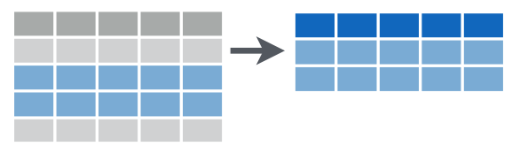
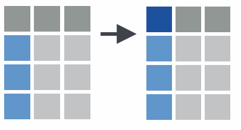
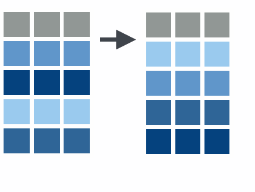

```{r setup, include=FALSE}
knitr::opts_chunk$set(echo = FALSE)
library(tidyverse)
#setwd("~/Archivos/teaching/MAD/0Slides/stat1291")
library(rmarkdown)
#render("filename.Rmd")     
#browseURL("filename.html")
#[//]: # (Comment: rintro.r)
```

## Ordenando los datos

Para visualizar y analizar los datos de forma efectiva, necesitamos que los datos estén en un formato que llamaremos "ordenado" ("tidy" en inglés). Tener los datos almacenados en un formato "ordenado" es más que lo que la definición coloquial del término "ordenado" podría sugerir. No se trata solo de disponer de datos "ordenadamente organizados" como en una hoja de cálculo, donde cada columna es una variable y cada fila es una observación. Definimos el término "ordenado" de una manera más rigurosa, esbozando un conjunto de reglas por las que se pueden almacenar los datos y las implicaciones de estas reglas en los análisis.

El conocimiento de este tipo de formateo de datos no fue necesario en nuestro tratamiento de visualización de datos, porque todos los datos ya estaban en formato ordenado. Veremos que tener datos ordenados permite crear visualizaciones de datos más fácilmente y también analizar los datos con modelos estadísticos.

El proceso completo para analizar los datos puede describirse en este esquema


Para realizar un análisis de datos adecuado y comunicar de forma efectiva, se requiere una tarea previa de "tratamiento" de datos que suele suponer más de la mitad del tiempo total de un proyecto de análisis de datos. Las tareas de limpieza, transformación y manipulación de datos se denominan habitualmente como "data wrangling" (pelearse con los datos) o "data munging". Este trabajo "sucio" es clave para obtener información útil en la toma de decisiones. Este artículo de "The New York Times" deja claro desde su título esta idea ["'Janitor Work' Is Key Hurdle to Insights"](https://www.nytimes.com/2014/08/18/technology/for-big-data-scientists-hurdle-to-insights-is-janitor-work.html). El experto  Jeffrey Heer afirma

> It's an absolute myth that you can send an algorithm over raw data and have insights pop up.

### El paquete `tidyverse`

El meta-paquete `tidyverse` incluye una colección de paquetes que ayudan en todo el proceso "ordenación de datos". El núcleo de `tidyverse` lo componen los siguientes paquetes (podéis ver una descripción [aquí](https://www.tidyverse.org/packages/)):

* `ggplot2`
* `tibble`
* `tidyr`
* `readr`
* `purrr`
* `dplyr`

A su vez estos se integran con otros paquetes importantes del "ecosistema" de R:


En esta y siguientes sesiones, primero vamos a usar `dplyr` para manipular un conjunto de datos ordenados (la parte transformadora del ciclo en el gráfico anterior). Luego volveremos a la parte de ordenar/organizar unos datos desordenados usando `tidyr`.

## Manipulacion de datos con `dplyr`

Esta sección explora las principales funciones en `dplyr` que Hadley Wickham describe como una *gramática de manipulación de datos* -- el contrapunto a su *gramática de gráficos* en `ggplot2`. Notar que una gramática consiste en verbos, sustantivos y objetos directos.

[//]: # (
The github repo for [`dplyr`](https://github.com/hadley/dplyr) not only houses the R code, but also vignettes for various use cases. The introductory vignette is a good place to start and can by viewed by typing the following on the command line: `vignette("dplyr", package = "dplyr")` or by opening the `dplyr` file in the vignettes directory of the `dplyr` repo. The material for this section is extracted from Hadley Wickham's [Introduction to dplyr Vignette](https://github.com/hadley/dplyr/blob/master/vignettes/dplyr.Rmd), [*R for data science*](http://r4ds.had.co.nz/transform.html), and MDSR.  
)

El paqute `dplyr` fue diseñado para:  

* proporcionar herramientas de manipulación de datos de uso común;  
* tener un rendimiento rápido para operaciones en memoria;  
* abstraer la interfaz entre las operaciones de manipulación de datos y la fuente de datos.

### Nota sobre "Data frames" y "Tibbles"

Las funciones `dplyr` operan sobre "data frames" (marcos de datos), pero también en "tibbles", una versión recortada de un "data frame" (`tbl_df`) que proporciona una mejor comprobación e impresión visual. Los "tibbles" son particularmente buenos para los conjuntos de datos grandes ya que sólo muestran las primeras 10 filas y las primeras 7 columnas por defecto, aunque se proporciona información adicional sobre las filas y columnas.

Por ejemplo, si usamos el "data frame" `ggplot2::presidential`. 

```{r, warning = FALSE, message = FALSE, eval = FALSE, echo =TRUE}
library(dplyr)
library(ggplot2) 
data("presidential")
presidential
```

tenemos el nombre, fecha de comienzo y finalización del mandato y partido de los presidentes de EE.UU. Pero `presidential` no se muestra como un *data frame* habitual porque es un *tibble*. Estos fueron diseños para datos con muchas filas y/o columnas, es decir, "big data". En este caso la función `print` combina características de  `head` y de  `str`. Podemos ver el tipo de datos y su ruta de herencia (relación con otros tipos de objetos) con `class()`:

[//]: # (`str` proporciona la ruta de herencia y un resumen del *data frame*. For brevity we will use `class()` to give the inheritance path:) 

```{r, echo = TRUE, eval = FALSE}
class(presidential)
```

A efectos de comparación, podéis ver cómo se muestra un *data frame* tradicional.
```{r, echo = TRUE, eval = FALSE} 
MASS::Boston
as_tibble(MASS::Boston)
```


## Los cinco verbos

El creador de `dplyr` (y `ggplot2`), Hadley Wickham, argumenta que la mayoría de las operaciones que es necesario realizar en una tabla de datos pueden ser logradas usando combinaciones de los siguientes cinco "verbos":

1. `select()`
2. `filter()`
3. `mutate()` (y `rename()`)
4. `arrange()`
5. `summarize()`

* `select()`: selecciona columnas (variables) en un *data frame*;  


* `filter()`: selecciona filas (observaciones) en un *data frame*;

* `mutate()`: añade nuevas columnas a un *data frame*;  


  + también `rename()`: cambiar el nombre de una columna de un *data frame*;
  


* `arrange()`: re-ordena filas en un *data frame*;  


* `summarise()`: contrae/colapsa un *data frame* en una sola fila; 


Todos los verbos funcionan de manera similar:

1. El primer argumento es un *data frame*.

2. Los argumentos siguientes describen qué hacer con el *data frame*, usando los nombres de variables (sin comillas).

3. El resultado es un nuevo *data frame* (realmente une `tbl_df`)

Juntas, estas propiedades hacen que sea fácil encadenar múltiples pasos simples para lograr un resultado complejo. Veremos como 
estas operaciones se pueden encadenar con el operador de tuberías o "pipes" (%>%), tomado del operador "|" de los lenguajes de consola de Unix y similares.

Todas estas funciones se pueden utilizar conjuntamente con `group_by()`, lo que cambia el alcance de cada función al pasar de operar en todo el conjunto de datos a hacerlo grupo por grupo. Estas funciones proporcionan los verbos para un lenguaje de manipulación de datos.

En caso de duda, se puede mirar la [chuleta de transformación de datos](https://github.com/rstudio/cheatsheets/raw/master/source/pdfs/data-transformation-cheatsheet.pdf). También se pueden encontrar online esta y otras chuletas de R y RStudio [aquí](https://www.rstudio.com/resources/cheatsheets/); notad que existen versiones en castellano de algunas de ellas.

### Una pequeña digresión sobre historia 

El enfoque de Wickham se inspira en su deseo de desdibujar los límites entre R y la omnipresente sintaxis de consulta de la base de datos relacional SQL. De hecho, los cinco verbos, cuando se combinan, muestran una estrecha similitud con las declaraciones de consulta SQL (al menos para fines de análisis de datos). De este modo, el dominio de los verbos de `dplyr` para manipulación de datos se ha convertido en una puerta de entrada para analizar "big data", tanto a través del sistema de gestión de bases de datos relacionales como  más allá. El verdadero poder de `dplyr` es que abstrae la fuente de datos, es decir, no importa si es un *data frame*, una base de datos o [Spark](http://spark.apache.org/).

De hecho, el paquete estadístico "SAS" siempre ha tenido una poderosa herramienta que hace más o menos lo mismo, desde la década de 1970. 

## Primer ejemplo
### Seleccionar variables y filtrar filas

```{r, warning = FALSE, message = FALSE, eval = FALSE, echo =TRUE}
presidential
```
Para recuperar sólo los nombres y partidos de estos presidentes, usaríamos `select()`. El primer argumento para la función `select()` es el *data frame*, seguido de una lista arbitrariamente larga de nombres de columnas, separados por comas. 

```{r, warning = FALSE, message = FALSE, eval = FALSE, echo =TRUE}
select(presidential, name, party)
```

Para recuperar sólo a los presidentes republicanos, utilizamos `filter()`. El primer argumento para `filter()` es un *data frame*, y los argumentos siguientes son *condiciones lógicas* que se evalúan en cualquier columna involucrada.

```{r, warning = FALSE, message = FALSE, eval = FALSE, echo =TRUE}
filter(presidential, party == "Republican")
```
 
### Anidamiento y tuberías

Naturalmente, la combinación de los comandos `filter()` y `select()` permite profundizar en información muy específica. Por ejemplo, podemos encontrar los presidentes demócratas que sirvieron desde Watergate. 

```{r, warning = FALSE, message = FALSE, eval = FALSE, echo =TRUE}
select(filter(presidential, start > 1973 & party == "Democratic"), name)
```

En la sintaxis mostrada anteriormente, la operación `filter()` está anidada dentro de la operación `select()`. Cada uno de los cinco verbos toma y devuelve un *data frame*, lo que hace posible este tipo de anidamiento. 
```{r, warning = FALSE, message = FALSE, eval = FALSE, echo =TRUE}
ejemplo <- select(filter(presidential, start > 1973 & party == "Democratic"), name)
dim(ejemplo)
head(ejemplo)
class(ejemplo)
```

Estas largas expresiones se vuelven muy difíciles de leer. En su lugar, recomendamos el uso del operador `%>%` (tubería). 
 
```{r, warning = FALSE, message = FALSE, eval = FALSE, echo =TRUE}
presidential %>%
  filter(start > 1973 & party == "Democratic") %>%
  select(name)
```
 
Notar como la expresión `dataframe %>% filter(condition)`  es equivalente a `filter(dataframe, condition)`.

La tubería anterior se lee como 

> Tomar el *data frame* `presidential`, entonces filtrar a los presidentes demócratas cuyo año de inicio es mayor que 1973. A continuación, seleccionar la variable `name`.


### Mutar variables para crear nuevas variables

Frecuentemente, en el proceso de análisis de datos, crearemos, redefiniremos y re-nombraremos algunas de nuestras variables. Las funciones `mutate()` y `rename()` proporcionan estas capacidades. 

Si bien tenemos los datos brutos sobre la fecha de inicio y finalización del mandato, no tenemos una variable numérica que indique la duración del mandato de cada presidente. 

```{r, eval = FALSE, echo = TRUE}
mypresidents <- presidential %>%
  mutate(term_length = end - start) 
head(mypresidents,2)
```
[//]: # (textbook should have used mutate(term.length = interval(start, end) / dyears(1)))

En esta situación, generalmente se considera un buen estilo crear un nuevo objeto en lugar de "machacar" el que proviene de una fuente externa. Para preservar el *data frame* presidenciales existente, guardamos el resultado de `mutate()` como un nuevo objeto llamado `mypresidents`.

La forma en que opera `rename()` es muy similar:

```{r, eval = FALSE, echo = TRUE}
presidential %>%
  rename(nombre = name) 
```

### Organizar filas

La función sort() ordenará un vector, pero no un *data frame*. La función que clasificará un *data frame* se llama `arrange()`. 

Para ordenar nuestro *data frame* por la duración del mandato de cada presidente, especificamos que queremos la columna `term_length` en orden descendente. 

```{r, warning = FALSE, message = FALSE, eval = FALSE, echo =TRUE}
mypresidents %>% arrange(desc(term_length))
```

Varios presidentes concluyeron uno o dos mandatos completos, por lo que tienen exactamente la misma duración (4 u 8 años, respectivamente). Para romper estos empates, podemos clasificarlos adicionalmente por `start`.

```{r, warning = FALSE, message = FALSE, eval = FALSE, echo =TRUE}
mypresidents %>% arrange(desc(term_length), start)
```

### Resumir todo el conjunto de datos o para cada grupo 

El último de los cinco verbos para el análisis de una sola tabla es `summarize()`, que a menudo se usa en conjunción con `group_by()`. Los verbos anteriores nos proporcionaron los medios para manipular un *data frame* de maneras poderosas y flexibles. Pero la extensión del análisis que podemos hacer con estos cuatro verbos es limitada. Por otra parte, `summarize()` con `group_by()` nos permite hacer comparaciones.

Cuando se usa solo, `summarize()` colapsa un *data frame* en una sola fila. Tenemos que especificar *cómo* queremos reducir una columna entera de datos en un solo valor. 


```{r, warning = FALSE, message = FALSE, eval = FALSE, echo =TRUE}
library(lubridate)
mypresidents %>%
  summarize(
    N = n(), 
    first_year = min(year(start)), 
    last_year = max(year(end)),
    num_dems = sum(party == "Democratic"),
    avg_term_length = mean(term_length)
    )
```

En este ejemplo, la función `n()` simplemente cuenta el número de filas. Esto es casi siempre información útil. (También se puede usar `n_distinct()`). La siguiente variable determina el primer año en que uno de estos presidentes asumió el cargo. Este es el año más pequeño en la columna de `start`.
La variable `num_dems` simplemente cuenta el número de filas en las que el valor de la variable de partido era demócrata.

Esto plantea la pregunta de si los presidentes demócratas o republicanos cumplieron un mandato promedio más largo durante este período de tiempo. Para resolver esto, podemos ejecutar `summarize()` de nuevo, pero esta vez, en lugar de que el primer argumento sea el *data frame* de `mypresidents`, especificaremos que las filas del *data frame* de los `mypresidents` deben ser agrupadas por los valores de la variable `party`. De esta manera, los mismos cálculos que los anteriores se llevarán a cabo para cada una de los partidos por separado.

```{r, warning = FALSE, message = FALSE, eval = FALSE, echo =TRUE}
mypresidents %>%
  group_by(party) %>% 
  summarize(
    N = n(), 
    avg_term_length = mean(term_length)
    )
# Comparar el data.frame intermedio group_by(mypresidents,party) con mypresidents
```

## La tuberia ("pipe") 

La tubería, `%>%`, proviene del paquete `magrittr` de Stefan Milton Bache. Los paquetes en el `tidyverse` cargan `%>%` automáticamente.

El método abreviado de teclado para escribir `%>%` es 

- Cmd + Shift + M (Mac)
- Ctrl + Shift + M (Windows, PC)

Notad que el operador de tubería se puede aplicar a cualquier función que hemos visto anteriormente (no solo verbos de manipulación de datos)
```{r, warning = FALSE, message = FALSE, eval = FALSE, echo =TRUE}
log(10)
10 %>% log()

presidential %>% names()
mypresidents %>% nrows()
```


En el caso de los gráficos de `ggplot2` se utiliza `+`, que es exclusivo de este paquete, en lugar de `%>%`. La única razón está en que  `ggplot2` fue desarrollado antes que el operador de tuberias. El autor de `ggplot2` ha reconocido que si "volviera atrás en el tiempo" usaría el operador de tuberías.

## Suplemento

### Comparaciones para `filter()`

El primer argumento de la función `filter()` es el conjunto de datos (normalmente suministrado a través de tuberías). 

El segundo argumento de `filter()` es un vector lógico: es decir, un vector que consiste en `TRUE` y `FALSE`.  Sólo se conservan las filas en las que la condición se evalúa a "VERDADERO". 

El vector lógico se crea comparando una o más variables. 

* Los operadores lógicos básicos son `>`, `>=`, `<`, `<=`, `!=` (no igual), y `==` (igual). 

* Para la comparación de conjuntos, se utiliza `x %in% Y`, que es cierto cuando `x` es un elemento del conjunto `Y`.

* Cuando se combinan dos o más comparaciones, se usan operadores booleanos: `&` (y), `|` (o), `! ` (no), 

Suponga que `x` es una variable con cuatro observaciones. ¿Cuál es el vector lógico resultante? 

```{r, warning = FALSE, message = FALSE, eval = FALSE, echo =TRUE}
x <- c(2,1,3,0)
x == 0 
!(x == 0)
x == 0 | x == 1 
x %in% c(0,1)
```

### Seleccionar muchas variables 

El conjunto de datos `presidential` sólo tiene cuatro variables, por lo que la selección de variables tiene un poco de sentido. Para seleccionar variables para conjuntos de datos con un gran número de variables, hay algunas opciones útiles. 

Para demostrarlo, cargamos el *data frame* `nycflights13::flights` que contienes 19 variables (tampoco un número terriblemente grande). 
```{r, echo = TRUE, eval = FALSE}
#install.packages("nycflights13")
library(nycflights13)
flights
```

- Seleccionar unas pocas variables es fácil:  `select(flights, year, month, day)`

- Para seleccionar todas las variables desde la variable `year` hasta la variable `arr_time`: `select(flights, year:arr_time)`  (para no tener que escribir todos los nombres de variables) 

- Para seleccionar todas las variables excepto `year, month, day`:  `select(flights, -(year:day))`

- Existen varias funciones de ayuda que puede utilizar dentro de `select()`:

    + `starts_with("abc")`: para los nombres que comienzan con "abc".

    + `ends_with("xyz")`: para todos los nombres que acaban con "xyz".

    + `contains("ijk")`: para los nombres que contienen "ijk".

    + `num_range("x", 1:3)`: para x1, x2 y x3.

    + `matches("(.)\\1")`: selecciona las variables que coinciden con una expresión regular (en este caso, cualquier variable que contenga caracteres repetidos).


### Manejo de valores ausentes  

Una característica importante de la R que puede hacer complicada la comparación son los valores ausentes (faltantes), o `NA`s ("no disponibles").

```{r, warning = FALSE, message = FALSE, eval = FALSE, echo =TRUE}
library(nycflights13)
head(is.na(flights$dep_delay))

flights %>%
  summarize(num_flights = n(), missing_delay = sum(is.na(dep_delay))) %>%
  mutate(missing_pct = missing_delay / num_flights)
```

`NA` representa un valor desconocido, por lo que los valores que faltan son "contagiosos": casi cualquier operación que implique un valor desconocido también devolverá un valor desconocido. Todas las operaciones siguientes devuelven `NA`.

```{r, warning = FALSE, message = FALSE, eval = FALSE, echo =TRUE}
x <- NA
x > 5
x + 10 
x == x

flights %>%
  summarize(num_flights = n(), mean_delay_NA = mean(dep_delay), 
            mean_delay = mean(dep_delay, na.rm = TRUE))
```

Para comprobar si los elementos de `x` son `NA`, se usa `is.na(x)`. 

Por ejemplo, para filtrar todas las observaciones con valores que faltan `<dataframe> %>% filter(!is.na(<variable>))`: 

```{r, warning = FALSE, message = FALSE, eval = FALSE, echo =TRUE}
flights %>% 
  filter(!is.na(dep_delay)) %>% 
   summarize(num_flights = n(), missing_delay = sum(is.na(dep_delay)))
```
También podemos usar los argumentos que algunos comandos tienen para eliminar valores ausentes (típicamente, `na.rm=TRUE`, pero en `cor()` es `use = "complete.obs"`) o bien usar la función `na.omit()`:

```{r, warning = FALSE, message = FALSE, eval = FALSE, echo =TRUE}
flights %>%
  summarize(num_flights = n(), mean_delay_NA = mean(dep_delay), 
            mean_delay = mean(dep_delay, na.rm = TRUE))

flights %>%
  na.omit() %>%
  summarize(num_flights = n(), mean_delay_NA = mean(dep_delay), 
            mean_delay = mean(dep_delay, na.rm = TRUE))
```

