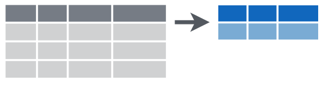

```{r setup, include=FALSE}
knitr::opts_chunk$set(echo = FALSE)
library(tidyverse)
#setwd("~/Archivos/teaching/MAD/0Slides/stat1291")
library(rmarkdown)
#render("filename.Rmd")     
#browseURL("filename.html")
#[//]: # (Comment: rintro.r)
```

## Limpieza y transformación de datos
<center>
{width=60%}
</center>

* Un análisis de datos adecuado requiere tareas previas de limpieza, transformación y manipulación de datos ("data wrangling" o "data munging")

* Este trabajo "sucio" ocupa mucho tiempo pero es clave para obtener información útil<!-- en la toma de decisiones-->: ver ["'Janitor Work' Is Key Hurdle to Insights"](https://www.nytimes.com/2014/08/18/technology/for-big-data-scientists-hurdle-to-insights-is-janitor-work.html). 

* El experto  Jeffrey Heer afirma

> It's an absolute myth that you can send an algorithm over raw data and have insights pop up.

## Manipulacion de datos con `dplyr`

* Parte de `tidyverse` y escrito por Hadley Wickham 

* Ofrece una *gramática de manipulación de datos* 
  - contrapunto a su *gramática de gráficos* en `ggplot2`

* Una gramática consiste en verbos, sustantivos y objetos directos.

[//]: # (
The github repo for [`dplyr`](https://github.com/hadley/dplyr) not only houses the R code, but also vignettes for various use cases. The introductory vignette is a good place to start and can by viewed by typing the following on the command line: `vignette("dplyr", package = "dplyr")` or by opening the `dplyr` file in the vignettes directory of the `dplyr` repo. The material for this section is extracted from Hadley Wickham's [Introduction to dplyr Vignette](https://github.com/hadley/dplyr/blob/master/vignettes/dplyr.Rmd), [*R for data science*](http://r4ds.had.co.nz/transform.html), and MDSR.  
)

* Proporciona herramientas de manipulación de datos de uso común 

* Rendimiento rápido para operaciones en memoria


## Nota sobre "Data frames" y "Tibbles"

* `tidyverse` define el tipo de objeto "tibbles": versión recortada de un "data frame" (`tbl_df`)
<!--
  - "data frame" = marco, conjunto o tabla de datos
-->
* Buenos para los conjuntos de datos grandes: proporciona una mejor comprobación e impresión visual
  - muestra las primeras 10 filas y 7 columnas por defecto (como `head`)
  - proporciona información adicional sobre las filas y columnas (`str`).

```{r, warning = FALSE, message = FALSE, eval = FALSE, echo =TRUE}
library(tidyverse)
data("presidential")
presidential
class(presidential)
```

* Por comparación un *data frame* tradicional.
```{r, echo = TRUE, eval = FALSE} 
MASS::Boston
as_tibble(MASS::Boston)
```


## Los cinco verbos

* La mayoría de operaciones en una tabla de datos pueden realizarse combinando cinco "verbos":

<!--
1. `select()`
2. `filter()`
3. `mutate()` (y `rename()`)
4. `arrange()`
5. `summarize()`
-->

1.- `select()`: selecciona columnas (variables) en un *data frame*;  
{width=50%}

2.- `filter()`: selecciona filas (observaciones) en un *data frame*;
{width=50%}

## Los cinco verbos (cont.)

3.-`mutate()`: añade nuevas columnas a un *data frame*;  
{width=60%}

  + también `rename()`: cambiar el nombre de una columna de un *data frame*;
  {width=40%}


## Los cinco verbos (cont.)

4.- `arrange()`: re-ordena filas en un *data frame*;  
{width=40%}

5.- `summarise()`: contrae/colapsa un *data frame* en una sola fila; 
{width=40%}

## Extendiendo los cinco verbos

* Todos los verbos funcionan de manera similar:

  1. El primer argumento es un *data frame*.

  2. Los argumentos siguientes describen qué hacer con el *data frame*, usando los nombres de variables (sin comillas).

  3. El resultado es un nuevo *data frame* (un `tbl_df`)

* Es fácil encadenar múltiples pasos simples para lograr un resultado complejo mediante el **operador de tuberías o "pipes"** (%>%)

  - tomado del operador "|" de los lenguajes de consola de Unix y similares.

* Las funciones se pueden utilizar con `group_by()`: el alcance de cada función pasa de operar en todo el conjunto de datos a hacerlo grupo por grupo. 

* Entre la colección de [chuletas](https://rstudio.com/resources/cheatsheets/) existe una de [transformación de datos](https://raw.githubusercontent.com/rstudio/cheatsheets/master/translations/spanish/data-transformation_Spanish.pdf). 

<!--También se pueden encontrar online esta y otras chuletas de R y RStudio [aquí](https://www.rstudio.com/resources/cheatsheets/); notad que existen versiones en castellano de algunas de ellas.
-->

## Una pequeña digresión sobre historia 

* Wickham se inspira en la omnipresente sintaxis de consulta de la base de datos relacional SQL. 

* Los cinco verbos muestran una estrecha similitud con las declaraciones de consulta SQL (al menos para fines de análisis de datos). 

## Ejemplo: seleccionar variables y filtrar filas

```{r, warning = FALSE, message = FALSE, eval = FALSE, echo =TRUE}
presidential
```

* Recuperar sólo los nombres y partidos de estos presidentes
  - el primer argumento para  `select()` es el *data frame*
  - luego una lista de nombres de columnas, separados por comas. 

```{r, warning = FALSE, message = FALSE, eval = FALSE, echo =TRUE}
select(presidential, name, party)
```

* Recuperar sólo a los presidentes republicanos, utilizamos `filter()`
  - el primer argumento para `filter()` es un *data frame*
  - luego  *condiciones lógicas* evaluados en la columna involucrada.

```{r, warning = FALSE, message = FALSE, eval = FALSE, echo =TRUE}
filter(presidential, party == "Republican")
```
 
## Anidamiento y tuberías

* Podemos querer combinar `filter()` y `select()` para obtener información muy específica.

* Ej., presidentes demócratas que sirvieron desde Watergate. 

```{r, warning = FALSE, message = FALSE, eval = FALSE, echo =TRUE}
select(filter(presidential, start > 1973 & party == "Democratic"), name)
```

* La operación `filter()` está anidada dentro de la operación `select()`

  - cada verbos toma y devuelve un *data frame*, lo que hace posible este tipo de anidamiento. 
  
```{r, warning = FALSE, message = FALSE, eval = FALSE, echo =F}
ejemplo <- select(filter(presidential, start > 1973 & party == "Democratic"), name)
dim(ejemplo)
head(ejemplo)
class(ejemplo)
```


```{r, warning = FALSE, message = FALSE, eval = FALSE, echo =TRUE}
ejemplo <- select(filter(presidential, start > 1973 & party == "Democratic"), name)
class(ejemplo)
```

## Anidamiento y tuberías (cont.)

* Estas largas expresiones se vuelven muy difíciles de leer

* Se recomienda usar el operador `%>%` (tubería). 
 
```{r, warning = FALSE, message = FALSE, eval = FALSE, echo =TRUE}
presidential %>%
  filter(start > 1973 & party == "Democratic") %>%
  select(name)
```
 
* Notar como la expresión `dataframe %>% filter(condition)`  es equivalente a `filter(dataframe, condition)`.

* La tubería anterior se lee como 

> Tomar el *data frame* `presidential`, entonces filtrar a los presidentes demócratas cuyo año de inicio es mayor que 1973. A continuación, seleccionar la variable `name`.

## La tuberia ("pipe") 

* Proviene del paquete `magrittr`, incorporado en `tidyverse`

* El método abreviado de teclado para escribir `%>%` es 

  - Cmd + Shift + M (Mac)
  - Ctrl + Shift + M (Windows, PC)

* El operador de tubería se puede aplicar a cualquier función <!-- que hemos visto anteriormente (no solo verbos de manipulación de datos)-->
```{r, warning = FALSE, message = FALSE, eval = FALSE, echo =TRUE}
log(10)
10 %>% log()

presidential %>% names()
presidential %>% nrows()
presidential %>% head(2)
```

* `ggplot2` utiliza `+` en lugar de `%>%` por haberse desarrollado antes

## Mutar variables para crear nuevas variables

* `mutate()` y `rename()` permite crear, redefinir y renombrar variables 

* Ej., queremos una variable numérica que indique la duración del mandato de cada presidente. 

```{r, eval = FALSE, echo = TRUE}
mypresidents <- presidential %>%
  mutate(term_length = end - start) 
head(mypresidents,2)
```
[//]: # (textbook should have used mutate(term.length = interval(start, end) / dyears(1)))

  - Un buen estilo crear un nuevo objeto en lugar de "machacar" una fuente externa

* `rename()` es muy similar:

```{r, eval = FALSE, echo = TRUE}
presidential %>%
  rename(nombre = name) 
```

## Organizar filas

* `sort()` ordena un vector, no un *data frame*. Para esto tenemos `arrange()`. 

* Ej., ordenar por la duración del mandato de cada presidente

```{r, warning = FALSE, message = FALSE, eval = FALSE, echo =TRUE}
mypresidents %>% arrange(desc(term_length))
```

* En caso de empate, se puede clasificar adicionalmente por otra variable, `start`.

```{r, warning = FALSE, message = FALSE, eval = FALSE, echo =TRUE}
mypresidents %>% arrange(desc(term_length), start)
```

## Resumir todo el conjunto de datos

* `summarize()` por sí solo colapsa un *data frame* en una sola fila. 

* Tenemos que especificar *cómo* queremos reducir una columna entera de datos en un solo valor. 

```{r, warning = FALSE, message = FALSE, eval = FALSE, echo =TRUE}
library(lubridate)
mypresidents %>%
  summarize(
    N = n(), 
    first_year = min(year(start)), 
    last_year = max(year(end)),
    num_dems = sum(party == "Democratic"),
    avg_term_length = mean(term_length)
    )
```

  - `n()` simplemente cuenta el número de filas (una alternativa similar `n_distinct()`). 

## Resumir para cada grupo 

* El verbo `summarize()` a menudo se usa en conjunción con `group_by()`. 

* Ej., ¿es más largo el mandato promedio de los demócratas o de los republicanos?

  - Deberíamos hacer los cálculos anteriores para cada partido 
  
* Usaremos `summarize()` pero especificamos que las filas del *data frame* deben ser agrupadas por los valores de una variable

```{r, warning = FALSE, message = FALSE, eval = FALSE, echo =TRUE}
mypresidents %>%
  group_by(party) %>% 
  summarize(
    N = n(), 
    avg_term_length = mean(term_length)
    )
```

* Comparar el "data frame" intermedio `group_by(mypresidents,party)` con `mypresidents`

## Suplemento: comparaciones para `filter()`

* `filter()` usa un vector lógico (`TRUE` / `FALSE`): se conservan las filas en las que la condición es verdadera. 

* El vector lógico se crea comparando una o más variables. 

  * Los operadores lógicos básicos son `>`, `>=`, `<`, `<=`, `!=` (no igual), y `==` (igual). 

  * Para la comparación de conjuntos, se usa `x %in% Y` <!--, que es cierto cuando `x` es un elemento del conjunto `Y`.-->

  * Operadores booleanos (combinar comparaciones):  `&` (y), `|` (o), `! ` (no)

* ¿Cuál es el vector lógico resultante? 
```{r, warning = FALSE, message = FALSE, eval = FALSE, echo =TRUE}
x <- c(2,1,3,0)
x == 0 
!(x == 0)
x == 0 | x == 1 
x %in% c(0,1)
```


## Suplemento: seleccionar muchas variables 

* `nycflights13::flights` contienes 19 variables
```{r, echo = TRUE, eval = FALSE}
#install.packages("nycflights13")
library(nycflights13)
flights
```

* Seleccionar unas pocas variables es fácil:  `select(flights, year, month, day)`

* Seleccionar todas las variables desde la `year` hasta `arr_time`: `select(flights, year:arr_time)`  <!--(para no tener que escribir todos los nombres de variables) -->

* Seleccionar todas las variables excepto `year, month, day`:  `select(flights, -(year:day))`

## Suplemento: seleccionar muchas variables (cont.)

* Existen varias funciones de ayuda que puede utilizar dentro de `select()`:

    + `starts_with("abc")`: para los nombres que comienzan con "abc".

    + `ends_with("xyz")`: para todos los nombres que acaban con "xyz".

    + `contains("ijk")`: para los nombres que contienen "ijk".

    + `num_range("x", 1:3)`: para x1, x2 y x3.

    + `matches("(.)\\1")`: selecciona las variables que coinciden con una expresión regular (en este caso, cualquier variable que contenga caracteres repetidos).


## Suplemento: Manejo de valores ausentes 
<!--
Una característica importante de la R que puede hacer complicada la comparación son los valores ausentes (faltantes), o `NA`s ("no disponibles").

```{r, warning = FALSE, message = FALSE, eval = FALSE, echo =TRUE}
library(nycflights13)
head(is.na(flights$dep_delay))

flights %>%
  summarize(num_flights = n(), missing_delay = sum(is.na(dep_delay))) %>%
  mutate(missing_pct = missing_delay / num_flights)
```
-->

* `NA` representa un valor desconocido ("no disponibles"). Son "contagiosos" <!--: casi cualquier operación que implique un valor desconocido también devolverá un valor desconocido. -->

```{r, warning = FALSE, message = FALSE, eval = FALSE, echo =TRUE}
x <- NA
x > 5
x + 10 
x == x
flights %>%
  summarize(num_flights = n(), mean_delay_NA = mean(dep_delay), 
            mean_delay = mean(dep_delay, na.rm = TRUE))
```

* Para comprobar si los elementos de `x` son `NA`, se usa `is.na(x)`. 

* Ej., para filtrar todas las observaciones con valores que faltan `df %>% filter(!is.na(<variable>))`: 

```{r, warning = FALSE, message = FALSE, eval = FALSE, echo =TRUE}
flights %>% 
  filter(!is.na(dep_delay)) %>% 
   summarize(num_flights = n(), missing_delay = sum(is.na(dep_delay)))
```


## Manejo de valores ausentes (cont.)


* También podemos usar los argumentos que algunos comandos tienen para eliminar valores ausentes 
  - típicamente, `na.rm=TRUE`
  - en `cor()`, `use = "complete.obs"`
  - o usar la función `na.omit()`:

```{r, warning = FALSE, message = FALSE, eval = FALSE, echo =TRUE}
flights %>%
  summarize(num_flights = n(), mean_delay_NA = mean(dep_delay), 
            mean_delay = mean(dep_delay, na.rm = TRUE))

flights %>%
  na.omit() %>%
  summarize(num_flights = n(), mean_delay_NA = mean(dep_delay), 
            mean_delay = mean(dep_delay, na.rm = TRUE))
```


```{r, eval = FALSE, echo = TRUE}
data <- tribble(
  ~x1, ~x2,
    1,  NA,
    2,  12,
    3,  13,
    4,  14,
   NA,  NA,
    6,  16,
    7,  17,
   NA,  18
  )
```

```{r, eval = FALSE, echo =FALSE}
data <- tibble(x1 = c(1:4, NA, 6:7, NA), x2 = c(NA, 12:14, NA, 16:18) )

data %>% 
  summarize(
    num    = n(),
    meanNA = mean(x1),
    mean   = mean(x1, na.rm = TRUE)
  )

data %>%
  filter(!is.na(x1)) %>% 
  summarize(
    num    = n(),
    meanNA = mean(x1),
    mean   = mean(x1, na.rm = TRUE)
  )

data %>% 
  na.omit() %>% 
  summarize(
    num    = n(),
    meanNA = mean(x1),
    mean   = mean(x1, na.rm = TRUE)
  )
```
