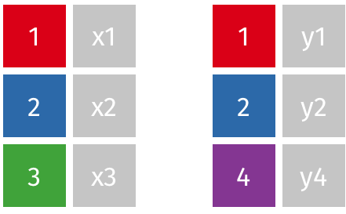
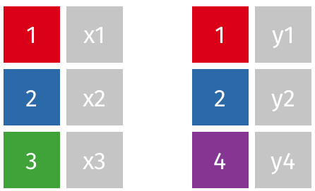
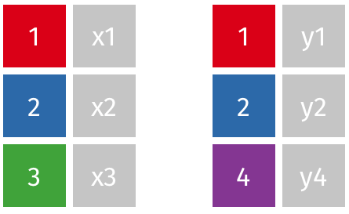
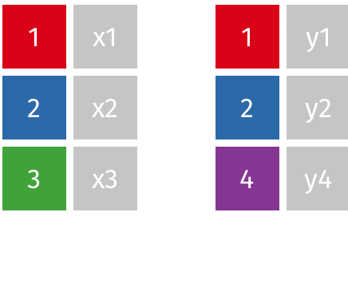

```{r setup, include=FALSE}
knitr::opts_chunk$set(echo = FALSE)
library(tidyverse)
#setwd("~/Archivos/teaching/MAD/0Slides/stat1291")
#setwd("C:/Users/pedro/Dropbox/MAD/0Slides/stat1291")
library(rmarkdown)
#render("filename.Rmd")     
#browseURL("filename.html")
#[//]: # (Comment: rintro.r)
```

## Múltiples tablas de datos

* Una tabla (conjunto de datos) recuerda a una hoja de cálculo bien organizada 

* Igual que existen libros de hojas de cálculo, el análisis de datos raramente implica una única tabla 

* ¿Por qué múltiples tablas? Es más eficiente almacenar y buscar "elementos similares" dentro de una tabla" y diferentes entre ellas.

* **Datos relacionales**: múltiples tablas de datos con relaciones entre cada par de tablas

* Las tablas se organizan/relacionan mendiante identificadores únicos llamados **claves** en un sistema de gestión de base de datos relacional


## Introducción con los datos `nycflights13` 

```{r, message = FALSE, echo = TRUE, eval = FALSE}
library("tidyverse")
library("nycflights13")
```

* Varios conjuntos de datos sobre los vuelos (NY 2013); p.e., en la parte de vuelos `flights`
```{r, message = FALSE, echo = TRUE, eval = FALSE}
flights %>% 
  select(dep_time,arr_time,carrier:dest) %>% 
  head(10)
```

* Algunas variables están "codificadas": p.e., el nombre completo de la compañia se encuentra en `airlines`

```{r, message = FALSE, echo = TRUE, eval = FALSE}
airlines %>% head()
```
* Ambas tablas contienen un identificador único **clave** ("key"):  `carrier`

## Relaciones entre tablas


<!--

* `flights` se conecta con `airlines` a través de `carrier`.

* `flights` conecta con `planes` a través de `tailnum`.

* `flights` se conecta a los `airports` de dos maneras: `origin` y `dest`.

* `flights` se conecta a `weather` a través de `origin` (el lugar) y  `year`, `month`, `day` y `hour` (el tiempo).
-->

## Tipos de Claves 

* **Clave primaria**: identifican de forma única cada observación en una tabla

    * En `planes`, *una sola variable* es suficiente `tailnumber`
    
    * En `weather`, se necesitan *múltiples variables*: año, mes, día, hora y origen.

<!--
    * Es conveniente verificar que las claves primarias realmente identifican de manera única cada observación. -->

```{r, message = FALSE, echo = TRUE, eval = FALSE}
planes %>% count(tailnum) %>% filter(n > 1)
#table(planes$tailnum)
```

* **Clave externa**: señala la clave primaria de otra tabla. 
<!-- Asegura la integridad referencial. -->

    * `tailnumber` es clave externa en `flights`

    * una variable puede ser clave primaria y externa: `origin` en `weather` y `airports`

* **Clave subrogada**: la tabla carece de identificación única y se crea por número de fila

<!--
* A veces una tabla no tiene una clave de intenficación única:
```{r, message = FALSE, echo = TRUE, eval = FALSE}
flights %>% 
  count(year, month, day, flight) %>% 
  filter(n > 1)
```
Si una tabla carece de clave primaria, a veces es útil añadir una con `mutate()` y `row_number()`. 
-->

## Tipos de relaciones entre tablas

* Una clave primaria y la correspondiente clave externa en otra tabla forman una **relación**.

* Pueden ser de cuatro tipos:

    1. de-uno-a-muchos. Es el caso más frecuentes. 
  
        + Ej., cada vuelo tiene un avión, pero cada avión tiene muchos vuelos. 

    2. de-uno-a-uno. Puede verse como un caso especial de uno a muchos. 

    3. de-muchos-a-muchos. 

        + Ej., entre aerolíneas y aeropuertos: cada aerolínea vuela a muchos aeropuertos; cada aeropuerto alberga muchas aerolíneas.

    4. de-muchos-a-uno


## Operaciones con dos tablas

* **Uniones de mutación** ("Mutating joins"): añade nuevas variables a una tabla desde filas coincidentes en otra.  

* **Uniones de filtrado** ("Filtering joins"): filtra las observaciones de una tabla basándose en si coinciden o no con una observación de la otra tabla. 

* **Operaciones de conjunto** ("Set operations"): combinan las observaciones en los conjuntos de datos como si fueran elementos de un conjunto.    


* Esta discusión asume que tenemos datos ordenados (*tidy*):
    + las filas son observaciones 
    + las columnas son variables

## *Mutating joins*

* Los verbos de unión tiene dos argumentos obligatorios: las tablas que se unen

* Una unión para añadir los nombres de las compañías a los datos de vuelo:
```{r, message = FALSE, echo = TRUE, eval = FALSE}
library("nycflights13")
flights2 <- flights %>% 
  select(year:day, hour, origin, dest, tailnum, carrier)
left_join(flights2, airlines)
```

* Con tuberías:
```{r, message = FALSE, echo = TRUE, eval = FALSE}
flights2 %>% 
  left_join(airlines)
```

## Argumento `by`: cómo se emparejan las tablas

<!--
* Las uniones tiene un argumento adicional, `by`: controla qué variables se usa para hacer coincidir las observaciones
-->

* Por defecto se usan todas las variables que aparezcan en ambas tablas <!--(unión natural). -->

<!--    + P.e., vuelos y meteorología coinciden en año, mes, día, hora y origen.--> 
```{r, message = FALSE, echo = TRUE, eval = FALSE}
flights2 %>% left_join(weather)
```

* `by = "a"` para usar sólo algunas de las variables comunes. 
    + P.e., `flights` y `planes` tienen año, pero significan cosas diferentes; unimos solo por `tailnum`
```{r, message = FALSE, echo = TRUE, eval = FALSE}
flights2 %>% left_join(planes, by = "tailnum")
```
<!-- Nótese que las columnas de año en la salida se desambigúan con un sufijo. -->

* `by = c ("b" = "d")` para emparejar la variable `b` en la primera tabla `x` con la variable `d` en la segunda `y`. <!--Las variables usadas para la unión también se utilizarán en la tabla de salida.-->
    + P.e., el vuelo tiene un aeropuerto de origen y destino, ¿a cuál lo unimos?
```{r, message = FALSE, echo = TRUE, eval = FALSE}
flights2 %>% left_join(airports, c("dest" = "faa"))
flights2 %>% left_join(airports, c("origin" = "faa"))
```

## Tipos de unión de mutuación

```{r, message = FALSE, echo = TRUE, eval = TRUE}
df1 <- tibble(clave = c(1:3), val_x = c("x1", "x2", "x3"))
df2 <- tibble(clave = c(1:2, 4), val_y = c("y1","y2","y3"))
```

* `inner_join(x, y)` sólo incluye observaciones que coincidan en `x` y `y`.
```{r, message = FALSE, echo = TRUE, eval = FALSE}
df1 %>% inner_join(df2)
```


:::: {style="display: grid; grid-template-columns: 1fr 1fr; grid-column-gap: 10px; "}

::: {}


{width=102%}

:::

::: {}

<center>



</center>
:::

::::


* Uniendo dos series temporales con periodos diferentes: [PIB](https://fred.stlouisfed.org/series/GDPC1) y [consumo](https://fred.stlouisfed.org/series/MEHOINUSA672N)

## Tipos de unión de mutuación: uniones externas

:::: {style="display: grid; grid-template-columns: 1fr 1fr; grid-column-gap: 10px; "}

::: {}


* `left_join(x, y)`
* `right_join(x, y)`
* `full_join(x, y)`


* Cuando una fila no coincide en una unión externa, las nuevas variables se rellenan como valores ausente con NA. 

:::

::: {}

<center>

{width=80%}

</center>
:::

::::


## Tipos de unión de mutuación: `left_join()`

* `left_join(x, y)` incluye todas las observaciones en `x`, coinciden o no con la de `y`. 

```{r, message = FALSE, echo = TRUE, eval = FALSE}
df1 %>% left_join(df2)
```

* Usada habitualmente porque asegura que no pierda observaciones de su tabla primaria.




## Tipos de unión de mutuación: `right_join()`

* `right_join(x, y)` incluye todas las observaciones en `y`. 

* Equivalente a `left_join (y, x)` pero las columnas se ordenan de forma diferente.

```{r, message = FALSE, echo = TRUE, eval = FALSE}
df1 %>% right_join(df2)
df2 %>% left_join(df1)
```




## Tipos de unión de mutuación: `full_join()`

* `full_join()` incluye todas las observaciones de `x` e `y`.
```{r, message = FALSE, echo = TRUE, eval = FALSE}
df1 %>% full_join(df2)
```



## Uniones de mutuación como conjuntos

{width=95%}

* PERO un diagrama de Venn no puede mostrar lo que sucede cuando las claves no identifican una observación de manera única.

## Claves duplicadas
<!--
* Las uniones de mutación también pueden generar nuevas observaciones. 
-->

<!--
* Si una coincidencia no es única (claves duplicadas), una unión añade nuevas observaciones
-->

* Si una coincidencia no es única, se generan todas las combinaciones posibles (producto cartesiano) de las observaciones coincidentes

* **Solo una tabla** tiene claves duplicadas. 

    + añade información adicional en una relación de uno a muchos.

{width=52%}

```{r, message = FALSE, echo = TRUE, eval = FALSE}
df1dup <- tibble(clave = c(1, 2, 2, 1), val_x = c("x1", "x2", "x3", "x4"))
df2dup <- tibble(clave = c(1, 2), val_y = c("y1", "y2"))
df1dup %>% left_join(df2dup)
```

## Claves duplicadas (cont.)

* **Ambas tablas** tienen claves duplicadas. 

  + puede ser un error: las claves no identifican únicamente una observación en ninguna de las dos tablas 
  + igualmente, se obtienen todas las combinaciones posibles
  
{width=45%}

```{r, message = FALSE, echo = TRUE, eval = FALSE}
df1dup2 <- tibble(clave = c(1, 2, 2, 3), val_x = c("x1", "x2", "x3", "x4"))
df2dup2 <- tibble(clave = c(1, 2, 2, 3), val_y = c("y1", "y2", "y3", "y4"))
df1dup2 %>% left_join(df2dup2)
```

<!--
#### Observación

La función `base::merge()`  puede realizar los cuatro tipos de unión de mutación (usando las opciones `all.x = ` y `all.y = `, ver ayuda). Las ventajas de los verbos específicos de `dplyr` es que expresan más claramente la intención del código: la diferencia entre las uniones es realmente importante pero está oculta en los argumentos de `merge()`. Las uniones de dplyr son considerablemente más rápidas y no alteran el orden de las filas.
-->

## *Filtering joins*: `semi_join()`

* Las uniones de filtrado emparejan observaciones pero **afectan a las observaciones**, no a las variables

* `semi_join(x, y)` mantiene todas las observaciones en `x` que coinciden en `y`.


```{r, message = FALSE, echo = TRUE, eval = FALSE}
df1 %>% semi_join(df2)
```


## *Filtering joins*: `anti_join()`

* `anti_join(x, y)` elimina todas las observaciones en `x` que coinciden en `y`.


```{r, message = FALSE, echo = TRUE, eval = FALSE}
df1 %>% anti_join(df2)
```

## *Filtering joins*: claves duplicadas

* En las uniones de filtrado sólo importa la existencia de una coincidencia, NO qué observación coincida. 

* Por tanto, NUNCA duplica filas


```{r, message = FALSE, echo = TRUE, eval = FALSE}
df1dup2 %>% semi_join(df2dup2)
```

## Aplicaciones de `anti_join()` y `semi_join()`

* `anti_join()` es útil para diagnosticar desajustes de uniones. 

* Muchos vuelos en `nycflights13` no tienen `tailnum`
```{r, message = FALSE, echo = TRUE, eval = FALSE}
library("nycflights13")
flights %>% 
  anti_join(planes, by = "tailnum") %>% 
  count(tailnum, sort = TRUE)
```

* Si nos preocupa qué observaciones serán emparejadas, se debe empezar por un `semi_join()` o `anti_join()` porque nunca duplican (solo eliminan) <!-- observaciones)-->

<!--
```{r, message = FALSE, echo = TRUE, eval = FALSE}
df1dup3 <- tibble(clave = c(1, 1, 3, 4), val_x = c("x1", "x2", "x3", "x4"))
df2dup3 <- tibble(clave = c(1, 1, 2), val_y = c("y1", "y2", "y1"))

# Cuatro filas para empezar:
df1dup3 %>% nrow()
# Y tenemos cuatro filas después de la unión
df1dup3 %>% inner_join(df2dup3, by = "clave") %>% nrow()
df1dup3 %>% inner_join(df2dup3, by = "clave")
# Pero sólo dos filas en realidad coinciden
df1dup3 %>% semi_join(df2dup3, by = "clave") %>% nrow()
df1dup3 %>% semi_join(df2dup3, by = "clave")
```
-->

## Operaciones de conjunto

* Esperan que las entradas `x` e `y` tengan las **mismas variables**, y tratan las observaciones como conjuntos.

* `intersect(x, y)`: devuelve solo las observaciones (filas) tanto en `x` como en  `y`  
* `union(x, y)`: devuelte las observaciones únicas en ambas tablas `x` e `y`  
* `setdiff(x, y)`: devuelte las observaciones en `x`, pero no en `y`.  

## Operaciones de conjunto (cont.)


```{r, message = FALSE, echo = TRUE, eval = FALSE}
df1 <- tibble(x = 1:2, y = c(1, 1))
df2 <- tibble(x = c(1,1), y = 1:2)
```

* Las cuatro posibilidades son:
```{r, message = FALSE, echo = TRUE, eval = FALSE}
intersect(df1, df2)   # inner_join(df1,df2)
union(df1, df2)       # full_join(df1,df2)   # Notad que tenemos 3 filas, no 4
setdiff(df1, df2)     # anti_join(df1,df2)
setdiff(df2, df1)     # anti_join(df2, df1)
```


## Equivalencia con bases de datos SQL
```{r, echo=FALSE, eval=TRUE, message=FALSE, warning=FALSE}
library(kableExtra)
#library(knitr)
tabla <- tribble(
     ~dplyr           ,     ~SQL                                                               ,
  "inner_join()"      ,	"SELECT * FROM x JOIN y ON x.a = y.a"                                  ,
  "left_join()"       ,	"SELECT * FROM x LEFT JOIN y ON x.a = y.a"                             ,
  "right_join()"      ,	"SELECT * FROM x RIGHT JOIN y ON x.a = y.a"                            ,
  "full_join()"       ,	"SELECT * FROM x FULL JOIN y ON x.a = y.a"                             ,
  "semi_join()"       ,	"SELECT * FROM x WHERE EXISTS (SELECT 1 FROM y WHERE x.a = y.a)"       ,
  "anti_join()"       ,	"SELECT * FROM x WHERE NOT EXISTS (SELECT 1 FROM y WHERE x.a = y.a)"   ,
  "intersect(x, y)"   ,	"SELECT * FROM x INTERSECT SELECT * FROM y"                            ,
  "union(x, y)"       ,	"SELECT * FROM x UNION SELECT * FROM y"                                ,
  "setdiff(x, y)"     , "SELECT * FROM x EXCEPT SELECT * FROM y"                              
)
tabla %>%
  kbl()  %>%
  kable_paper("hover", full_width = F, font_size = 22)
```

<!--

* `inner_join()`:	`SELECT * FROM x JOIN y ON x.a = y.a`  
* `left_join()` :	`SELECT * FROM x LEFT JOIN y ON x.a = y.a`  
* `right_join()`:	`SELECT * FROM x RIGHT JOIN y ON x.a = y.a`  
* `full_join()` :	`SELECT * FROM x FULL JOIN y ON x.a = y.a`  
* `semi_join()` :	`SELECT * FROM x WHERE EXISTS (SELECT 1 FROM y WHERE x.a = y.a)`  
* `anti_join()` :	`SELECT * FROM x WHERE NOT EXISTS (SELECT 1 FROM y WHERE x.a = y.a)`  
* `intersect(x, y)`:	`SELECT * FROM x INTERSECT SELECT * FROM y`  
* `union(x, y)`    :	`SELECT * FROM x UNION SELECT * FROM y`  
* `setdiff(x, y)`  : `SELECT * FROM x EXCEPT SELECT * FROM y`  
-->

* SQL soporta más tipos de unión y puede trabajar con más de dos tablas.

<!--
Como sugiere esta sintaxis, SQL soporta un rango más amplio de tipos de unión que `dplyr` porque se pueden conectar las tablas usando restricciones diferentes a la igualdad (algunas veces llamadas no-equijoins).

`x` and `y` no tienen que ser tablas en la misma base de datos. Si especifica `copy = TRUE`, `dplyr` copiará la tabla `y` en el mismo lugar que `x`. 

[//]: # (originalmente era
en el mismo lugar que la variable `x`. Esto es útil si ha descargado un conjunto de datos resumido y ha determinado un subconjunto para el que desea obtener los datos completos.
)

Hay que revisar las reglas de coerción. Por ejemplo, los factores se conservan sólo si los niveles coinciden exactamente; pero si sus niveles son diferentes, los factores se "coaccionan" (se fuerza su conversión) a tipo de carácter.

En este momento, `dplyr` no proporciona ninguna función para trabajar con tres o más tablas.

-->
