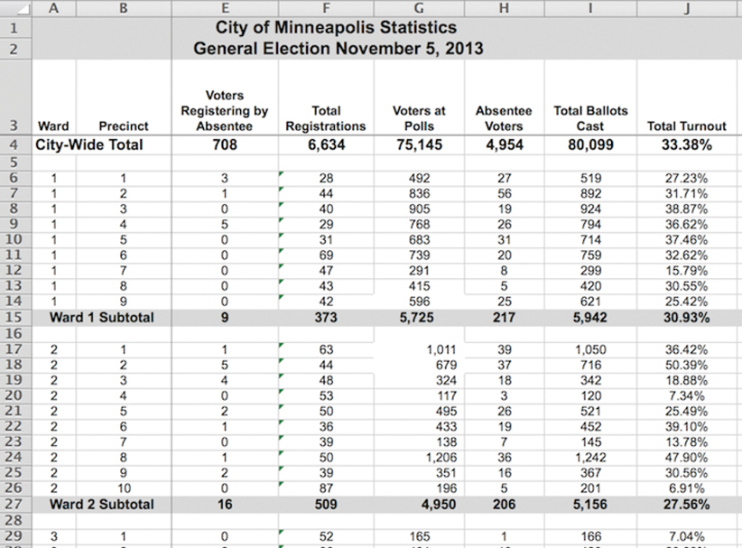
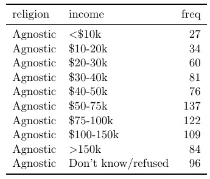
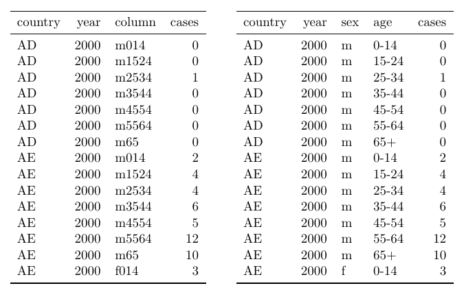
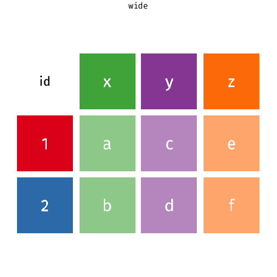

```{r setup, include=FALSE}
knitr::opts_chunk$set(echo = FALSE)
library(tidyverse)
#setwd("~/Archivos/teaching/MAD/0Slides/stat1291")
#setwd("C:/Users/pedro/Dropbox/MAD/0Slides/stat1291")
library(rmarkdown)
#render("filename.Rmd")     
#browseURL("filename.html")

#[//]: # (Comment: rintro.r)
```

## ¿Qué son datos ordenados ('tidy data')?

Los datos pueden ser tan simples como una columna de números en una hoja de cálculo o tan complejos como los registros de todos los departamentos de una empresa (almacen, logística, ventas, recursos humanos, contabilidad, gestión, etc.). Necesitamos operar con un pequeño conjunto de herramientas estándar, para preparar los datos (limpieza, organización) y así facilitar su análisis.

Un conjunto de datos ordenado es una colección de valores, generalmente o bien números (si son cuantitativos) o bien caractéres/factores (si son cualitativos). Los valores se organizan de dos maneras. Cada valor pertenece a:

  * Una **variable**, que contiene todos los valores que miden el mismo *atributo* subyacente (como la altura, la temperatura o la duración) entre las unidades;
  
  * Una **observación (caso)**, que contiene todos los valores medidos en la misma *unidad* (como una persona, día o recinto) a través de atributos.
  

  
Conseguir que los datos lleguen a estar en un formato adecuado requiere un trabajo inicial, pero merece la pena a largo plazo. Una vez que los datos estén bien ordenados y organizados con las herramientas de `tidyr`, se puede dedicar más tiempo al análisis de los datos en lugar de adaptarlos a las necesidades de cada representación o modelo.
  
## Datos no ordenados

Hay muchas estructuras de datos útiles y bien fundadas que no son datos ordenados. Existen dos razones principales para utilizar otras estructuras de datos:

  * Las representaciones alternativas pueden tener ventajas sustanciales en cuanto a rendimiento o espacio.

  * Algunos campos especializados han desarrollado sus propias convenciones para almacenar datos que pueden ser muy diferentes a las convenciones de los datos ordenados.

Cualquiera de estas razones significa que se necesita algo más que un *data frame*. Si nuestros datos encajan de forma natural en una estructura rectangular compuesta por observaciones y variables, los datos ordenados deberían ser la opción predeterminada. Pero hay buenas razones para usar otras estructuras; los datos ordenados no son la única manera.

### Ejemplos

```{r, message = FALSE, echo = TRUE, eval = FALSE}
library(tidyverse)
```

¿Están ordenados los siguientes ejemplos?

#### 1. Resultados de la elección de la alcaldía de Minneapolis.


No está en un formato ordenado, aunque la visualización sea atractiva y elegante. Esta tabla viola la primera regla para los datos ordenados.

  * Regla 1: Las filas, llamadas casos, deben representar cada una el mismo atributo subyacente, es decir, el mismo tipo de cosa. 
  
  * Regla 2: Cada columna es una variable que contiene el mismo tipo de valor para cada caso.

La regla 1 se incumple porque, aunque las filas representan un solo distrito ('precint') en la mayor parte de la tabla, otras filas dan totales de barrio ('ward') o ciudad. Las dos primeras filas son leyendas que describen los datos, no casos. Para que los datos estén ordenados, es necesario eliminar ciertas filas de la hoja de cálculo.

#### 2. Datos de `UCBAdmissions`

`UCBAdmissions` contiene datos agregados sobre los solicitantes a la escuela de postgrado de Berkeley para los seis departamentos más grandes en 1973 clasificados por admisión y sexo. Los datos están bien organizados, pero es una tabla tridimensional (array), no un  *dataframe*.

```{r, message = FALSE, echo = TRUE, eval = FALSE}
data("UCBAdmissions")
UCBAdmissions[,,1:2]
```

¿Mejor de esta manera?
```{r, message = FALSE, echo = TRUE, eval = FALSE}
(narrow_tbl <- as_tibble(UCBAdmissions))
```

Compare las primeras cuatro líneas de `narrow_tbl` (arriba), con la siguiente tabla en el conjunto de datos original.
```{r, message = FALSE, echo = TRUE, eval = FALSE}
(wide_tbl <- UCBAdmissions[,,1])
```

Se puede pensar que `wide_tbl` es mejor para verlo. ¿Pero está ordenado? ¿Es `narrow_tbl` ordenado?

#### 3. Rendimiento de los corredores en una carrera de 10 millas, a lo largo del tiempo


¿Está ordenado el conjunto de datos? La respuesta depende del análisis que se tenga en mente. En muchos casos, se necesitaría separar en dos partes la información de la primera columna.

¿Qué significa un caso aquí? Es tentador pensar que un caso es una persona. Después de todo, son las personas las que corren carreras de carretera. Pero note que los individuos aparecen más de una vez... Esto sugiere que un caso es un corredor en una carrera de un año, que se identifica por una combinación de `name.yob` y `year`.

Incluso así, la información de la tabla es **redundante**. Existe información de dos tipos: información de la carrera e información personal de los corredores. Probablemente lo mejor sea dividir este conjunto de datos en dos tablas: una de la carrera (año, ganador, tiempo) y otra de los corredores (nombre, año de nacimiento, sexo, edad).

<!--

## Problemas comunes

### 1. Las cabeceras de columna son valores, no nombres de variables

Un tipo común de conjunto de datos desordenado son los datos tabulares diseñados para su presentación, donde las variables forman tanto las filas como las columnas, y las cabeceras de columna son valores, no nombres de variables. También ofrece almacenamiento eficiente para algunos diseños de datos.

Por ejemplo, este conjunto de datos 


tiene realmente tres variables: religión, ingreso (la variable que aparece por columnas) y frecuencia. La forma ordenada sería:


Este problema suele aparecer con frecuencia con información en el tiempo: se tienen varias columnas para el valor de una variable (ej., ventas) en distintos años (ventas2000, ventas2001, etc.)

### 2. Múltiples variables almacenadas en una columna

A veces, para ahorrar espacion de almacenamiento, una misma columna tiene información sobre varias variables (atributos), como en la tabla de la izquierda. La variable `column` mezcla sexo y rango de edad.



-->
## Consejos para datos ordenados

1. Guardar las cosas similares juntas ("Cada oveja con su pareja.")

2. Ninguna información redundante

Por tanto, las tablas de datos tienden a ser:

  * largas (con muchas filas)
  
  * estrechas (con pocas columnas)

  * eficiente en términos de velocidad de almacenamiento y recuperación
  
El  "problema" de este concepto está en que no es tan útil si no sabes cómo hacer uniones (!).


[//]: # (We will use an R package dplyr to transform a wide table to a narrow table (and vice versa), and to separate a column into to (and its inverse), using the following verbs.
    gather(), spread(), separate() and unite().)


## Ordenando datos con `tidyr`


El paquete `dplyr` incluye `tidyr`, cuyo objetivo es ayudarnos a crear *datos ordenados* ('tidy data'). Los datos ordenados son datos donde:

  1. Cada variable está en una columna.

  2. Cada observación es una fila.

  3. Cada valor es una celda.

Los datos ordenados describen una forma estándar de almacenar los datos que se utiliza siempre que es posible en todo el `tidyverse`. Si nos aseguramos de que los datos estén ordenados, gastaremos menos tiempo luchando con las herramientas y más tiempo trabajando en su análisis.

Comparemos tres conjuntos de datos:
```{r, eval=FALSE, echo=TRUE}
# tormentas
storms <- read.csv("data/storms.csv")
storms

# casos de tuberculosis
cases <- read.csv("data/cases.csv")
names(cases) <- c("country","2011","2012","2013")
cases

#contaminación
pollution <- read.csv("data/pollution.csv")
pollution
```

Mientras que en `storms` se cumplen las condiciones de datos ordenados en los otros dos conjuntos de datos, tenemos distintos problemas. 

  * En `cases` los nombres de columna nombres de columna `2011`, `2012` y `2013` representan valores de la variable del año, y cada fila representa tres observaciones, no una.
  
  * En `pollution`, una observación se dispersa en múltiples filas.

  

En `storms` podemos acceder de forma fácil a los casos (observaciones) de cada atributo (variable)

```{r, eval=FALSE, echo=TRUE}
storms$storm
storms$wind
storms$pressure
storms$date
```

Sin embargo, para conocer las variables del conjunto de datos y sus observaciones tendríamos que hacer algo tan complicado como lo siguiente en cada caso:

```{r, eval=FALSE, echo=TRUE}
cases$country
names(cases)[-1]
unlist(cases[1:3, 2:4])
 
pollution$city[c(1,3,5)]
pollution$amount[c(1,3,5)]
pollution$amount[c(2,4,6)]
```

En `storms` es trivial calcular una nueva variable como la ratio de presión atmosférica y velocidad del viento. En las otras dos no es fácil mostrar la tasa de crecimiento de los casos de tuberculosis o la ratio de concentración de contaminación por partículas grandes o pequeñas.

## Cambiar la forma de una tabla ("dataframe")

Los mismos datos se pueden almacenar en un rectángulo ancho ("wide") o en un rectángulo largo ("long""). 


Aunque la misma información se puede almacenar en ambas representaciones, estas difieren en su utilidad para ciertos tipos de operaciones o en la facilidad con que se pueden utilizar en un análisis estadístico. También vale la pena señalar que hay más que sólo representaciones largas o amplias de los datos. El formato largo es similar al formato ordenado que defiende `tidyverse`. 

El cambio de forma ("reshaping") de una tabla entre formato largo y formato ancho es una de las tareas diarias del analista de datos. Cambiar entre representación larga y ancha se conoce como pivotar (o girar). 

La siguiente animación muestra la idea general de cómo las celdas en un formato se reordenan en el otro formato, con los metadatos relevantes que no se reordenan siendo extendidos o reducidos según sea necesario para que no perdamos ninguna información. 




## Verbos principales en `tidyr`

Hay dos verbos fundamentales para ordenar los datos:
<!--
  * `gather()` toma múltiples columnas, y las reúne en pares clave-valor. Cambia la forma de los datos de "anchos" a "largos" (*wide-to-long*).


  * `spread()` toma dos columnas (clave y valor) y las extiende en múltiples columnas. Cambia la forma de los datos "largos" a formato "ancho" (*long-to-wide*).

-->

  * `pivot_longer()` cambia la forma de los datos de "anchos" a "largos" (*wide-to-long*), aumentando el número de filas y disminuyendo el número de columnas.  Se usa para ordenar los datos originales en bruto, organizados para facilitar la recogida de información, en lugar de facilitar el análisis.

  * `pivot_wider()` cambia la forma de los datos "largos" a formato "ancho" (*long-to-wide*), aumentando el número de columnas y disminuyendo el número de filas. Es raro necesitarlo para conseguir datos ordenados, pero es útil para crear tablas de resumen, o datos en un formato que necesitan otras herramientas.


 La longitud es un término relativo, y sólo se puede decir (por ejemplo) que el conjunto de datos A es más largo que el conjunto de datos B.

El paquete `tidyr` también proporciona otros dos verbos importantes:

  * `separate()`, que facilita separar una columna que representa múltiples variables
  
  
  * `unite()`, que es el complemento/inverso de `separate()` (une varias columnas)


## De ancho a largo 

Como hemos visto en `cases`, un problema común es un conjunto de datos en el que algunos de los nombres de columna no son nombres de variables, sino valores de una variable. Queremos obtener un conjunto de datos ordenados donde aparezcan claramente las tres variables / atributos que hemos identificado: país, año y número de casos.

Para ordenar un conjunto de datos como este, necesitamos reunir esas columnas en un nuevo par de variables. Para describir esa operación necesitamos tres parámetros:

  * Conjunto de columnas que representan valores, no variables. En este ejemplo, esas son las columnas 2011, 2012 y 2013.

  * El nombre de la variable cuyos valores forman los nombres de columna. Se denomina, clave (*key*), y aquí es el año.

  * El nombre de la variable cuyos valores se distribuyen por las celdas. Se denomina valor, y aquí es el número de casos.


En el resultado final, una nueva columna con la clave (nombre de las antiguas columnas)


y otra nueva columna con el valor (antiguas celdas)


Los argumentos del verbo `pivot_longer()` por tanto son:

  1. el *data frame* a cambiar de forma
  
  2. nombre de la nueva columna de la clave (cadena de caracteres)
  
  3. nombre de la nueva columna de valor (cadena de caracteres)
  
  4. nombres o índice numerico de las columnas a colapsar
  

```{r, eval=FALSE, echo=TRUE}
pivot_longer(cases, 2:4,"year","numero")

cases %>% pivot_longer(cols = c("2011","2012","2013"), names_to = "year", values_to="numero")

cases %>% pivot_longer("2011":"2013", names_to = "year", values_to = "numero")

cases %>% pivot_longer(names_to = "year", values_to = "numero", -country)
```


### ¿Por qué ordenar los datos?


[//]: # (hacer como beanumber cases2 <- as.data.frame(t(as.matrix(cases))))

Además de las razones antes discutidas, notad que en el formato original no podíamos realizar un simple gráfico de la evoluación temporal del número de casos por países. Con los datos ordenados, esto resulta trivial:


```{r, eval=FALSE, echo=TRUE}
cases_ordenado <- cases %>% pivot_longer(names_to = "year", values_to = "numero", cols =-country)

ggplot(data = cases_ordenado, aes(x = year, y=numero, color = country) ) +
  geom_point() 
```

### Datos de caracteres en los nombres de las columnas

Habitualmente las columnas de los datos originales a convertir en formato largo serán de forma natural una variable de tipo caracter. Por ejemplo, los datos `relig_income` contiene tres variables:

* religión,  en las filas,

* renta, repartidata entre los nombres de las columnas, y

* valores de las celdas

Ordenamos los datos de la siguiente manera

```{r, echo=TRUE, eval=FALSE}
relig_income 

relig_income %>% 
  pivot_longer(-religion, names_to = "income", values_to = "count")

```
### Datos numéricos en los nombres de las columnas

Los datos de `billboard' contiene el rankin de canciones en el año 2000, semana a semana. Los datos codificados en los nombres de las columnas son realmente un número, no caracteres. Los nombres se convertirán en una variable llamada `week`, y que los valores se conviertan en una variable llamada `ranking`. También se utiliza `values_drop_na` para eliminar filas con valores faltantes, dado que no todas las canciones permanecen en las listas de éxitos durante 76 semanas.

```{r, echo=T, eval=F}
billboard
billboard %>% 
  pivot_longer(
    cols = starts_with("wk"), 
    names_to = "week", 
    values_to = "rank",
    values_drop_na = TRUE)


```
Necesitarimos que `week` fuera una variable numérica (entero) para hacer cálculos como el numero de semanas que una canción estuvo enla ista de éxitos. Podemos usar dos argumentos adicionales: `names_prefix` para eliminar el prefijo `wk` y `names_ptypes` para especificar el tipo de variable:

```{r, echo=T, eval=F}
billboard %>% 
  pivot_longer(
    cols = starts_with("wk"), 
    names_to = "week", 
    names_prefix = "wk",
    names_ptypes = list(week = integer()),
    values_to = "rank",
    values_drop_na = TRUE,
  )
```


## De largo a ancho 

Extender de largo a ancho (*pivot_wider()*) es lo opuesto a recoger de ancho a largo (*pivot_longer()*). Se usa cuando una observación se dispersa en varias filas. Por ejemplo, en `pollution` una observación es la contaminación de una ciudad, pero cada observación se distribuye en dos filas según el tipo de partícula contaminante. Queremos obtener un conjunto de datos ordenados donde aparezcan claramente las tres variables / atributos que hemos identificado: ciudad, contaminación por partículas grandes y contaminación por partículas pequeñas.

Para ordenar esto, primero analizamos la representación de manera similar a `pivot_longer()`. Esta vez, sin embargo, sólo necesitamos dos parámetros:

  * La columna que contiene nombres de variables, la columna clave. Aquí, tamaño (*size*).
  


  * La columna que contiene valores de las múltiples variables nuevas, la columna de valores. Aquí, la cantidad (*size*).


Así podemos expandir el conjunto orignal de datos:


Los argumentos del verbo `pivot_wider()` por tanto son:

  1. el *data frame* a cambiar de forma
  
  2. nombre de la columna a usar para las clave, de cuyos valores saldran los nuevos nombres de columnas
  
  3. nombre a usar para los valores, para las celdas de las nuevas columnas
  
```{r, eval=FALSE, echo=TRUE}
pivot_wider(pollution, names_from =  size, values_from = amount)

pollution %>% 
  pivot_wider(names_from = size, values_from = amount )

```

## Separar y unir

### `separate()`

En algunas ocasisiones, una columna del conjunto de daots contiene dos variables. Por ejemplo, la variable de fecha en `storms` tiene tres variables "ocultas": año, mes y día.

El verbo `separate()` separa una columna en varias columnas, dividiéndola donde quiera que aparezca un carácter separador. Por tanto, los argumentos de `separate()` son el *date frame*, la variable a separar, los nombres de las nuevas variables y el carácter separador (estrictamente, hablando una expresión regular):


```{r, eval=FALSE, echo=TRUE}
storms2 <- separate(storms, date, c("year", "month", "day"), sep = "-")
storms2

storms %>% 
  separate(date, into = c("year", "month", "day"), sep = "-")
```

Si observamos cuidadosamente los tipos de columnas: notaremos que el año, mes y día son columnas de caracteres. Este es el comportamiento por defecto en `separate()`: deja el tipo de columna tal como está. Aquí, sin embargo, no es muy útil, ya que realmente son números. Podemos pedir a `separate()` que trate de convertir a mejores tipos usando `convert = TRUE`:


```{r, eval=FALSE, echo=TRUE}
storms %>% 
  separate(date, into = c("year", "month", "day"), sep = "-", 
           convert = TRUE)
```

También puede pasar un vector de números enteros al argumento `sep` para que `separate()` interprete los números enteros como posiciones en las que dividirse. Los valores positivos comienzan en 1 en el extremo izquierdo de la cadena de caracteres; los valores negativos comienzan en -1 en el extremo derecho. Cuando se utilizan números enteros para separar cadenas, la longitud de `sep` debe ser uno menos que el número de nombres del argumento `into`.

Puede utilizar este arreglo para separar los dos últimos dígitos de cada año. Esto hace que estos datos sean menos ordenados, pero es útil en otros casos.
```{r, eval=FALSE, echo=TRUE}
storms %>% 
  separate(date, into = c("year", "month", "day"), sep = "-") %>% 
  separate(year, into = c("siglo", "decada"), sep = 2)  
```

### `unite()`

El verbo `unite()` es el inverso de `separate()`: combina múltiples columnas en una sola columna. Se necesita con mucha menos frecuencia que en el caso de `separate()`, pero sigue siendo una herramienta útil. Toma como argumentos un *data frame*, el nombre de la nueva variable a crear y un conjunto de columnas a combinar.

```{r, eval=FALSE, echo=TRUE}
unite(storms2, "date", year, month, day)
```

También existe un argumento opcional, `sep`. El valor por defecto colocará un subrayado (_) entre los valores de diferentes columnas. Podemos cambiarlo especificando explícitamente el valor que deseamos.

```{r, eval=FALSE, echo=TRUE}
unite(storms2, "date", year, month, day, sep = "-")
```

Si no deseamos ninguna separación, debemos indicar `sep=""`.


## Comentario sobre valores ausentes

Cambiar la representación de un conjunto de datos trae consigo una sutileza importante de los valores ausentes. Sorprendentemente, un valor puede faltar en una de dos formas posibles:

  * Explícitamente, es decir, marcado con `NA`.
  
  * Implícitamente, es decir, simplemente no está presente en los datos.

Ilustremos esta idea con un conjunto de datos muy sencillo:


```{r, eval=FALSE, echo=TRUE}
stocks <- tibble(
  year   = c(2015, 2015, 2015, 2015, 2016, 2016, 2016),
  qtr    = c(   1,    2,    3,    4,    2,    3,    4),
  return = c(1.88, 0.59, 0.35,   NA, 0.92, 0.17, 2.66)
)
```

Hay dos valores ausentes en este conjunto de datos:

  * Falta explícitamente la rentabilidad para el cuarto trimestre de 2015, porque la celda donde debería estar su valor contiene `NA`.

  * La rentabilidad para el primer trimestre de 2016 está implícitamente ausente, porque simplemente no aparece en el conjunto de datos.

La forma en que se representa un conjunto de datos puede hacer explícitos los valores implícitos. Por ejemplo, podemos hacer explícito el valor que falta implícito poniendo años en las columnas:

```{r, eval=FALSE, echo=TRUE}
stocks %>% 
  pivot_wider(names_from = year, values_from = return)
```

Debido a que estos valores ausentes explícitos pueden no ser importantes en otras representaciones de los datos, se puede establecer `values_drop_na = TRUE` en `pivot_longer()` para convertir implícitamente los valores explícitos que faltan:

```{r, eval=FALSE, echo=TRUE}
stocks %>% 
  pivot_wider(names_from = year, values_from = return) %>% 
  pivot_longer(cols = c("2015","2016"), names_to = "year", values_to = "return", values_drop_na = TRUE)
```

Otra herramienta importante para hacer explícitos los valores que faltan en los datos ordenados es `complete()`:

```{r, eval=FALSE, echo=TRUE}
stocks %>% 
  complete(year, qtr)
```

Toma un conjunto de columnas y encuentra todas las combinaciones únicas. Luego se asegura de que el conjunto de datos original contiene todos esos valores, rellenando `NA` explícitos cuando sea necesario.
