```{r setup, include=FALSE}
knitr::opts_chunk$set(warning = FALSE, message = FALSE, eval = TRUE, echo = TRUE, results = "hide", fig.show="hide")

library(tidyverse)
library(dlookr)
#setwd("/home/albarran/Dropbox/MAD/00.TEC")
library(rmarkdown)
#render("filename.Rmd")     
#browseURL("filename.html")
```

## ¿Qué son datos ordenados ('tidy data')?

* Los conjuntos rectangulares de datos son tablas con datos ordenados:

1. Cada columna es una **variable**: todos los valores que miden el mismo *atributo* (cuantitativo o cualitativo) o característica <!--subyacente (como la altura, la temperatura o la duración)--> entre unidades
  
2. Cada fila es una **observación (caso)**: todos los valores medidos en la misma *unidad* <!-- (como una persona, día o empresa)--> a través de atributos.

3. Cada celda es un **valor**

<center>
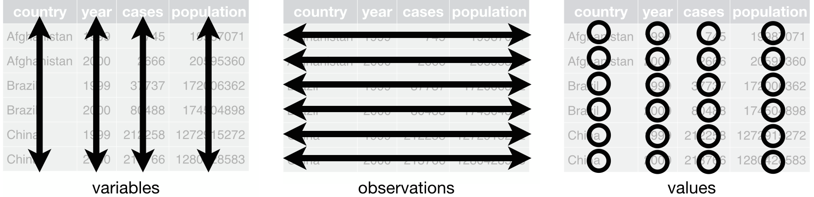{width=95%}
</center>


## Datos no ordenados

* NO todos los conjuntos de datos son ordenados

  - representaciones alternativas con ventajas de rendimiento o espacio
  
  - convenciones específicas para mostrar información

* El trabajo inicial para alcanzar el formato ordenado adecuado merece la pena a largo plazo

* Se puede dedicar más tiempo al análisis de los datos en lugar de adaptarlos a las necesidades de cada representación o modelo
    
* Pero hay buenas razones para usar otras estructuras: los datos ordenados no son la única manera

## Ejemplo: Resultados de la elección a la alcaldía <!--de Minneapolis.-->
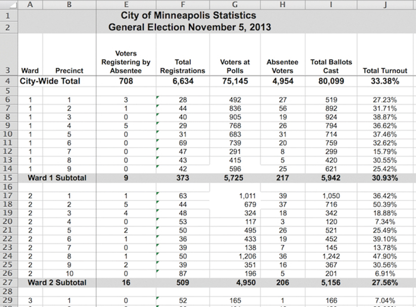{width=75%}

## Ejemplo: Resultados de la elección (cont.)

* La visualización es atractiva y elegante, PERO cualquier tipo de análisis o visualización de datos resulta imposible

  - Ej. distribución de votantes por distrito ('precint')

* Las filas representan a veces un solo distrito ('precint'), pero también hay totales de barrio ('ward') o ciudad

* Las dos primeras filas son leyendas que describen los datos, no casos

* Sería necesario eliminar ciertas filas de la hoja de cálculo

<!--
## Ejemplo: datos de `UCBAdmissions`

`UCBAdmissions` contiene datos agregados sobre los solicitantes a la escuela de postgrado de Berkeley para los seis departamentos más grandes en 1973 clasificados por admisión y sexo. Los datos están bien organizados, pero es una tabla tridimensional (array), no un  *dataframe*.

```{r, message = FALSE, echo = TRUE, eval = FALSE}
data("UCBAdmissions")
UCBAdmissions[,,1:2]
```

¿Mejor de esta manera?
```{r, message = FALSE, echo = TRUE, eval = FALSE}
library(tidyverse)
```

```{r, message = FALSE, echo = TRUE, eval = FALSE}
(narrow_tbl <- as_tibble(UCBAdmissions))
```

Compare las primeras cuatro líneas de `narrow_tbl` (arriba), con la siguiente tabla en el conjunto de datos original.
```{r, message = FALSE, echo = TRUE, eval = FALSE}
(wide_tbl <- UCBAdmissions[,,1])
```

Se puede pensar que `wide_tbl` es mejor para verlo. ¿Pero está ordenado? ¿Es `narrow_tbl` ordenado?

-->

## Ejemplo: ganadores de una carrera

:::: {style="display: flex;"}

::: {}

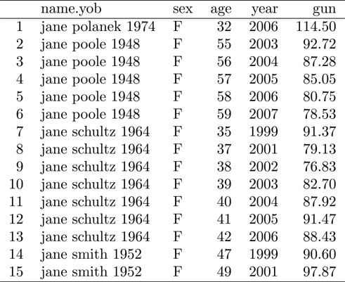
:::

::: {}

* Separar en dos partes la información de la primera columna

* Un caso aquí es la combinación de persona y año en que ganó

* La información es **redundante**: dividirla en dos tablas

    - una de la carrera (año, ganador, tiempo) 
    - otra de los corredores (nombre, año de nacimiento, sexo, edad)

:::

::::

<!--

## Problemas comunes

### 1. Las cabeceras de columna son valores, no nombres de variables

Un tipo común de conjunto de datos desordenado son los datos tabulares diseñados para su presentación, donde las variables forman tanto las filas como las columnas, y las cabeceras de columna son valores, no nombres de variables. También ofrece almacenamiento eficiente para algunos diseños de datos.

Por ejemplo, este conjunto de datos 
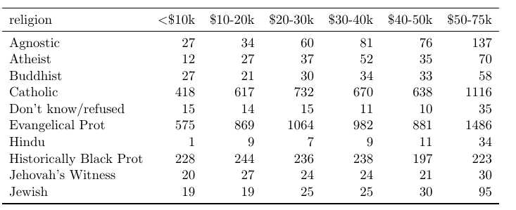

tiene realmente tres variables: religión, ingreso (la variable que aparece por columnas) y frecuencia. La forma ordenada sería:
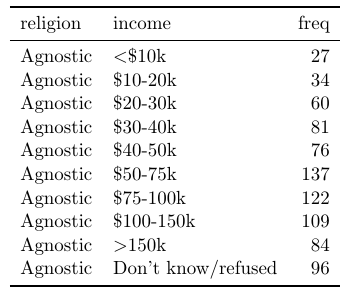

Este problema suele aparecer con frecuencia con información en el tiempo: se tienen varias columnas para el valor de una variable (ej., ventas) en distintos años (ventas2000, ventas2001, etc.)

### 2. Múltiples variables almacenadas en una columna

A veces, para ahorrar espacion de almacenamiento, una misma columna tiene información sobre varias variables (atributos), como en la tabla de la izquierda. La variable `column` mezcla sexo y rango de edad.

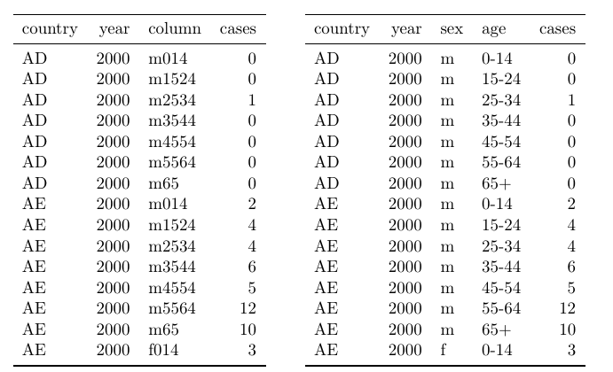

-->

## Consejos para datos ordenados

1. Guardar las cosas similares juntas ("Cada oveja con su pareja.")

2. Ninguna información redundante

* Las tablas de datos tienden a ser:

    - largas (con muchas filas)
  
    - estrechas (con pocas columnas)

    - eficiente en términos de velocidad de almacenamiento y recuperación

* Se pueden necesitar tablas adicionales para tener información completa: `codebook` para variables codificadas
 
* Útil solo si sabes cómo hacer uniones (!).

<!--
## ejemplos

Comparemos tres conjuntos de datos:
```{r, eval=FALSE, echo=TRUE}
# tormentas
storms <- read.csv("data/storms.csv")
storms

# casos de tuberculosis
cases <- read.csv("data/cases.csv")
names(cases) <- c("country","2011","2012","2013")
cases

#contaminación
pollution <- read.csv("data/pollution.csv")
pollution
```

Mientras que en `storms` se cumplen las condiciones de datos ordenados en los otros dos conjuntos de datos, tenemos distintos problemas. 

  * En `cases` los nombres de columna nombres de columna `2011`, `2012` y `2013` representan valores de la variable del año, y cada fila representa tres observaciones, no una.
  
  * En `pollution`, una observación se dispersa en múltiples filas.

## Ordenando datos con `tidyr`

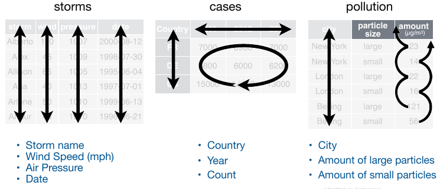  

En `storms` podemos acceder de forma fácil a los casos (observaciones) de cada atributo (variable)

```{r, eval=FALSE, echo=TRUE}
storms$storm
storms$wind
storms$pressure
storms$date
```

Sin embargo, para conocer las variables del conjunto de datos y sus observaciones tendríamos que hacer algo tan complicado como lo siguiente en cada caso:

```{r, eval=FALSE, echo=TRUE}
cases$country
names(cases)[-1]
unlist(cases[1:3, 2:4])
 
pollution$city[c(1,3,5)]
pollution$amount[c(1,3,5)]
pollution$amount[c(2,4,6)]
```

En `storms` es trivial calcular una nueva variable como la ratio de presión atmosférica y velocidad del viento. En las otras dos no es fácil mostrar la tasa de crecimiento de los casos de tuberculosis o la ratio de concentración de contaminación por partículas grandes o pequeñas.

-->

## Cuatro representaciones de los mismos datos

```{r, echo=TRUE, eval=FALSE}
library(tidyverse)
table1     # datos ordenados
table2     # no tiene un valor por celda
```

<!--
```{r, echo=FALSE, figures-side, fig.show="hold", out.width="30%", fig.cap="table1"}
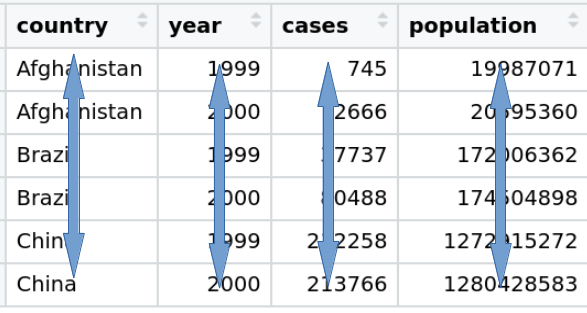

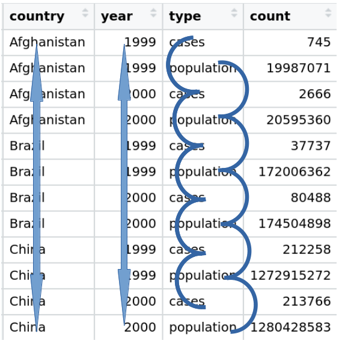
```
-->

:::: {style="display: flex;"}

::: {}


<!--* `table1`-->

{width=95%}

:::

::: {}

<!--* `table2` -->

{width=85%}

:::

::::

## Cuatro representaciones (cont.)

```{r, echo=TRUE, eval=FALSE}
table3     # mezcla más de una variable en una columna
table4a 
table4b
```

* `table4a` y `table4b` ofrecen información útil para presentación, pero 
    - variables tanto en filas como columnas
    - las cabeceras de columna son valores, no nombres de variables.

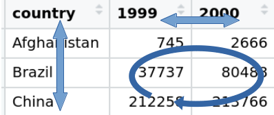{width=60%}


## Ventajas de datos ordenados

1. Con una estructura de datos consistente, se pueden aprender fácilmente unas herramientas que funcionan de forma uniforme con ella

    + `tidyverse` (incluyendo `ggplot2`) están diseñados para trabajar con datos ordenados
    
2. La mayoría de las funciones R (y otros lenguajes) trabajan con vectores: los datos ordenados son una forma natural

* Para acceder al vector valores de `cases`
```{r, echo=TRUE, eval=FALSE}
table1$cases                   # table1 %>% select(cases)
table2$count[c(1,3,5,7,9,11)]  # table2 %>% filter(type == "cases") %>% select(count)
c(table4a$`1999`, table4a$`2000`)
```

* Crear una nueva variable (tasa sobre la población)

```{r, echo=TRUE, eval=FALSE}
table1 %>% mutate(rate = cases / population * 10000)
```


## Ventajas de datos ordenados (cont.)


* Calcular casos por año
```{r, echo=TRUE, eval=FALSE}
table1 %>% count(year, wt = cases)
```

* Visualizar cambios en el tiempo

```{r, echo=TRUE, eval=FALSE}
ggplot(table1, aes(x = year, y = cases)) +  geom_line(aes(colour = country))
```

* Mejor y más correcto incluso si la tabla fuera diferente
```{r, echo=TRUE, eval=FALSE}
table4c <- tibble(year = 1999:2000, AF = c(745, 2666), 
                  BR = c(37737, 80488), CH = c(212258, 213766))
ggplot(table4c, aes(x = year)) 
  + geom_line(aes(y=AF)) + geom_line(aes(y=BR)) +geom_line(aes(y=CH)) 
```


## Cambiar la forma de una tabla (pivotar / girar)

:::: {style="display: flex;"}

::: {}

* Los mismos datos se pueden almacenar en un rectángulo ancho ("wide") o en un rectángulo largo ("long""). 

* PERO su utilidad para ciertas operaciones es distinta

* Los datos en bruto suelen estar en formato largo: facilita la recogida de información, no el análisis

* El cambio de forma entre formato largo y  ancho es una tareas habitual del analista de datos. 


<!--
* El cambio de forma ("reshaping") de una tabla entre formato largo y formato ancho es una de las tareas diarias del analista de datos. 


* Cambiar entre representación larga y ancha se conoce como pivotar (o girar). 
-->

:::

::: {}

{width=100%}
:::

::::

## Cambiar la forma de una tabla (cont.)

* Las celdas en un formato se reordenan en el otro

<center>
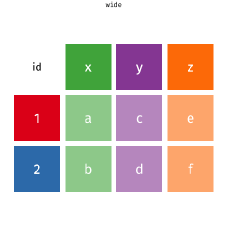{width=45%}
</center>

* Los metadatos que no se reordenan son extendidos/reducidos <!-- para no perder información. -->


## Verbos principales en `tidyr`

<!--* `pivot_longer()`: cambia la forma de los datos de "anchos" a "largos" <!--(*wide-to-long*)-->
* `pivot_longer()`: cambia la forma de "anchos" a "largos" (+filas/-cols)

    + **ordena** datos originales para facilitar el análisis.

* `pivot_wider()` cambia la forma de "largos" a "anchos" (+cols/-filas)

    + útil para crear tablas de resumen o un formato para otras herramientas.

<center>
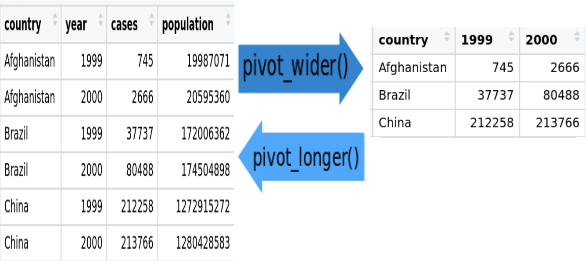{width=75%}
</center>
<!--
 La longitud es un término relativo, y sólo se puede decir (por ejemplo) que el conjunto de datos A es más largo que el conjunto de datos B.
-->

## Verbos principales en `tidyr` (cont.)

* `separate()`: separar una columna que representa múltiples variables

  {width=85%}
  
* `unite()`: une varias columnas (inverso de `separate()`)

## De ancho a largo 

* Para ordenar `table4a`, necesitamos pivotar las variables que no están ordenadas (año y `cases`) en un par de nuevas columnas

* Para describir esa operación necesitamos tres parámetros:

  -  Conjunto de columnas que representan valores, no variables (`1999`, `2000`)

   - Clave (*key*): nombre de la variable cuyos valores forman el encabezamiento. Aquí es año.

  - Valor: nombre de la variable cuyos valores se distribuyen por las celdas. Aquí es el número de casos.

## De ancho a largo (cont.)


* Los argumentos de `pivot_longer()` son:

  1. el *data frame* a cambiar de forma
  2. nombres o índice numérico de las columnas a colapsar
  3. nombre de la nueva columna de la clave 
  4. nombre de la nueva columna de valor


:::: {style="display: flex;"}

::: {}


* El resultado son dos nuevas columnas con: 

  - la clave (antiguo encabezamiento) 
  - el valor (antiguas celdas)


:::

::: {}


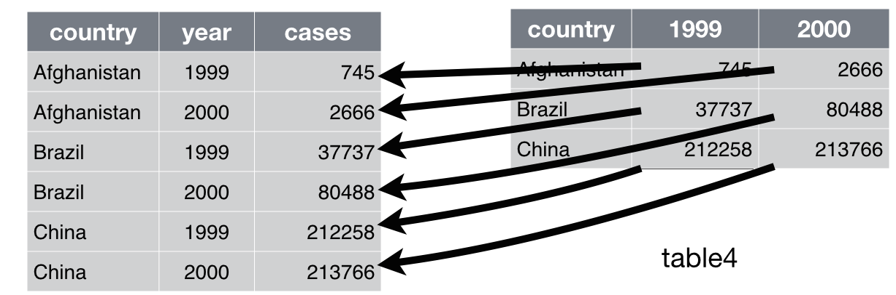{width=100%}

:::

::::


```{r, eval=FALSE, echo=TRUE}
pivot_longer(table4a, cols=2:3, names_to = "year", values_to = "cases")
```
  

## De ancho a largo: comentarios

* Como recordatorio, las siguientes llamadas son equivalentes
```{r, eval=FALSE, echo=TRUE}
pivot_longer(table4a, 2:3, "year", "cases")
table4a %>% 
  pivot_longer(c(`1999`, `2000`), values_to = "cases", names_to = "year")
table4a %>% 
  pivot_longer(names_to = "year", values_to = "cases", -country)
table4a %>% 
  pivot_longer(names_to = "year", values_to = "cases", `1999`:`2000`)
```


* Habitualmente las columnas de los datos originales a convertir en formato largo serán caracteres 

    - Si son implícitamente número, su nombre va entre \`
  
    - Podemos queres separar el nombre en dos y convertir una parte a numérica (si hubieran sido `Year1999`, `Year2000`)


<!--

## Datos numéricos en los nombres de las columnas

Los datos de `billboard' contiene el rankin de canciones en el año 2000, semana a semana. Los datos codificados en los nombres de las columnas son realmente un número, no caracteres. Los nombres se convertirán en una variable llamada `week`, y que los valores se conviertan en una variable llamada `ranking`. También se utiliza `values_drop_na` para eliminar filas con valores faltantes, dado que no todas las canciones permanecen en las listas de éxitos durante 76 semanas.

```{r, echo=T, eval=F}
billboard
billboard %>% 
  pivot_longer(
    cols = starts_with("wk"), 
    names_to = "week", 
    values_to = "rank",
    values_drop_na = TRUE)
```

Necesitarimos que `week` fuera una variable numérica (entero) para hacer cálculos como el numero de semanas que una canción estuvo enla ista de éxitos. Podemos usar dos argumentos adicionales: `names_prefix` para eliminar el prefijo `wk` y `names_ptypes` para especificar el tipo de variable:

```{r, echo=T, eval=F}
billboard %>% 
  pivot_longer(
    cols = starts_with("wk"), 
    names_to = "week", 
    names_prefix = "wk",
    names_ptypes = list(week = integer()),
    values_to = "rank",
    values_drop_na = TRUE,
  )
```
-->
## De ancho a largo: comentarios (cont.)

* Por supuesto, podemos hacer lo mismo con `table4b`

* Y obtener `table1` del proceso, uniendo ambas tablas

```{r, echo=T, eval=F}
tidy4a <- table4a %>% 
  pivot_longer(c(`1999`, `2000`), names_to = "year", values_to = "cases")
tidy4b <- table4b %>% 
  pivot_longer(c(`1999`, `2000`), names_to = "year", values_to = "population")
left_join(tidy4a, tidy4b)
```

## De largo a ancho 

* *pivot_wider()*) se utiliza para limpiar datos con observaciones que se dispersan en varias filas: ej. `table2`

* Sólo necesitamos dos parámetros:

  1. La columna que contiene nombres de variables. Aquí, `type`
  2. La columna de la que tomar los valores. Aquí, `count`

```{r, eval=FALSE, echo=TRUE}
table2 %>%
    pivot_wider(names_from = type, values_from = count)
```


## De largo a ancho 

* Los argumentos de `pivot_wider()` por tanto son:

1. el *data frame* a cambiar de forma
2. nombre de la columna cuyos valores son los nuevos nombres de columnas
3. nombre de la columna con los valores para <!--las celdas de -->las nuevas columnas

<center>
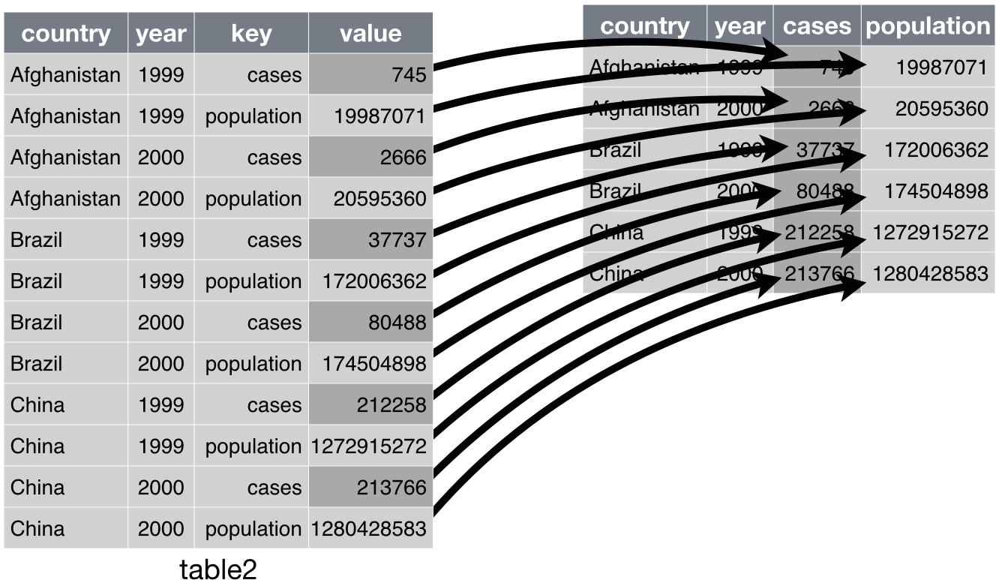{width=65%}
</center>

## `separate()`

* `separate()` divide una columna en varias, usando como argumentos:

    - el *date frame*
    - la variable a separar
    - los nombres de las nuevas variables 
    - el carácter separador (estrictamente, una expresión regular)


```{r, eval=FALSE, echo=TRUE}
table3 %>% 
  separate(rate, into = c("cases", "population"), sep = "/")
```
* Por defecto, si no especificamos el argumento `sep`, separa cuando aparece cualquier caracter no alfanumérico:
```{r, eval=FALSE, echo=TRUE}
table3 %>% 
  separate(rate, into = c("cases", "population"))
```

## `separate()` (cont.)

* También se puede pasar un vector de números enteros al argumento `sep`: se interpretan como posiciones en las que dividirse

    - los valores positivos comienzan en 1 en el extremo izquierdo
    - los valores negativos comienzan en -1 en el extremo derecho. 
    
* Cuando se utilizan números enteros para separar cadenas, la longitud de `sep` debe ser uno menos que el número de nombres del argumento `into`.

```{r, eval=FALSE, echo=TRUE}
table3 %>% 
  separate(year, into = c("century", "year"), sep = 2)
```

* Por defecto, se mantiene en tipo variable (en general, caracter). Se puede intentar convertir a mejores tipos usando `convert = TRUE`:

```{r, eval=FALSE, echo=TRUE}
table3 %>% 
  separate(rate, into = c("cases", "population"), convert = TRUE)
```


## `unite()`

* `unite()` combina múltiples columnas en una sola usando como argumentos 
    - un *data frame*
    - el nombre de la nueva variable a crear 
    - un conjunto de columnas a combinar
    - caracter entre valores de las columnas originales
    
    <!--
    - usado con menos frecuencia que `separate()`, su inverso
    -->
```{r, eval=FALSE, echo=TRUE}
table5 %>% 
  unite(new, century, year, sep = "")
```

* Por defecto colocará un subrayado (_) entre los valores de diferentes columnas.

* Se puede especificar explícitamente el valor deseado: sin separación "" u otro

```{r, eval=FALSE, echo=TRUE}
table5 %>% 
  unite(new, century, year, sep = "-")
```


## Comentario sobre valores ausentes

<!--* En el siguiente conjunto de datos-->

```{r, eval=FALSE, echo=TRUE}
stocks <- tibble(
  year   = c(2015, 2015, 2015, 2015, 2016, 2016, 2016),
  qtr    = c(   1,    2,    3,    4,    2,    3,    4),
  return = c(1.88, 0.59, 0.35,   NA, 0.92, 0.17, 2.66)
)
```

*  Hay **dos tipos** de valores ausentes:

    - La rentabilidad en 2015.Q4 falta **explícitamente**: el valor de su celda es `NA`.
    - La rentabilidad en 2016.Q1 está **implícitamente** ausente: simplemente no aparece en el conjunto de datos

* La forma de representación de un conjunto de datos puede implicar que esto cambie, por ejemplo, hacer explícitos los valores implícitos

```{r, eval=FALSE, echo=TRUE}
stocks %>% 
  pivot_wider(names_from = year, values_from = return)
```


## Comentario sobre valores ausentes (cont.)

* Los valores ausentes explícitos pueden no ser importantes en otras representaciones de los datos

* Se puede establecer `values_drop_na = TRUE` en `pivot_longer()` para que los valores ausentes explícitos anteriores sean implícitos:

```{r, eval=FALSE, echo=TRUE}
stocks %>% 
  pivot_wider(names_from = year, values_from = return) %>% 
  pivot_longer(cols = c("2015","2016"), names_to = "year", values_to = "return",
               values_drop_na = TRUE)
```

* `complete()` hace explícitos los valores ausentes en datos ordenados: busca todas las combinaciones únicas y se asegura de que las contiene
<!--
  - Encuentra todas las combinaciones únicas y se asegura de la tabla contiene todas.
  - Se asegura de que la tabla  contiene todos esos valores, rellenando `NA` explícitos cuando sea necesario.
-->
```{r, eval=FALSE, echo=TRUE}
stocks %>% 
  complete(year, qtr)
```


