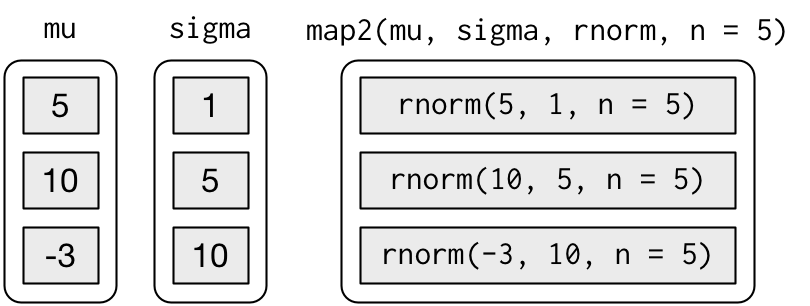
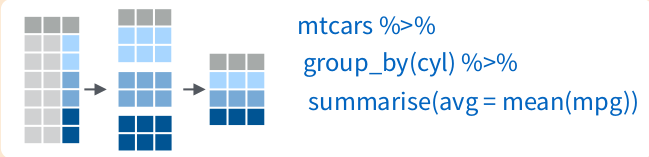
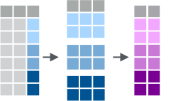

```{r setup, include=FALSE}
knitr::opts_chunk$set(warning = FALSE, message = FALSE, eval = TRUE, echo = TRUE)

library(tidyverse)
```


## Bucles
* Las funciones reducen la duplicación identificando patrones repetidos de código

* La iteración también ayuda cuando se necesita repetir la misma operación con múltiples entradas

* Dos paradigmas de iteración: 

    + programación imperativa: bucles `for` y `while`

    + programación funcional: `map` y `lapply`

* Los bucles `for` (y `while`) son una forma adecuada de entender cómo funcionan las iteraciones porque hacen explícitas las iteraciones

* Los bucles de programación funcional son más claros (menos código y menos propensos a errores)

## Una iteración simple con `for`

```{r echo=TRUE, eval=FALSE}
print(1)
print(2)
print(3)
```

* Estamos repitiendo lo mismo `print()` con 3 entradas diferentes

* Con un bucle `for`, una variable `x` itera sobre los valores de una secuencia 

:::: {style="display: flex;"}

::: {}

```{r echo=TRUE, eval=FALSE}
for (x in 1:3) {
  print(x)
}
```

:::

::: {}

$\hspace{2cm}$ 

::: 


::: {}

```{r echo=TRUE, eval=FALSE}
x <- 1
print(x)
x <- 2
print(x)
x <- 3
print(x)
```

:::

::::

* La secuencia puede ser muy general: `1:20`, `c("a", "b", "c" )`, `c(1,15, 100, 200, 500)`

## Elementos en la estructura de un bucle 

<!--
* Ej., calcular la mediana de cuatro variables con un bucle
-->

```{r echo=FALSE, eval=FALSE}
median(iris[[1]])
median(iris[[2]])
median(iris[[3]])
median(iris[[4]])
```

<!-- 
iris[[1]] & iris[,1] son vector: pq iris es data.frame
iris2 <- as_tibble(iris)  
iris2[[1]] es vector,
iris2[,1] & select(iris2,1) es tibble
-->

```{r echo=TRUE, eval=FALSE}
output <- vector("double", 4)         # 1. resultado
for (i in 1:4) {                      # 2. secuencia
  output[[i]] <- median(iris[[i]])    # 3. cuerpo
}
output                                # mediana de cada variable
```

* *Antes de empezar*, se reserva espacio para el **resultado**: nuevo objeto con `vector()`, especificando tipo y longitud 

    + También se puede modificar un objeto ya existente 

* La **secuencia** se puede iterar sobre índice numérico obtenido, p.e., usando `seq_along(x)` <!-- (más limpio que `1:length(x)` para `x` vacio) -->
  
```{r, echo=FALSE, eval=FALSE}
y <- vector("double", 0)
seq_along(y) 
#> integer(0)
1:length(y)
#> [1] 1 0
```
  
  + Accedemos a los elementos con `x[[i]]`: son listas, *data frame* o aclarara que son un sólo elemento de un vector  
  
  <!--
  + En bucles, solemos acceder a los elementos con `x[[i]]`, en lugar de con `[`, porque se suele modificar listas o *data frame* 
  
  + Y con los vectores para aclarar que se trabaja con un solo elemento -->

  + También se puede iterar sobre elementos  `for (i in x)` o nombres `for (i in names(x))`


## Elementos en la estructura de un bucle (cont.)

* Si no conocemos la longitud de la secuencia, trabajar con listas (vacias) y colapsar a vector es más rápido que concatenar con `c()` 


:::: {style="display: flex;"}

::: {}

<!-- vector("double") = double() -->
<!-- double() tambien se puede asignar como list() -->

```{r echo=TRUE, eval=FALSE}
x <- iris[,1:4]
output <- vector("double")    
for (i in seq_along(x)) {
  output <- c(output, mean(x[[i]]))
}
```


:::

::: {}

$\hspace{1cm}$ 

::: 


::: {}

<!-- list() = vector("list") -->
<!-- alterntiva a unlist():  purrr::flatten_dbl() -->

```{r echo=TRUE, eval=FALSE}
x <- iris[,1:4]
output <- list()    
for (i in seq_along(x)) {
  output[[i]] <- mean(x[[i]])
}
output %>% unlist() 
```

:::

::::

<!--
* Para cadena larga, en lugar de `paste()` en cada iteración, guardar en vector y combinar al final `paste(output, collapse = "")`

* Para una gran tabla de datos, en lugar de `rbind()`, guardar la tabla de cada iteración en una lista y al final usar `dplyr::bind_rows(output)`
-->

* Igualmente, NO ir pegando caracteres (`paste()`) NI añadiendo filas (`rbind()`) a una tabla sino hacerlo al final

  +  `paste(output, collapse = "")`

  + `dplyr::bind_rows(output)`

## `while`: longitud de la secuencia desconocida

* Un bucle `while` solo tiene dos componentes: se ejecuta el **cuerpo** mientras se cumpla una **condición**

```{r echo=TRUE, eval=FALSE}
while (condición) {
  # cuerpo
}
```

* Se suele usar en simulaciones y otras situaciones en la que no se sabe cuantas veces se debe ejecutar un código 

* En ocasiones `for` y `while` son equivalentes

:::: {style="display: flex;"}

::: {}

```{r echo=TRUE, eval=FALSE}
for (i in seq_along(x)) {
  # cuerpo
}
```

:::

::: {}

$\hspace{2cm}$ 

::: 


::: {}

```{r echo=TRUE, eval=FALSE}
i <- 1
while (i <= length(x)) {
  # cuerpo
  i <- i + 1 
}
```

:::

::::

## Operaciones vectorizadas

* R es un lenguaje de [programación funcional](https://es.wikipedia.org/wiki/Programaci%C3%B3n_funcional), en particular gracias a `purrr`

* Como alternativa a los bucles, se centra en descomponer los problemas en piezas independientes

:::: {style="display: flex;"}

::: {}

  1. buscar la solución para un elemento: el cuerpo de un bucle se envuelve en una función
  2. pasar una lista de elementos a la función

:::

::: {}

<center>

</center>


:::

::::

* Además un problema complejo se descompone en pasos más pequeños (a través de la tubería): filosofía [MapReduce](https://es.wikipedia.org/wiki/MapReduce)

  + `map()`+`reduce()`
  
## Las funciones `map()`

:::: {style="display: flex;"}

::: {}
* El proceso de "mapeo" consiste en 

  1. toma un vector como entrada
  2. aplica una función a cada elemento 
  3. devuelve un nuevo vector de la misma longitud (y  nombres) que la entrada

:::

::: {}

$\hspace{1cm}$ 

::: 


::: {}

<center>
{width=95%}
</center>


:::

::::


* El tipo de vector de salida está determinado por el sufijo de `map()`.
  
:::: {style="display: flex;"}

::: {}

  + `map()`:     lista
  + `map_dfr()`: *data frame*
  + `map_lgl()`: vector lógico


:::

::: {}

$\hspace{1cm}$ 

:::

::: {}

  + `map_int()`: vector entero
  + `map_dbl()`: vector doble
  + `map_chr()`: vector de caracteres

:::

::::

* Similares a `lapply()` y familia de R base

## Usando funciones `map()`

<!--
* Primer argumento: un vector (lista, *data frame*), que se puede pasar por `%>%`

* Segundo argumento: una función, como fórmula, caracter o entero 

* Tercer argumento `...`: para pasar argumentos adiccionales
-->

```{r, echo=TRUE, eval=FALSE}
mis_coches <- c("corolla", "civic")             # 1. Vector (o lista o data frame)

show_cars <- function(mod = "civic", n = 6)  {  # 2. Función
  mpg %>% filter(model == mod) %>% head(n)
}

map(mis_coches, show_cars)                      #3.Resultado, como lista
mis_coches %>% map_dfr(show_cars)               #             como df
```


* Se usa `...` para pasar argumentos adicionales

```{r, echo=TRUE, eval=FALSE}
iris %>% select(1:4) %>% 
  map_dbl(mean, na.rm=TRUE)     
```

* Notad que se mantienen los nombres

* Veremos que el argumento función puede ser también una formula, nombre o índice

<!--
## Usando funciones `map()` (cont.)

* Se puede usar una *fórmula* como una función "anónima" dentro de `map()`

(en lugar de `function(df) lm(mpg ~ wt, data = df)`)

```{r echo=TRUE, eval=FALSE}
models <- mtcars %>% 
  split(.$cyl) %>%                  # divide por valores de un factor
  map(~lm(mpg ~ wt, data = .))      # . = lo que se ha pasado por tubería
```

:::: {style="display: flex;"}

::: {}

```{r echo=TRUE, eval=FALSE}
models <- mtcars %>% 
  split(.$cyl) %>% 
  map(function(df) lm(mpg ~ wt, data = df))
```

:::

::: {}

$\hspace{2cm}$

:::

::: {}


```{r echo=TRUE, eval=FALSE}
models <- mtcars %>% 
  split(.$cyl) %>% 
  map(~lm(mpg ~ wt, data = .))
```

:::

::::

* La misma idea permite acceder a elementos o hacerlo por nombre 

```{r echo=T, eval=F}
models %>%  map(summary) %>% map_dbl(~.$r.squared)
models %>%  map(summary) %>% map_dbl("r.squared")
```

* También se puede acceder por nombre o por índice de posición

```{r echo=T, eval=F}
x <- list(list(1, 2, 3), list(4, 5, 6), list(7, 8, 9))
x %>% map_dbl(2)
```

-->

## Múltiples argumentos: `map2()` y `pmap()`

* `map2()` permite pasar dos vectores a una función

:::: {style="display: flex;"}

::: {}

```{r echo=TRUE, eval=FALSE}
mu    <- list(5, 10, -3)
sigma <- list(1, 5, 10)
map2(mu, sigma, rnorm, n = 5) %>% glimpse()
```


:::

::: {}

$\hspace{1cm}$ 

:::

::: {}
<center>
{width=98%}
</center>

:::

::::

* `pmap()` pasa múltiples argumentos

:::: {style="display: flex;"}

::: {}

```{r echo=TRUE, eval=FALSE}
n <- list(1, 3, 5)
args1 <- list(n, mu, sigma)
args1 %>% pmap(rnorm) %>% glimpse()
```

:::

::: {}

$\hspace{1cm}$ 

:::

::: {}
<center>
{width=95%}
</center>

:::

::::

* Mejor pasarlos como lista con nombres o directamente como *data frame* 

## Otras funciones de `purrr`

* `walk()`, `walk2()` y `pwalk()` para funciones que realizan una acción (ej., `print()`, `ggsave()`)

```{r echo=T, eval=F}
list(1, "a", 3)  %>% walk(print)
```

* `keep()` y `discard()` para funciones que devuelven `TRUE`/`FALSE`
```{r echo=T, eval=F}
iris %>% keep(is.factor)
```

<!--  + también, `some()`, `every()`, `detect_*()`-->
  
* `safely()`, `possibly()`, `quietly()` para "capturar" errores

* `reduce()` para funciones que reducen dos listas a una (uniones, intersecciones)

```{r echo=T, eval=F}
list(1:30, seq(5,40,4), 25:45) %>% reduce(intersect)
```

<!--
* `accumulate()` similar pero manteniendo resultados intermedio

    + ej., suma acumulada: `1:10 %>% accumulate(`+`)`
-->

* Una chuleta completa [aquí](https://github.com/rstudio/cheatsheets/raw/master/translations/spanish/purrr_COrtega_Spanish.pdf)


## Recordando `group_by()` 

* `group_by()` crea un copia por grupos de la tabla


* Combinado con `summarize()` ofrece resultados para cada valor del grupo 

    (nueva tabla con los valores del grupo como observaciones) 


<center>
{width=90%}
</center>


## Funciones con `group_by()` al estilo `purrr`

* `group_map()`, `group_modify()` y `group_walk()` se pueden usar para iterar sobre "tibbles" agrupados

<!--
    + existen alternativas con funciones de `purrr` y otras bibliotecas
-->

1. Se toma un `tibble` y se agrupa

2. Se aplica un función que toma un `tibble` y devuelve un `tibble`

3. Devuelve un `tibble` agrupado (o lista) de la función aplicada a cada grupo del `tibble`


<center>
{width=45%}
</center>


## Iterando sobre grupos de un *data frame*

* Devuelve una lista de *data frames*

```{r echo=TRUE, eval=FALSE}
mtcars %>%
  group_by(cyl) %>%
  group_map(head, n = 2)   
```


* Devuelve una lista de *data frames*

```{r echo=TRUE, eval=FALSE}
mtcars %>%
  group_by(cyl) %>%
  group_modify(head, n = 2) 
```

## Iterando sobre grupos de un *data frame* (cont.)

* Regresión sobre grupos de un *data frame*

```{r echo=TRUE, eval=FALSE}
mtcars %>%
  group_by(cyl) %>%
  group_modify(~broom::tidy(lm(mpg ~ disp, data = .x))) # devuelve "data frame" agrupado
```

* Se ha definido una función "anónima" para crear la regresión

* `.x` (o `.`) indica lo que se ha pasado por la tubería

## Un ejemplo general

* La misma idea permite acceder a elementos o hacerlo por nombre 

```{r echo=T, eval=F}
models <- mtcars %>%
            group_by(cyl) %>%
            group_map(~lm(mpg ~ wt, data = .)) 

models %>%  
  map(summary) %>% 
  map_dbl(~.$r.squared)

models %>%  map(summary) %>% map_dbl("r.squared")
```

* Las funciones `map()´ también permiten acceder por índice de posición

```{r echo=T, eval=F}
x <- list(list(1, 2, 3), list(4, 5, 6), list(7, 8, 9))
x %>% map_dbl(2)
```
