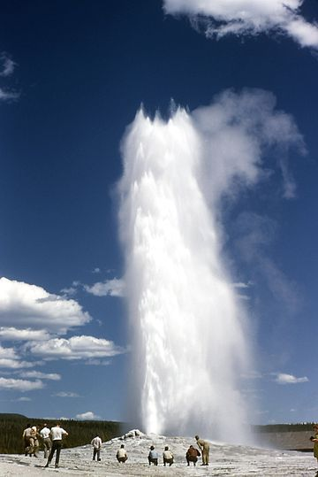

```{r setup, include=FALSE}
knitr::opts_chunk$set(warning = FALSE, message = FALSE, eval = TRUE, echo = TRUE, results = "hide", fig.show="hide")

library(tidyverse)
library(dlookr)
#setwd("/home/albarran/Dropbox/MAD/00.TEC")
library(rmarkdown)
#render("filename.Rmd")     
#browseURL("filename.html")
```


## Aprendizaje Estadístico / Aprendizaje Automático

* Aprendizaje automático (*machine learning*, ML) o estadístico (*statiscal learning*): conjunto de técnicas algorítmicas para extraer información de los datos

<center>
{width=65%}
</center>


## Aprendizaje supervisado vs. no supervisado

* **Aprendizaje supervisado**: escenarios en los que para cada observación de las mediciones $X_i$ hay una respuesta asociada $Y_i$: $Y = f(X) + \varepsilon$
    
    + $f$ representa la información/relación sistemática que $X$ (género, educación, etc.) ofrecen sobre un resultado medido $Y$ (ej. renta)

    + $\varepsilon$ es el error irreducible (variables no observables)  

    + Aprendemos a predecir el valor o la clase de un individuo a partir de casos previamente "etiquetados" (medididos/clasificados)

<!--
:::: {style="display: flex;"}

::: {}
$\widehat{Y} - Y= \underbrace{\left[\widehat{f}(X) - f(X)\right]}_{(1)} +                  \underbrace{\varepsilon}_{\mbox{(2)}}$
:::

::: {}

$\ \ \ \ \ $

:::

::: {}

1. error reducible (eligiendo modelo)
  
2. error irreducible (variables no observables)

:::

::::
-->

* **Aprendizaje no supervisado**: no hay una respuesta asociada a las mediciones de $X_i$ para supervisar el análisis que generará un modelo.

    + Aprendemos rasgos no medidos a partir de casos "no etiquetados": ej. las observaciones de organizan en grupos distintos (de clientes, países)
    
    <!--
    + *Clustering*: las observaciones se organizan en grupos relativamente distintos (de clientes, de países, etc.)-->

## Aprendizaje supervisado: estimar $f$

* Modelo paramétrico: supone un forma de $f$ que depende de parámetros desconocidos, p.e., lineal  $f(x) =\beta_0 + \beta_1 x_1 + \dots + \beta_k x_k$

* Modelo no paramétrico: estimar $f$ tan próxima a los datos como sea posible sin supuestos funcionales

* Es más sencillo estimar parámetros que una función arbitraria

* Mejor ajuste cuanto más flexibilidad (método no paramétrico o muchos parámetros), pero puede ajustar "demasiado" (*overfitting*)

## Aprendizaje supervisado: estimar $f$ (cont.)


* Además existe una disyuntiva entre precisión de la predicción e **interpretabilidad** (inferencia)
  
* A veces simplemente nos interesa predecir el resultado a partir de unos factores
    
* Un método más restrictivo puede ser preferible si nos interesa *entender* la manera en que $X$ afecta a $Y$

    + qué variables son relevantes, 
    + con qué signo y magnitud, 
    + generar hipótesis, etc.


## Aprendizaje supervisado: problemas de regresión y de clasificación

1. **Regresión**: la variable de respuesta es cuantitativa (toma valores numéricos)


2. **Clasificación**:  la variable de respuesta es cualitativa (toma valores en una de $K$ categorías o clases)


* En ambos casos, queremos "predecir" una variable: 

    + un valor numérico
    
    + una categoría

* Clasificación es un caso especial de Predicción.
    
<!--
Es importante entender que no trataremos todas las técnicas ni podemos entrar en el fondo de cada técnica.  El objetivo es proporcionar una visión general de alto nivel de las técnicas y modelos empleados habitualmente y así comprender los objetivos generales del aprendizaje automático.
-->

## Ejemplo de regresión

* Predecir el número de usuarios (`volume`):

```{r}
library(mosaicData)
RailTrail %>% ggplot(aes(x = avgtemp, y = volume)) + 
  geom_point() + geom_smooth(method = 'loess') 
```

* `volume` "supervisa" el ajuste del modelo

* Podemos usar el modelo no paramétrico "loess" para predecir `volume`

```{r}
RailTrail.fit <- RailTrail %>% 
  mutate(
    loess.fit = loess(volume ~ avgtemp, data = .)$fitted) 
head(select(RailTrail.fit, volume, loess.fit, avgtemp))
```

```{r, echo=FALSE, eval=FALSE}
RailTrail.fit %>%
  ggplot() + 
  geom_point(aes(x = avgtemp, y = volume)) + 
  geom_line(aes(x = avgtemp, y = loess.fit), color = "blue")
```

## Ejemplo de clasificación

* Clasificación del tipo de flor en los [datos Iris](https://es.wikipedia.org/wiki/Iris_flor_conjunto_de_datos)

```{r} 
iris %>% mutate(true.Species = Species) %>% 
  ggplot(aes(x = Petal.Length, y = true.Species, color = true.Species)) +   geom_point()
```

* Clasificación rudimentaria en función de longitud del pétalo:

  * Setosa, si < 2 
    
  * Versicolor, si >2 y <5
  
  * Virginica, si > 5
     
```{r, echo=FALSE, eval=FALSE}
iris.crude <- iris %>% mutate(true.Species = Species) %>%
  mutate(
    predicted.Species = 
      ifelse(Petal.Length < 2, "setosa", 
             ifelse(Petal.Length < 5, "vesicolor", 
                    "virginica"))
    ) 

iris.crude %>% 
  ggplot(aes(x = Petal.Length, y = true.Species,  
             color = true.Species, shape = predicted.Species)) + 
  geom_point()
```

<!--
Una vista rápida parece indicar una buena clasificación. La variable de respuesta para la supervisión es `true.Species`.
-->

* La predicción es mucho mejor si se utilizan más variables

* La visualización tiene un poder limitado: debemos usar métodos de clasificación basados en modelos o algoritmos.


<!--
La predicción es mucho mejor si se utilizan más variables, pero ¿cómo utilizar 4 variables en la clasificación? La visualización en sí misma tiene un poder limitado para contestar esta pregunta. Debemos utilizar métodos de clasificación basados en modelos o algoritmos.

La visualización seguirá siendo útil en el análisis exploratorio (decidir qué método utilizar) y en la transmisión del resultado del análisis.

-->


## Ejemplo de clasificación (cont.)

* Factores para predecir si un cliente potencial es de alto ingreso
```{r}
censo <- read_csv("https://www.dropbox.com/s/6bqyjnkd2c638rm/census.csv?dl=1") %>%
  mutate(income = as.integer(factor(income))-1)
```

* Ajustamos un modelo logístico (logit) simple
```{r}
modelo_logistico <- glm(income ~ capital_gain, data = censo, family = "binomial")
summary(modelo_logistico)
cbind(censo$income, predict(modelo_logistico, type = "response")) %>% head()
```

* La predicción mejora si incluimos más variables explicativas
```{r}
modelo_logistico2 <- glm(income ~ capital_gain + age + education + sex, 
                         data = censo, family = "binomial")
summary(modelo_logistico2)
cbind(censo$income, predict(modelo_logistico2, type = "response")) %>% head()
```

## Aprendizaje No Supervisado

<!--
Usamos técnicas en el aprendizaje no supervisado cuando no hay ninguna variable de respuesta. Simplemente tenemos un conjunto de observaciones $X$, y queremos entender las relaciones entre ellos.
-->

* *Clustering*  (agrupamiento o particionamiento): identificar grupos desconocidos de casos a partir de características observadas

<!--
Empezamos con ejemplo simple para entender la idea y el funcionamiento de los algoritmos. Usaremos datos de `faithful` (incluido por defecto en R) sobre tiempo de espera entre erupciones y sobre duración de la erupción para el géiser Old Faithful en el Parque Nacional de Yellowstone, EE.UU.


-->

* Tiempo de espera entre erupciones y sobre duración de la erupción para el géiser Old Faithful
```{r echo=FALSE, eval=FALSE}
library(tidyverse)
head(faithful)
```


```{r}
faithful%>% ggplot(aes(y = eruptions, x = waiting)) + 
  geom_point()
```

* Se pueden apreciar dos "grupos" o *clusters* o tipos de erupciones.

```{r}
faithful.clustered <- 
  faithful %>% mutate(cluster = factor(kmeans(x = ., centers = 2)$cluster))
faithful.clustered %>% ggplot(aes(y = eruptions, x = waiting)) + 
  geom_point(aes(color = cluster))
```

<!--
## Evaluación de modelos

* ¿Cómo sabemos que modelo es mejor?

* Dado  $Y = f(X) + \varepsilon$ y una predicción $\widehat{f}$, el promedio de los errores de predicción es:

$$ E\left[\left(y-\widehat{f}(x)\right)^2\right]= \left(E\left[\widehat{f}(x)\right]-f(x)\right)^2 + E\left[\left[\widehat{f}(x)-E\left(\widehat{f}(x)\right)\right]^2\right]+\sigma^2$$


## "Trade-off" Varianza--Sesgo

La disyuntiva entre sesgo y varianza es el problema de minimizar simultáneamente dos fuentes de error que impiden que los algoritmos de aprendizaje supervisados sean generalizables más allá de su conjunto de entrenamiento.

  * El **sesgo** de la estimación es el error por los supuestos erróneos en el algoritmo de aprendizaje. Con un alto sesgo, un algoritmo pierde las relaciones relevantes entre las características y la variable de resultado. En este caso se tiene un ajuste insuficiente (*underfit*).
  
  * La **varianza** de la estimación es un error de sensibilidad a pequeñas fluctuaciones en el conjunto de entrenamiento. Con una alta varianza, un algoritmo modela un puro ruido aleatorio en los datos de entrenamiento. Ahora tendríamos un ajuste excesivo (*overfit*) en la muestra de entrenamiento (pero en la de pruebas gran error de predicción).
  
  El sesgo se reduce y la varianza aumenta en relación con la complejidad del modelo. A medida que se añaden más y más parámetros a un modelo, la complejidad del modelo aumenta y la varianza se convierte en nuestra principal preocupación, mientras que el sesgo disminuye constantemente. Por ejemplo, a medida que se añaden más términos polinómicos a una regresión lineal, mayor será la complejidad del modelo resultante. 


## Medidas de error en predicción

* Criterios habituales para evaluación de modelos de respuesta cuantitativa

+ *Root Mean Square Error*: $RMSE(y,\widehat{y})=\sqrt{\frac{1}{n}\sum_{i=1}^{n}\left(y-\widehat{y}\right)^2}$
     + mismas unidades que $y$
     + penaliza grandes desviaciones
+ *Mean Absolute Error*: $MAE(y,\widehat{y})=\frac{1}{n}\sum_{i=1}^{n}\left|y-\widehat{y}\right|$
     + también mediana

 + *Correlación*: 
      + lineal ($y$ y $\widehat{y}$ pueden no tener las mismas unidades y escala como con RMSE y MAE) 
      + de rangos ($y$ y $\widehat{y}$ solo tiene que tener el mismo orden relativo, no minimizar distancia entre ellas)
 
+ *Coeficiente de determinación*, $R^2$ 
-->