```{r setup, include=FALSE}
knitr::opts_chunk$set(warning = FALSE, message = FALSE, eval = TRUE, echo = TRUE, results = "hide", fig.show="hide")

library(tidyverse)
library(dlookr)
#setwd("/home/albarran/Dropbox/MAD/00.TEC")
library(rmarkdown)
#render("filename.Rmd")     
#browseURL("filename.html")
```


## Aprendizaje Estadístico o Automático

* Aprendizaje automático (*machine learning*, ML) o estadístico (*statiscal learning*): conjunto de técnicas algorítmicas para extraer información de los datos

<center>
{width=65%}
</center>


## Aprendizaje supervisado vs. no supervisado

* **Aprendizaje supervisado**: escenarios en los que para cada observación de las mediciones $X_i$ hay una *respuesta asociada* $Y_i$ ("supervisa" el aprendizaje)

    + Aprendemos la respuesta de casos nuevos a partir de casos previos 

<center>    
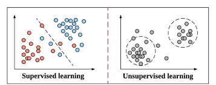{width=55%} 
</center> 

* **Aprendizaje no supervisado**: no hay una respuesta asociada a las mediciones de $X_i$ para supervisar el análisis que generará un modelo.

    + Aprendemos rasgos no medidos a partir de casos "no etiquetados": ej. observaciones similares organizadas en grupos distintos <!--(de clientes, países)-->
    

## Aprendizaje supervisado

* Modelo para la variable dependiente (de respuesta) en función de factores observados (predictores/características), más otros no observados ($\varepsilon$)
\[
Y = f(X) + \varepsilon
\]

    <!--Y= variable objetivo)-->
    <!--X= independientes (predictores, características, regresores, factores)-->
    <!--X= inputs, features, covariates -->
    
    + $f$ representa la información/relación sistemática que $X$ (género, educación, etc.) ofrecen sobre un resultado medido $Y$ (ej. renta)

* Objetivos: 

    + predecir casos *nuevos* <!-- a partir de otros previamente etiquetados  (medidos/clasificados)-->

    + comprender qué factores afectan al resultado y cómo

    + evaluar la calidad de nuestras predicciones e inferencias

* Cuidado con afirmaciones sobre *causalidad*!
    
## Aprendizaje supervisado: estimar $f$ desconocida


* **Modelo paramétrico:** supone un forma de $f$ que depende de parámetros desconocidos, p.e., lineal  $f(x) =\beta_0 + \beta_1 x_1 + \dots + \beta_k x_k$

* **Modelo no paramétrico:** ajustar $f$ a los datos sin supuestos funcionales

    + Es más sencillo estimar parámetros que una función arbitraria

* A mayor flexibilidad, mejor ajuste, PERO existe una disyuntiva entre precisión de la predicción e **interpretabilidad** (inferencia)
  
<!--
* A veces solo nos interesa predecir el resultado a partir de unos factores
-->    

* Preferimos un método más restrictivo si no solo interesa predecir, sino *entender* la manera en que $X$ afecta a $Y$ 

    + variables relevantes y su signo y magnitud, 
    + generar hipótesis, etc.


## Problemas de "regresión" y de clasificación

* El método de aprendizaje supervisado más adecuado para un problema depende de si la respuesta es cualitativa o cuantitativa.

1. **Problema de Regresión**

    + La variable de respuesta es cuantitativa (toma valores numéricos)

2. **Problema de Clasificación**  

    + La variable de respuesta es cualitativa (toma valores en una de $C$ categorías o clases)

<!--
No trataremos todas las técnicas ni podemos entrar en el fondo de cada técnica.  

El objetivo es proporcionar una visión general de alto nivel de las técnicas y modelos empleados habitualmente y así comprender los objetivos generales del aprendizaje automático.
-->

## Ejemplo de regresión

* Predecir el número de usuarios (`volume`):

```{r}
library(mosaicData)
RailTrail %>% ggplot(aes(x = avgtemp, y = volume)) + 
  geom_point() + geom_smooth(method = 'lm', formula = y ~ poly(x,3) ) +
  coord_cartesian(ylim = c(100,750))
```

* `volume` "supervisa" el ajuste del modelo

* Podemos usar el modelo para predecir `volume`

```{r}
RailTrail.fit <- RailTrail %>% 
  mutate(
    lm.fit = lm(volume ~ poly(avgtemp,3), data = .)$fitted) 
head(select(RailTrail.fit, volume, lm.fit, avgtemp))
```

```{r, echo=FALSE, eval=FALSE}
RailTrail.fit %>%
  ggplot() + 
  geom_point(aes(x = avgtemp, y = volume)) + 
  geom_line(aes(x = avgtemp, y = loess.fit), color = "blue")
```

<!--
## Ejemplo de clasificación

* Clasificación del tipo de flor en los [datos Iris](https://es.wikipedia.org/wiki/Iris_flor_conjunto_de_datos)

```{r} 
iris %>% ggplot(aes(x = Petal.Length, y = Species, color = Species))  +
  geom_point()
```

* Clasificación rudimentaria en función de longitud del pétalo:

  * Setosa, si < 2 
    
  * Versicolor, si >2 y <5
  
  * Virginica, si > 5
     
```{r, echo=FALSE, eval=FALSE}
iris.crude <- iris %>% mutate(true.Species = Species) %>%
  mutate(
    predicted.Species = 
      ifelse(Petal.Length < 2, "setosa", 
             ifelse(Petal.Length < 5, "vesicolor", 
                    "virginica"))
    ) 

iris.crude %>% 
  ggplot(aes(x = Petal.Length, y = true.Species,  
             color = true.Species, shape = predicted.Species)) + 
  geom_point()
```


* La predicción es mucho mejor si se utilizan más variables


* La visualización tiene un poder limitado: debemos usar métodos de clasificación basados en modelos o algoritmos.

-->

## Ejemplo de clasificación

* Factores para predecir si un cliente potencial es de alto ingreso
```{r}
censo <- read_csv("https://www.dropbox.com/s/6bqyjnkd2c638rm/census.csv?dl=1") %>%
  mutate(income = as.integer(factor(income))-1)
```

* Ajustamos un modelo logístico (logit) simple
```{r}
modelo_logistico <- glm(income ~ capital_gain, data = censo, family = "binomial")
summary(modelo_logistico)
cbind(censo$income, predict(modelo_logistico, type = "response")) %>% head()
```

* La predicción mejora si incluimos más variables explicativas (modelo más flexible)

<!--
```{r, eval=FALSE, echo=FALSE}
modelo_logistico2 <- glm(income ~ capital_gain + age + education + sex, 
                         data = censo, family = "binomial")
summary(modelo_logistico2)
cbind(censo$income, predict(modelo_logistico2, type = "response")) %>% head()
```
-->

<!--
## Ejemplo de aprendizaje no supervisado

<!--
Usamos técnicas en el aprendizaje no supervisado cuando no hay ninguna variable de respuesta. Simplemente tenemos un conjunto de observaciones $X$, y queremos entender las relaciones entre ellos.
-->

<!--

* *Clustering*  (agrupamiento o particionamiento): identificar grupos desconocidos de casos a partir de características observadas

<!--
Tiempo de espera entre erupciones y sobre duración de la erupción para el géiser Old Faithful en el Parque Nacional de Yellowstone, EE.UU.


-->

<!--
* Tiempo de espera entre erupciones y sobre duración de la erupción para el géiser Old Faithful
```{r echo=FALSE, eval=FALSE}
library(tidyverse)
head(faithful)
```


```{r}
faithful%>% ggplot(aes(y = eruptions, x = waiting)) + 
  geom_point()
```

* Se pueden apreciar dos "grupos" o *clusters* o tipos de erupciones.

```{r}
faithful.clustered <- 
  faithful %>% mutate(cluster = factor(kmeans(x = ., centers = 2)$cluster))
faithful.clustered %>% ggplot(aes(y = eruptions, x = waiting)) + 
  geom_point(aes(color = cluster))
```

-->

## Error de predicción

* Un modelo es mejor si sus predicciones se ajusten mejor a las observaciones

* El error de predicción es $y - \widehat{y} = f(X) - \widehat{f}(X)  + \varepsilon$

  + $f - \widehat{f}$ = error reducible (eligiendo modelo)

  + $\varepsilon$ = error irreducible (variables no observadas) 

* La **función de pérdida (o coste)** evalúa cómo valoramos las desviaciones 
```{r figures-side, echo=FALSE, fig.show="hold", out.width="50%", fig.height=4}
library(latex2exp)
curve(x^2, from = -2, to = 2, xlab = TeX("$y-\\hat{y}$"), ylab = "Coste")
curve(abs(x), add = TRUE, col = "blue")
legend('top',legend = c("x^2", "abs(x)"), text.col = c("black","blue"))

curve(0 * (x>=0) - x * (x<0), from = -2, to = 2, xlab = TeX("$y-\\hat{y}$"), ylab = "Coste", col = "red")
curve(0.25 * (x> 0 & x<0.5) + 0.75 * (x>0.5) + 0.75 * (x>1.5) + 0.25 * (x < -1), add = TRUE, col = "black")
```

## Métricas de error de predicción (cuantitativa)

+ *Mean Square Error*: $MSE(y,\widehat{y})={\frac{1}{n}\sum_{i=1}^{n}\left(y-\widehat{y}\right)^2}$
     + penaliza grandes desviaciones
   
+ *Root Mean Square Error*: $RMSE(y,\widehat{y})=\sqrt{\frac{1}{n}\sum_{i=1}^{n}\left(y-\widehat{y}\right)^2}$
     + mismas unidades que $y$

+ *Mean Absolute Error*: $MAE(y,\widehat{y})=\frac{1}{n}\sum_{i=1}^{n}\left|y-\widehat{y}\right|$

<!--     + también mediana -->

 + *Correlación* lineal o de rangos entre $y$ y $\widehat{y}$ 
 
 <!--
      + lineal ($y$ y $\widehat{y}$ pueden no tener las mismas unidades y escala como con RMSE y MAE) 
      + de rangos ($y$ y $\widehat{y}$ solo tiene que tener el mismo orden relativo, no minimizar distancia entre ellas)
-->

+ *Coeficiente de determinación*, $R^2$, y $R^2-ajustado$ <!--(solo para comparar modelos con la misma variable dependiente)-->

+ $AIC$, $BIC$, ...

## Muestras de entrenamiento y de prueba

* Las métricas de error (ej., $MSE$) se calculan habitualmente para los mismos datos usados para ajustar/estimar el modelo: **muestra de entrenamiento** 

* PERO nosotros queremos saber qué tal se predicen *casos nuevos*

* Usar las métricas en muestras de entrenamiento lleva a problemas de **"overfitting"** (sobreajuste): escenarios en los que un modelo menos flexible tendría menor error de predicción con casos nuevos

    * Los grados de libertad (número de valores en el modelo que son libres de variar) resume la *flexibilidad* de una curva.


* Debemos calcular las métricas de error con observaciones que el modelo NO ha usado antes: **muestra de prueba**


## "Overfitting"
<center>
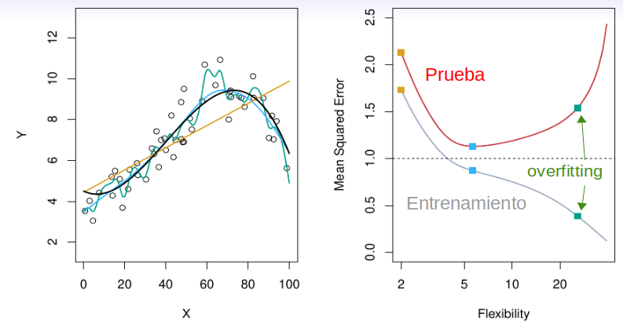{width=85%}
</center>

```{r echo=FALSE, eval=FALSE}
ggplot(mtcars, aes(x=wt, y=mpg)) + geom_point() + 
  geom_smooth(method = "lm", formula = y ~ poly(x,2), se = FALSE) + 
  coord_cartesian(ylim = c(10,30))
```

```{r}
RailTrail %>% ggplot(aes(x = avgtemp, y = volume)) + 
  geom_point() + geom_smooth(method = 'lm', formula = y ~ poly(x,22) ) +
  coord_cartesian(ylim = c(100,750))
```


## "Overfitting" (cont.)

:::: {style="display: flex;"}

::: {}
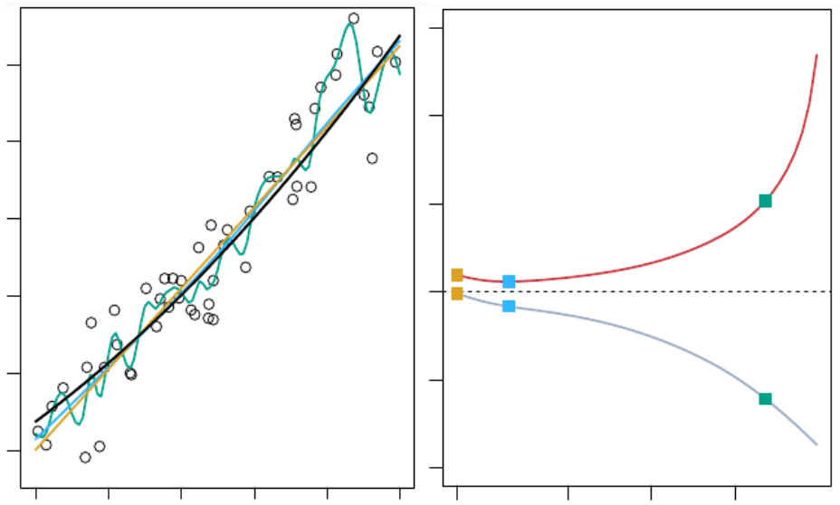{width=99%}  

:::

::: {}
\ \ 
::: 

::: {}
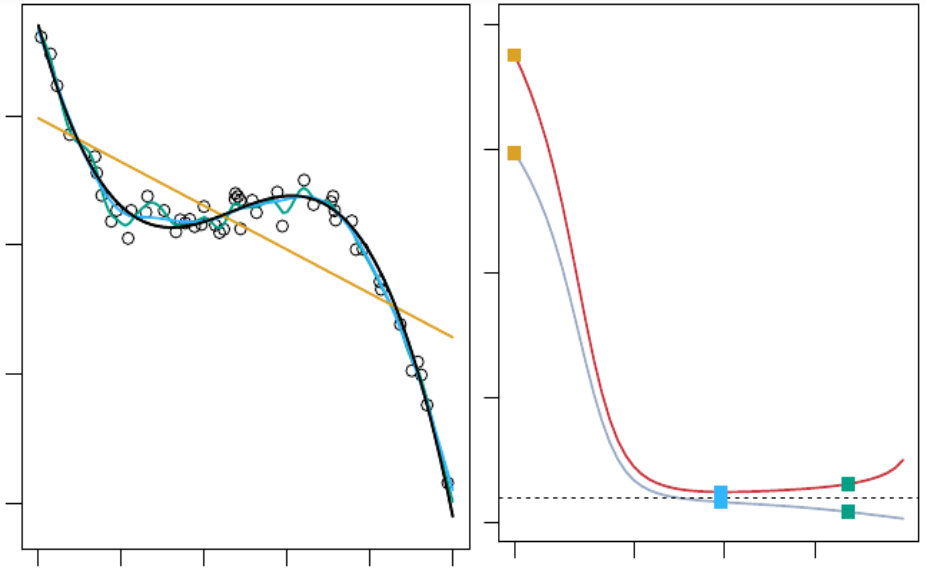{width=99%} 
:::

::::


<!--
* Independientemente de los datos y método, a medida que aumenta la flexibilidad 
-->
* Siempre que aumenta la flexibilidad el MSE
    + disminuye en la muestra de entrenamiento 

    + tiene forma de U en la muestra de prueba
 
* Nota: el MSE en entrenamiento es siempre menor que en prueba

## MSE en la muestra de prueba

\[
\small
E\left[\left(y-\widehat{f}(x)\right)^2\right] =
E\left[\left(f(x)-\widehat{f}(x) + \varepsilon 
+ E\left[\widehat{f}(x)\right]-E\left[\widehat{f}(x)\right] \right)^2\right] =
\]

\[
\small
=\underbrace{\left[E\left(\widehat{f}(x)\right)-f(x)\right]^2}_{(1)} + \underbrace{E\left(\left[\widehat{f}(x)-E\left(\widehat{f}(x)\right)\right]^2\right)}_{(2)}+Var(\varepsilon)
\]


* $\small (1)=\left[Sesgo\left(\widehat{f}(x)\right)\right]^2$: error por supuestos erróneos en $f$

    + ajuste insuficiente (*underfit*) al perder relaciones relevantes entre $X$ e $Y$

* $\small (2)=Var\left(\widehat{f}(x)\right)$: sensibilidad a fluctuaciones en el  entrenamiento
    + si el algoritmo modela puro ruido en entrenamiento, ajustará bien allí, pero predecirá mal casos nuevos (*overfit*)
  
## "Trade-off" Varianza--Sesgo

* El sesgo se reduce y la varianza aumenta con la complejidad del modelo

<!--
A medida que se añaden más y más parámetros a un modelo, la complejidad del modelo aumenta y la varianza se convierte en nuestra principal preocupación, mientras que el sesgo disminuye constantemente. Por ejemplo, a medida que se añaden más términos polinómicos a una regresión lineal, mayor será la complejidad del modelo resultante. 
-->

<center>
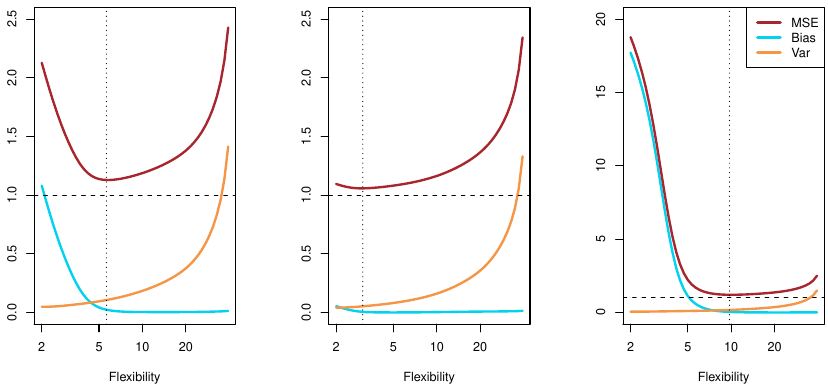{width=95%}
</center>

<!--
SESGO-VARIANZA VISTO EN ECONOMETRIA I: omitir variable relevante (modelos menos flexible), crea sesgo.
                                       incluir variable no relevante (mas flexibe), aumenta varianza
-->

## "Trade-off" Varianza--Sesgo (cont.)

* Es fácil construir un modelo con bajo sesgo, pero tendrá alta varianza. Y al revés.

* El desafío es encontrar un método (ej., flexibilidad del modelo) para el cual tanto la varianza como el sesgo cuadrado sean bajos

* NO  es posible minimizar simultáneamente ambas fuentes de error:  *memorización* (en entrenamiento) vs. *generalización* de resultados


## Medir el Error en la Clasificación

* Los modelos de clasificación NO predicen directamente la categoría, sino la *probabilidad* de que una observación pertenezca a cada categoría

* Típicamente se asigna la clase predicha como aquella con mayor probabilidad: en el caso binario, fijar un umbral de 0.5

```{r}
modelo_logistico <- glm(income ~ capital_gain, data = censo, family = "binomial")
prob.predict <- predict(modelo_logistico, type = "response")

umbral <- 0.5

cat.predict  <- if_else(prob.predict > umbral, 1, 0) 
cbind(censo$income, cat.predict, prob.predict) %>% head(10)
```

* Como no tiene sentido diferencia de clases (variables categóricas), NO se pueden calcular medidas como el MSE y otros relacionados

<!--
* Existen pseudo-$\small R^2$ como la correlación al cuadrado entre 

-->
## Matriz de Confusión

* **Matriz de confusión**: tabulación de los categorías observadas frente a las categorías predichas 

```{r echo=FALSE, eval=TRUE, results='asis'}
library(kableExtra)
tab <- tibble(` ` = c("POSITIVO (1)", "POSITIVO (1)", "NEGATIVO (0)", "NEGATIVO (0)"),
              `POSITIVO (1)` = c("Verdadero Positivo [VP]", " ", "Falso Negativo [FN]", "(Error Tipo II)"),
              `NEGATIVO (0)` = c("Falso Positivo [FP]", "(Error Tipo I)", "Verdadero Negativo [VN]", " "))

tab %>% kbl(align = "c", col.names = c(".", "POSITIVO (1)", "NEGATIVO (0)")) %>%  
  kable_paper("striped", full_width = T) %>%
  add_header_above(c(" " = 1, "CLASE OBSERVADA" = 2), bold = TRUE, font_size = "x-large") %>% 
  collapse_rows(columns = 1, valign = "middle")  %>%
  pack_rows("CLASE PREDICHA", 1, 4)
```
<!--
* Ver [aquí](https://en.wikipedia.org/wiki/Confusion_matrix)
-->

```{r}
table(cat.predict, censo$income)
```

<!--
## Métricas calculadas con la matriz de confusión
-->

## Métricas con la matriz de confusión


* **Tasa de error en la clasificación o de clasificación errónea**: 
\[
\small TCE=\frac{FP+FN}{VP+FP+VN+FN} = \frac{1}{n}\sum_{i=1}^{n}I\left[y_i \neq \widehat{y}_i\right]
\]

  + su complemento es la tasa de observaciones correctamente clasificadas (exactitud o *accuracy*) $\small ACCUR=(VP+VN)/(VP+FP+VN+FN)$
  
* Puede no ser informativa cuando algunas clases son infrecuentes (datos *imbalanced* o desequilibrados): ej., TCE será baja porque la mayoría de las observaciones no son fraude

* La **precisión** o valor de predicción positivo es la cantidad de verdaderos positivos sobre el total de positivos predichos $\small PREC=VP/(VP+FP)$

    + Tasa de falso descubrimiento: $\small 1-PREC$ 

## Métricas con la matriz de confusión (cont.)

* La **tasa de verdaderos positivos**, **sensibilidad** o exahustividad (*recall*) es la cantidad de verdaderos positivos sobre el total de positivos observados \[
\small TVP=SENSIT=VP/(VP+FN)
\]

<!-- probabilidad de detección, potencia  -->

* La **tasa de verdaderos negativos** o *especificidad* es la cantidad de verdaderos negativos sobre el total de negativos observados \[
\small TVN=ESPECIF=VN/(VN+FP)
\]

    + **Tasa de falsos positivos**: $\small TFP = 1 - TVN = 1 - ESPECIF$

* Existen varias otras medidas derivadas de las anteriores

* Una medida global para datos *imbalanced* es la *exactitud equilibrada*: $\small \frac{TVP+TVN}{2}$

## Curva ROC y AUC

<!--
https://developers.google.com/machine-learning/crash-course/classification/roc-and-auc
-->

* La **curva ROC** ("receiver operating characteristic") representa TVP (eje y) frente a TFP (eje x) en *diferentes umbrales de clasificación*  

<!--(es una curva de probabilidad)-->

* Reducir el umbral clasifica más elementos como positivos, por lo que aumentan tanto los falsos positivos como los verdaderos positivos.


:::: {style="display: flex;"}

::: {}

<center>
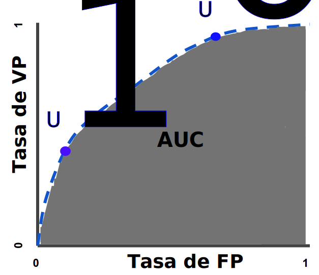{width=65%}
</center>

:::

::: {}

+  Deberíamos evaluar cada modelo con muchos umbrales 

* El área bajo la curva ROC es la **AUC** ("area under the curve")

:::

::::

* **AUC - ROC** es una medida de rendimiento para problemas de clasificación para diferentes umbrales

<!--
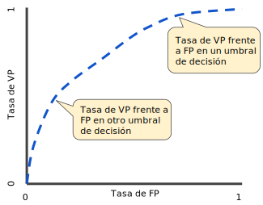{width=40%}
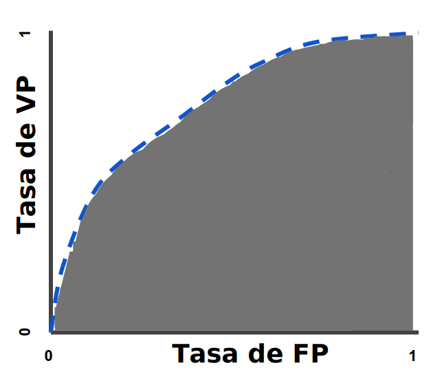{width=40%}

https://machinelearningmastery.com/roc-curves-and-precision-recall-curves-for-classification-in-python/

https://towardsdatascience.com/understanding-auc-roc-curve-68b2303cc9c5
-->

## Curva ROC y AUC (cont.)

* AUC informa del grado de separabilidad: mayor AUC implica que el modelo es capaz de distinguir entre clases (predecir 0s y 1s correctamente)

<center>
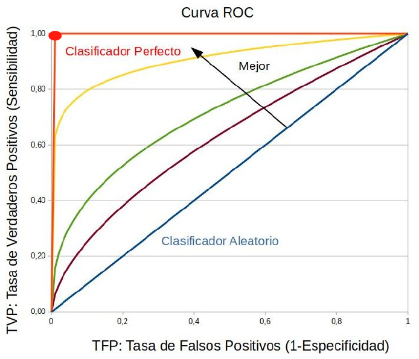{width=55%}
</center>


## Curva ROC y AUC: extensiones

* Cuando la variable de respuesta tiene más de dos clases, 

    1. Se realiza un análisis AUC-ROC para cada categoría: se define unavariable binaria para la categoría frente a todas las demás

    2. Se obtiene el promedio de tanto de la ROC como de la AUC, bien dando igual peso a cada categoría o bien ponderando el número de casos de cada una

* Con datos *imbalanced* algunos autores señalan que es más informativo usar gráfico de TFP frente a precisión en lugar de ROC


## Evaluación de Modelos: entrenamiento y prueba


* Para evaluar correctamente los modelos, DEBEMOS **dividir aleatoriamente** el conjunto de datos disponible en dos partes:

    * **Entrenamiento**: conjunto de datos sobre los que se construye/estima el modelo

    * **Pruebas**: se comprueba cómo funciona un modelo ya construido, evaluándolo con datos no vistos anteriormente

* De esta manera podemos evitar (o al menos minimizar) problemas tanto de *underfit* como sobre todo *overfit*. 

* La partición típica suele incluir el 80% o 90% de los datos en entrenamiento y el 10% o 20% en prueba

* ¿Por qué renunciar a parte de los datos si sabemos que un tamaño muestral grande es importante? Evaluar correctamente un modelo lo es mucho más

## Evaluación de Modelos: Validación cruzada

<!--
* Los resultados de evaluación puede verse afectados por la partición concreta obtenida (ej. incluir observaciones atípicas en la muestra de prueba)
-->

* La técnica más usada se llama de validación cruzada (*cross-validation* o *rotation estimation*). 
    - se repite varias veces y de forma ordenada el proceso de remuestreo para la partición en grupos de entrenamiento y prueba (similar a *bootstrap*)
    - se evita que los resultados sean sensibles a una partición concreta

<!--
the estimate of test error is highlyvariable, depending on precisely which observations areincluded in the training set and which observations areincluded in the validation set.•In the validation approach, only a subset of theobservations — those that are included in the training setrather than in the validation set — are used to fit themodel.•This suggests that the validation set error may tend tooverestimatethe test error for the model fit on the entiredata set
-->


* Entre las variantes más habituales se encuentran:

    - Validación cruzada de K iteraciones (*K-fold cross-validation* o K-fold CV)
    
    - Validación cruzada aleatoria (*Random cross-validation*, RCV)
    
    - Validación cruzada dejando uno fuera (*Leave-one-out cross-validation*, LOOCV)
    
    - Validación cruzada dejando p fuera (*Leave-p-out cross-validation*, LpOCV)

<!--
https://en.wikipedia.org/wiki/Cross-validation_(statistics)
-->

## Validación cruzada de K iteraciones


* La **validación cruzada de K iteraciones** divide (aleatoriamente y *ex-ante*) la muestra en K subconjuntos (normalmente 10)

:::: {style="display: flex;"}

::: {}

<center>
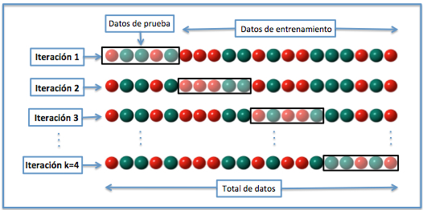
</center>


::: 

::: {}

+ Un subconjunto se usa como prueba y el K-1 restantes como entrenamiento

+ Se repite el proceso durante k iteraciones, con cada posible subconjunto de datos de prueba. 

::: 

::::

+ Se calcula la media aritmética de los resultados de cada iteración para obtener un único resultado


* Es el tipo más habitual de validación cruzada


## Validación cruzada aleatoria y LOOCV

:::: {style="display: flex;"}

::: {}

<center>
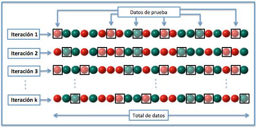
</center>

::: 

::: {}

+ **RCV**: en *cada iteración* se realiza la particion aleatoria (con reemplazamiento) entre entrenamiento y prueba

+ Las observaciones pueden "repetir" como prueba

::: 

::::


:::: {style="display: flex;"}

::: {}

<center>
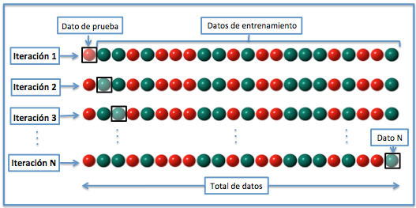
</center>


::: 

::: {}


+ **LOOCV**: solo una observación se usa como prueba en cada iteración y el resto como entrenamiento

+ Se realizan $n$ iteraciones; se calcula una media sobre $n$ resultados

::: 

::::

