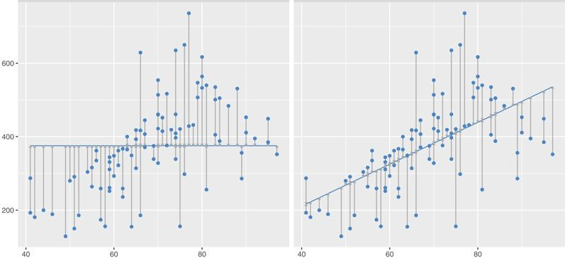

```{r setup, include=FALSE}
knitr::opts_chunk$set(warning = FALSE, message = FALSE, eval = TRUE, echo = TRUE, results = "hide", fig.show="hide")

library(tidyverse)
library(dlookr)
#setwd("/home/albarran/Dropbox/MAD/00.TEC")
library(rmarkdown)
#render("filename.Rmd")     
#browseURL("filename.html")
```


<!--
## Regresión Lineal Simple
-->

## Regresión Lineal 

* La regresión lineal predice una respuesta cuantitativa $\small Y$ como a partir de $k$ regresores $X=$ $\small X_1,X_2,\dots,X_k$

* Supuesto<!-- de linealidad (en los parámetros)-->:  relación lineal entre $\small X$ e $\small Y$
\[
\small
Y=\beta_0+\beta_1 X_1+ \dots + \beta_k X_p + \varepsilon
\]

* Los coeficientes o parámetros del modelo representan

    * $\small \beta_0$ (constante): valor esperado de $\small Y$ cuando $\small X_=X_2=\dots=X_k=0$

    * $\small \beta_j$ (pendiente de la línea): cambio medio en $\small Y$ por un incremento de una unidad en $\small X_j$ (para $j=1,...,k$), *ceteris paribus*

* Objetivo: estimar los coeficientes desconocidos a partir de una muestra

## Regresión Lineal: Estimación

* El error de estimación o **residuo** es $\small \hat{e}_i = y_i - \hat{y}_i$, donde la predicción a partir del modelo estimado es $\small \hat{y}_i=\hat{\beta}_0+\hat{\beta}_1 X_1+ \dots + \hat{\beta}_k X_p$ 

* Los coeficientes estimados son los que minimizan la Suma Cuadrática de Residuos: la suma total de distancias entre los datos observados y predichos  


:::: {style="display: flex;"}

::: {}

<center>
{width=100%}
</center>

::: 

::: {}

\[
\small SCR=\sum_{i=1}^{n} \hat{e}_i^2= \sum_{i=1}^{n} ( y_i - \hat{y}_i)^2
\]

+ Por tanto, también minimiza $\small MSE = \frac{SCR}{n}$

::: 

::::

* Esto equivale a las condiciones derivadas de suponer $\small E(\varepsilon|X)=0$
   
## Regresión Lineal: Precisión de las estimaciones

* La precisión de los coeficientes estimados se mide con el **error estándar** 


:::: {style="display: flex;"}

::: {}

\[
\small se(\widehat{\beta}_j) =  \frac{\sigma^2}{(n-1)S^2_{x_j} (1 - R^2_{j})}
\]
:::

::: {}
\ \ \ 
:::

::: {}

+ $\small \sigma^2=Var(\varepsilon)$, estimada con $\small \frac{SCR}{n-k-1}$
+ $\small S^2_{x_j}=\frac{\sum (x_{ij}-\bar{x}_j)^2}{n-1}=$varianza muestral de $\small X_j$
+ $\small R^2_{j}$ es el $\small R^2$ de la regresión de $\small X_j$ sobre el resto de regresores

<!-- \frac{\sigma^2}{SCT_j (1 - R^2_{j})} = -->

:::

::::

* Los errores estándar se usan para construir intervalos de confianza y estadísticos para contrastar hipótesis sobre los parámetros, p.e.,
    
    + significatividad individual: $\small H_0: \beta_1=0$ con un estadístico $\small t=\frac{\widehat{\beta}_1-0}{se(\widehat{\beta}_1)}$
    + significatividad conjunta: $\small H_0: \beta_1=\beta_2=\dots=\beta_k=0$ con un estadístico $\small F$

   
## Regresión Lineal: Precisión del modelo

* Medición de la precisión del modelo: 

  + RMSE o variantes como el error estandar de la regresión, $\small \sqrt{\frac{SCR}{n-k-1}}$: son   medidas absolutas en las mismas unidades que $Y$ 
  + $\small R^2=1-\frac{SCR}{SCT} = \frac{SCE}{SCT}$ es una medida relativa: proporción de la varianza explicada por el modelo

 
* Las predicción $\widehat{y}$ también están sujetas a incertidumbre por la estimación

  + Existen formulas para calcular su error estándar (a partir de la matriz de varianza y covarianza de los coeficientes estimados) 
  + Por tanto, también se puede calcular un intervalo de confianza

  
## Regresión Lineal: Variables cualitativas

* Sólo dos valores: se incluye un regresor un indicador binario $\small D$
  + la constante recoge el valor esperado de $\small Y$ para el grupo con $\small D=0$
  + el coeficiente del indicador indica el efecto adicional (respecto al otro grupo) en el valor esperado de $\small Y$ para el grupo con $\small D=1$

```{r, echo=FALSE, eval=FALSE}
library(ISLR)
lm(data=Carseats, Sales ~ Advertising + Urban)
```
* Con varias categorías: se incluyen indicadores binarios para cada clase excepto uno, el grupo de referencia
  + la constante recoge el valor medio de $\small Y$ para el grupo de referencia
  + cada coeficiente recoge el efecto adicional sobre $\small Y$ de su grupo

```{r}
library(ISLR)
lm(data=Carseats , Sales ~ Urban + ShelveLoc)
```

* Aunque R los genera automáticamente para factores, también se pueden crear con `if_else()` o con el paquete `fastDummies` 

<!--
Now, before summarizing this R tutorial, it may be worth mentioning that there are other options to recode categorical data to dummy variables. For instance, we could have used the model.matrix function, the dummies package, and the step_dummy (recipes package).
-->

## Superando el supuesto de linealidad

* Se pueden incluir transformaciones no lineales de las variables del modelo, como logaritmos o incluir términos polinomiales

* La interpretación del cambio de un regresor sobre $\small Y$ es diferente
```{r}
lm(data=Carseats %>% filter(Sales != 0), log(Sales) ~ poly(Advertising,2))
```

<!-- https://stackoverflow.com/questions/24198013/significance-of-i-keyword-in-lm-model-in-r -->

* Otra forma de permitir no linealidades es discretizando variables continuas: permite efectos "escalón" diferentes para distintos valores

```{r}
lm(data=Carseats , Sales ~ cut_width(Advertising, 10)) %>% summary()
```


## Superando el supuesto de linealidad (cont.)

<!--
https://www.econometrics-with-r.org/8-3-interactions-between-independent-variables.html
-->

* También podemos incluir interacciones entre variables: el efecto de un regresor dependerá de otro regresor

```{r}
lm(data=Carseats , Sales ~ Advertising*Income)
```

* Principio jerárquico: al incluir una interacción *siempre* deben incluirse los factores principales (NO sólo `Advertising:Income`)

* Cuando interactuamos un regresor continuo y uno binario, permitimos que la pendiente del primero sea diferente para cada grupo

```{r}
lm(data=Carseats , Sales ~ (Income + Advertising)*Urban)
```

* La interacción de dos variables binarias tiene una interpretación similar, para el efecto esperado de $\small Y$

```{r}
lm(data=Carseats , Sales ~ ShelveLoc*Urban)
```

## "Problemas" del Modelo de Regresión Lineal

* *No linealidad*: incluir transformaciones no lineales <!--de los regresores o la variable dependiente-->

* *Correlación de los errores*: afecta a los errores estándar, no la estimación
  + usar errores estándar robustos o modelizar la dinámica
  
* *Heterocedasticidad*: ídem, usar errores estándar robustos <!-- o pesos -->
  + los gráficos de los residuos frente a un regresor o valores predichos: ¿heterocedasticidad o no linealidad? 
  <!--logaritmos o raíz cuadrada cuando hay una amplifiación de los residuos -->
  
* *Outliers* en la variable de respuesta o en los regresores
<!--: se puede intentar detectar con algunos criterios ("arbitrarios": ej. $\small \left|\frac{\hat{e}_i}{se(\hat{e}_i)}\right|>3$)-->

* *Colinearidad*: indica que no es posible separar el efecto de cada regresor: eliminar alguno o recombinarlos

* *No normalidad*: SC

* El único supuesto realmente importante es $\small E[\varepsilon|X]=0$

<!--
    afecta a la varianza del estimador de un coeficiente, pero NO a significatividad conjunta
    + realmente indica que no es posible separar adecuadamente el efecto de varios regresores por separado: eliminar alguno o recombinarlos -->

<!--
  + se suele usar criterios como VIF (*variance inflation factor*=1/(1-R^2_j)$=ratio de la varianza del estimador en regresion multiple / reg. simple) 
  si VIF>5 o 10
-->

## Selección de variables 

<!--
* En el análisis exploratorio, encontramos variables significativamente correlacionadas con la variable de respuesta
-->

* NO se pueden examinar todos los posibles modelos que incluyen combinaciones de los regresores significativamente correlacionados <!--(incluyendo interacciones) -->

* Procesos automatizados frecuentemente utilizados:

    + Selección hacia adelante (*forward selection*): añadir uno a uno los regresores más correlacionados <!--(criterio de parada en la mejora de SCR o p-valores.-->

    + Selección hacia atrás (*backward selection*): comenzando con todos, se va eliminando el regresor con mayor p-valor <!--(hasta criterio de parada)-->

    + Selección mixta: se añaden regresores uno a uno, pero en cada iteración se puede eliminar alguno si su p-valor excede un umbral

* No tienen criterio riguroso ni llevan a la misma solución. Además, se suelen utilizar en la misma muestra donde se estima

