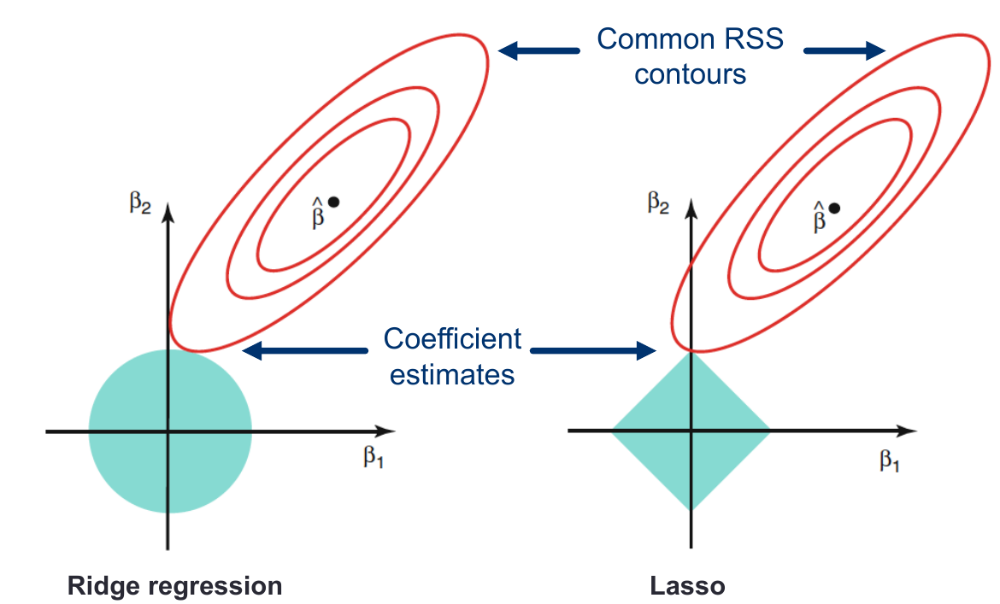

```{r setup, include=FALSE}
knitr::opts_chunk$set(warning = FALSE, message = FALSE, eval = TRUE, echo = TRUE, results = "hide", fig.show="hide")

library(tidyverse)
library(dlookr)
#setwd("/home/albarran/Dropbox/MAD/00.TEC")
library(rmarkdown)
#render("filename.Rmd")     
#browseURL("filename.html")
```


## Alternativas a Mínimos Cuadrados

\[
\small
Y = \beta_0 + \beta_1 X_1 + \dots + \beta_k X_k + \varepsilon
\]

* ¿Por qué?
  
    1.  **Precisión**: <!--incluso si la verdadera relación es lineal,-->la varianza aumenta cuando crece el número de parámetros (=regresores) relativo al de observaciones

        + con $\small k>n$ no existe una estimación única de mínimos cuadrados 
    
    2. **Interpretación**: un modelo con variables irrelevantes <!-- no asociadas a la de respuesta--> es más complejo y menos interpretable


* La **restricción o reducción** de los coeficientes estimados puede reducir la varianza (a costa de un aumento insignificante del sesgo)

* La **selección** de variables se utiliza para excluir variables irrelevantes y  ajustar ese modelo reducido por mínimos cuadrados

## Selección  del Mejor Subconjunto 

* Debemos estimar $\small 2^k$ modelos posibles con cada combinación de regresores (desde un solo regresor hasta todos a la vez)

* Usar SCR en entrenamiento lleva a elegir el modelo con $\small k$ parámetros

* Procedimiento:

  1. Para cada $\small p=1,\dots,k$, estimar todos los modelos con $p$ parámetros y elegir aquel con menor error (ej., SCR): $\small M^*_p$
  
  2. Elegir entre los modelos $\small M^*_1, \dots, M^*_k$ usando validación cruzada o similar

* No validamos todos, pero estimarlos es prohibitivo para $\small k$ moderada

## Selección paso a paso hacia adelante 

* Procedimiento: empezando por modelo sin regresores $\small M_0$

  1. Para cada $\small p=0, 1,\dots,k-1$, estimar todos los modelos que añadan UN regresor a $\small M^f_p$
  2. Elegir como modelo $\small M^f_{p+1}$ el que tiene menor SCR
  3. Elegir entre  $\small M_0, M^f_1, \dots, M^f_k$ con validación cruzada o similar

<!--
* Muchos menos modelos: $\small k-p$ por iteración, en total $\small 1+\frac{p(p+1)}{2}$
-->

* Solo $\small 1+\frac{p(p+1)}{2}$ modelos
* Factible aunque $\small k>n$ pero para modelo $M_0,\dots,M^f_{n-1}$

* No se garantiza encontrar el mejor subconjunto, por eliminar pronto un regresor importante
    + ej. el mejor $\small M^*_2$ no usa el regresor de <!--del mejor modelo de un regresor--> $\small M^f_1=M^*_1$

## Selección paso a paso hacia atrás

* Procedimiento: empezando por modelo con todos los regresores $\small M_k$
  1. Para cada $\small p=k, k-1, \dots,1$, estimar todos los modelos que eliminan UN regresor a $\small M^b_p$
  2. Elegir como modelo $\small M^b_{p-1}$ el que tiene menor SCR
  3. Elegir entre $\small M_0, M^b_1, \dots, M^b_k$ usando validación cruzada o similar

* Solo $\small 1+\frac{p(p+1)}{2}$ modelos
* Pero no factible si $\small k>n$ (no se puede ajustar $M_{k}$)

* NADA garantiza acabar con el mejor subconjunto de regresores

## Otros procedimientos

* **Selección mixta** de subconjuntos: en cada iteración se añaden variables de forma secuencial, pero también se eliminan las que ya no mejoren el ajuste

    + simulan la selección de mejores subconjuntos, con las ventajas computacionales de selección por pasos.

* Estimar *directamente* el error de prueba mediante validación cruzada

* Estimar *indirectamente* el error de prueba mediante **ajustes** en el error de entrenamiento para tener en cuenta el sesgo por "overfitting"

* Todos estos métodos (y los anteriores de selección) se pueden usar también en regresión logística

## Ajustes mediante penalización

* Sea $\small n$ el número de observaciones, $\small p$ el número de parámetros y $\small \widehat{\sigma}^2$ un estimación de la varianza del error $\small \varepsilon$

* $\small C_p$ de Mallow: $C_p = \frac{1}{n}\left( SCR + 2 d \widehat{\sigma}^2 \right)$

* Criterio de Información de Akaike $AIC = - 2 log L + 2 d$
    
    + $\small L$=valor maximizado de la función de verosimilitud
    
* En modelos lineales con errores normales $C_p = AIC$

* Criterio de Información Bayesiano: $BIC =  \frac{1}{n}\left( SCR + log(n) d \widehat{\sigma}^2 \right)$

    + $\small n>7 \Rightarrow log(n)>2$, $\small BIC$ penaliza más modelos con más parámetros
    
* $R^2-ajustado = 1- \frac{SCR/(n-d-1)}{SCT/(n-1)}$ o $SCR/(n-d-1)$ 

## Ajustar o Validar

* Validación cruzada ofrece una estimación **más directa**

* Los métodos de ajuste ofrecen una estimación indirecta a través de supuestos que pueden ser erróneos

* Validación cruzada es computacionalmente **más costosa**

* Validación cruzada NO necesita estimar $\widehat{\sigma}^2$ (puede ser difícil en algunos modelos)

* **Regla de parquedad paramétrica** o **de un error estándar**: dado un conjunto de modelos igualmente buenos, es mejor elegir el modelo más simple

    + seleccionar el modelo con menos variables que esté dentro de un error estándar del menor error de prueba estimado. 

## Métodos de regularización

* Alternativa a mínimos cuadrados con selección de regresores

* Ajustar un modelo que contenga **todos** los regresores, PERO con una técnica que limite las estimaciones de los coeficientes, o las reduzca a cero.

* A priori, NO es obvio por qué esa restricción debería mejorar el ajuste, pero esto reduce su varianza

* Dos enfoques
    + "Ridge regression": se reducen los coeficientes
    + LASSO ("least absolute shrinkage and selection operator"): selección automática de regresores

* Regresión de red elástica, incorpora ambos

## "Ridge Regression"

* En *MCO*: $\small \min_{\beta}=SCR={\sum_{i=1}^{n}\left(y-\widehat{y}\right)^2}$

* Añadir restricciones para prevenir "overfitting"  $\small \sum_{j=1}^{p}\beta_j^2 \leq c$

* Se obtiene un coeficiente estimado $\small \widehat{\beta}^R_{\lambda}$ que minimiza
\[
SCR + \lambda \sum_{j=1}^{p}\beta_j^2 = SCR + \lambda ||\beta||_2^2
\]

  + $||\beta||_2 = \sqrt{\sum_{j=1}^{p}\beta_j^2}$ es la norma L2 ($\ell_2$) del vector de coeficientes

  + $\lambda \geq 0$ es un parámetro de ajuste ("tuning parameter")


## "Ridge Regression": penalización de contracción

\[\small
\widehat{\beta}^R_{\lambda} = \arg \min_\beta SCR + \lambda \sum_{j=1}^{p}\beta_j^2 
\]

* Tratamos de ajustarnos a los datos minimizando SCR, PERO se recompensa a los coeficientes cercanos a cero: **penalización de contracción** 

* NO se penaliza a la constante (media de $\small Y$), solo el impacto de $\small X$

* $\small \lambda$= importancia de la penalización (cuanto se contraen los coeficientes)

    + $\small \lambda \approx 0$, cercano a MCO 
    
    + $\small \lambda >> 0$, todos los coeficientes se van a cero

* Ventaja sobre la selección de regresores: SOLO necesitamos ajustar un modelo para cada valor de $\small \lambda$

## "Ridge Regression": Advertencia


* En MCO los coeficientes estimados son equivariantes a la escala de los regresores. En "Ridge Regression", NO.

* En MCO, si $\small X_j$ por una constante, $\small c$, el coeficiente estimado se reescala por $\small 1/c$ y el valor predicho $\widehat{\beta_j}X_j$ sigue siendo el mismo. 

* $SCR$ no cambia cuando se reescala un regresor, PERO la penalización SÍ

* Los coeficientes estimados de "ridge regression" pueden cambiar drásticamente después de reescalar cualquier variable

* Se recomienda ajustar "ridge regression" **después de estandarizar** los regresores:
\[
\small
\widetilde{x}_{ij} = \frac{x_{ij}}{\sqrt{ \frac{1}{n}\sum_{i=1}^n(x_{ij}-\bar{x}_j)^2}}
\]


## "Ridge Regression": "trade-off" sesgo varianza

* ¿Por qué "ridge regression" mejoraría el ajuste sobre MCO? Por el "trade-off" entre sesgo y varianza

    * $\small \lambda$ aumenta (menos parecido a MCO), la flexibilidad disminuye: más sesgo, menos varianza

    * $\small \lambda$ disminuye, la flexibilidad aumenta: menos sesgo, más varianza

* "Ridge regression" funciona mejor cuando MCO tiene alta varianza: intercambia un poco más de sesgo por una gran reducción de la varianza


* Sin embargo, NO realiza selección de variables: sigue incluyendo *todos* los regresores 
    + puede complicar la interpretación con muchos, porque ninguno será exactamente cero


## LASSO

* Idea similar $\small \min_{\beta}=SCR={\sum_{i=1}^{n}\left(y-\widehat{y}\right)^2}$, sujeto a $\small \sum_{j=1}^{p}\beta_j^2 \leq c$

<!--
* Selección de mejor conjunto impone restricción
$\small \sum_{j=1}^{p} I(\beta_j \neq 0) \leq s$

Tampoco es factible: requiere considerar todos los modelso que tiene s regresores

LASSO/ridge  más factibles computacionalmente: sustituyen unas restricciones intratablse por alternativas mucho más fáciles de resolver
-->

\[
\widehat{\beta}^L_{\lambda} = \arg \min_\beta SCR + \lambda \sum_{j=1}^{p}|\beta_j| 
\]

* LASSO utiliza una penalización basada en la norma L1 ($\small \ell_1$): 
\[\small
||\beta||_1 = \sum_{j=1}^{p} |\beta_j|
\]

* También contrae los coeficientes estimados hacia cero, PERO obliga algunos a ser **exactamente iguales a cero** cuando $\small \lambda$ es grande

* LASSO realiza la selección de variables.

## LASSO

<center>
{width=90%}
</center>

## LASSO vs. "Ridge Regression"

* Ambos reducen significativamente la varianza a expensas de un pequeño aumento del sesgo 

* "Ridge regression" domina cuando hay muchos regresores igualmente importantes

* LASSO domina cuando hay un pequeño número de regresores importantes y muchos otros que no son útiles

* Generalización: Regresión de red elástica

\[\small
\min_{\beta}=SCR+\lambda \big[ (1-\alpha)||\beta||_2^2/2 + \alpha||\beta||_1\big]
\]


## Eligiendo el parámetro de ajuste

* Necesitamos un método para determinar qué modelo es el mejor: validación cruzada.

* Un algoritmo general para seleccionar un parámetro de ajuste:

  1. Elegir un rango de valores para $\small \lambda$
  
  2. Calcular el error mediante validación cruzada para cada valor de $\small \lambda$
  
  3. Seleccionar el valor con menor error
  
  4. Volver a ajustar el modelo usando todas las observaciones y el valor del parámetro de ajuste seleccionado.
  
  
## `glmnet` para regresión lineal

```{r}
library(mosaicData)
library(glmnet)

x <- model.matrix(volume ~ spring + summer + fall + weekday + poly(avgtemp, 6), data = RailTrail)

fit.lmreg <- glmnet(x = x, y = RailTrail$volume, family="gaussian",lambda=0.5, alpha=0.5)
coef(fit.lmreg)
```

* Elegimos el parámetero de regularización mediante validación cruzada

```{r}
set.seed(1)
cv.glmnet(x, RailTrail$volume) %>% plot()
```

## `glmnet` para regresión logística

```{r}
censo <- read_csv("https://www.dropbox.com/s/6bqyjnkd2c638rm/census.csv?dl=1") %>%
  mutate(income = as.integer(factor(income))-1)

x <- model.matrix(income ~ education + relationship + poly(age,2) + 
                    workclass + occupation, 
              family = "binomial", data = censo)

fit.glmreg <- glmnet(x = x, y = censo$income, lambda=0.001, alpha=1)
coef(fit.glmreg)

set.seed(1)  # validación cruzada para elegir parámetro de regularización
cv.glmnet(x, censo$income) %>% plot()
```
