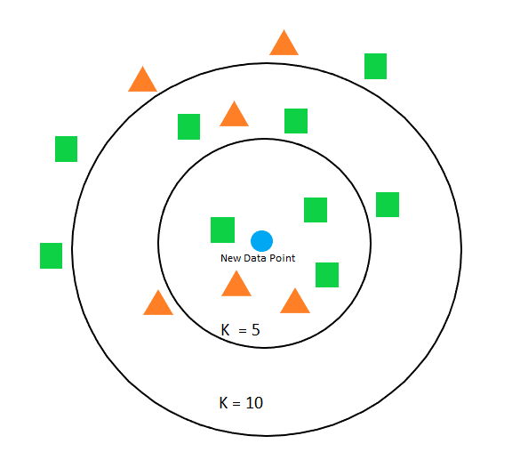

```{r setup, include=FALSE}
knitr::opts_chunk$set(warning = FALSE, message = FALSE, eval = TRUE, echo = TRUE, results = "hide", fig.show="hide")

library(tidyverse)
library(dlookr)
#setwd("/home/albarran/Dropbox/MAD/00.TEC")
library(rmarkdown)
#render("filename.Rmd")     
#browseURL("filename.html")
```

## k-NN ('k-nearest neighbors')
 
 * Métodos paramétricos = supuesto funcional para la **esperanza condicional** 
 
    + variable numérica $\small E[y|\mathbf{X}=x_0]=f(x_0)=\beta_0+\beta_1 x_0$
    
    + variable binaria: $\small E[y|\mathbf{X}=x_0]=\Pr(y=1|\mathbf{X}=x_0) =f(x_0)=\Lambda(\beta_{0}+\beta_{1} x_0)$
    
    + variable categórica: $\small \Pr(y=j|\mathbf{X}=x_0) =f_j(x_0)=\Lambda(\beta_{0j}+\beta_{1j} x_0)$

 
 * k-NN estima la esperanza condicional de forma no parámetrica <!--(predice sin construir un modelo)-->
 
 * Idea: el valor esperado de $\small y$ para una observación debe ser "similar" al de otras observaciones "cercanas" (por su valor en  $\small \mathbf{X}$)

    + mismo valor de $\small x_0$, mismo valor esperado de $\small y$
    
    + $\small f(\mathbf{X})$ no se supone conocida y fija
    
## Algoritmo k-NN

* Datos unos datos de entrenamiento $\small\{\mathbf{X}_{n\times p}, y_{n\times 1} \}$ y un parámetro $\small k>0$ entero
    
* Para una nueva observación $\small \mathbf{x^*}$ (prueba)


1. Identificar $\small D(\mathbf{x^*})$: las $\small k$ observaciones en los datos de entrenamiento más cercanas, según una medida de distancia (típicamente la norma $\small ||x^*-x_i||_2$ 

2. Estimar la esperanza/probabilidad condicional de $\small y$ con las observaciones de $\small D(\mathbf{x^*})$ y obtener

    * la media para $\small y$ numérica: $\small E[y|\mathbf{X}=x^*] \approx \frac{1}{k}\sum_{i\in D(\mathbf{x^*})} y_i$

    * la clase mayoritaria para categórica: $\small \Pr[y=j|\mathbf{X}=x^*] \approx \frac{1}{k}\sum_{i\in D(\mathbf{x^*})} I(y_i = j)$

3. Asignárselo como valor predicho a $\mathbf{x^*}$

## Algoritmo k-NN (cont.)

<center>
{width=40%}
</center>

<!--
* No necesita un proceso de entrenamiento previo: lo hace sobre la marcha.

* Simple y fácil de entender 

* Puede tardar en calcular predicciones (procesa en el momento)
-->

* El valor "óptimo" de $k$ se elige mediante validación cruzada.

    * $\small k$ bajo (= algoritmo demasiado flexible): alta varianza y sesgo bajo

    * Al aumentar $\small k$ (menos flexible), menor varianza, pero mayor sesgo

## Algoritmo k-NN: comentarios

* Implementación en R

```{r, eval=FALSE}
install.packages("class")
install.packages("kknn")
```


* Su utilidad depende de la geometría de los datos

     + la distancia solo se puede calcular para variables continuas

     + conviene reescalar los datos
     
<!--     
     + si una variable tiene una escala ancha puede perjudicar todo el proceso.
-->


* Se utiliza frecuentemente para imputar valores ausentes: `step_knnimpute` (transformación antes de modelizar, no cambiando todo)

    * Mejor una media condicional que una media simple

    * Nota: `recipes` de `tidymodels` incluye varios procedimientos de imputación

<!--    
    * Nota 2: imputar la variable dependiente no tiene mucho sentido
-->    
      


## k-NN: ejemplo de clasificación

```{r}
censo <- read_csv("https://www.dropbox.com/s/6bqyjnkd2c638rm/census.csv?dl=1") %>% 
  mutate(income=as.factor(income))

# solo variables cuantitativas
x <- c("age", "education_1", "capital_gain", "capital_loss", "hours_per_week")

censo_ent <- censo %>% select(x,income) %>% sample_frac(size = 0.8) 
censo_pru <- censo %>% select(x,income) %>% setdiff(censo_ent) 

library("class")
income_pred <- knn(censo_ent %>% select(x), test = censo_pru %>% select(x), 
                   cl = censo_ent$income, k = 1)
table(income_pred, censo_pru$income)

library(kknn)
knn2 <- kknn(income ~ age + education_1 + capital_gain + capital_loss + hours_per_week, 
             train = censo_ent, test = censo_pru )
summary(knn2)
table(income_pred, fitted(knn2))
```

<!-- kknn tiene muchas opciones adicionales para hacer CV, etc 

tidymodels es mas sistematico
-->

## k-NN con `tidymodels`

```{r}
library(tidymodels)
set.seed(7482)
censo_part <- censo %>% initial_split(prop = .8)

censo_receta_knn1 <- training(censo_part) %>%
  recipe(income ~ age + education_1 +  capital_gain + capital_loss + hours_per_week) %>% 
  step_scale(all_numeric(), -all_outcomes())

censo_modelo_knn1  <- nearest_neighbor(mode = "classification",
                                       neighbors = 5, dist_power = 2) %>% 
                          set_engine("kknn")

censo_flujo_knn1 <- workflow() %>% add_recipe(censo_receta_knn1) %>% 
                      add_model(censo_modelo_knn1)

censo_flujo_knn1_est  <- censo_flujo_knn1 %>% fit(data = censo_part %>% training()) 

censo_flujo_knn1_est %>% predict(testing(censo_part)) %>% 
  bind_cols(testing(censo_part)) %>%  accuracy(income, .pred_class) 
```


## k-NN con `tidymodels` (cont.)

```{r}
library(mosaicData)
set.seed(9753)
RailTrail_part <- RailTrail %>% initial_split(prop = .8)

RailTrail_receta_knn1 <- training(RailTrail_part) %>%
  recipe(volume ~ cloudcover + precip + avgtemp) %>% 
  step_scale(all_numeric(), -all_outcomes())

RailTrail_modelo_knn1  <- nearest_neighbor(mode = "regression",
                                       neighbors = 5, dist_power = 2) %>% 
                          set_engine("kknn")

RailTrail_flujo_knn1 <- workflow() %>% add_recipe(RailTrail_receta_knn1) %>% 
                      add_model(RailTrail_modelo_knn1)

RailTrail_flujo_knn1_est  <- RailTrail_flujo_knn1 %>% fit(training(RailTrail_part)) 

RailTrail_flujo_knn1_est %>% predict(testing(RailTrail_part)) %>% 
  bind_cols(testing(RailTrail_part)) %>% metrics(volume, .pred) 
```
