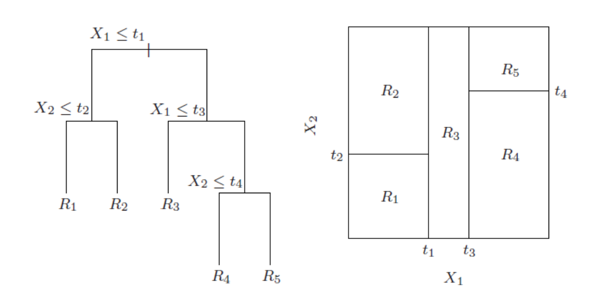

```{r setup, include=FALSE}
knitr::opts_chunk$set(warning = FALSE, message = FALSE, eval = TRUE, echo = TRUE, results = "hide", fig.show="hide")

library(tidyverse)
library(dlookr)
#setwd("/home/albarran/Dropbox/MAD/00.TEC")
library(rmarkdown)
#render("filename.Rmd")     
#browseURL("filename.html")
```


## Árboles de decisión


* Los métodos basados en árboles implican la estratificación o la segmentación del espacio de predicción en una serie de regiones simples

<!-- 
* El conjunto de reglas de división usada para segmentar puede resumirse en un árbol

* árbol de decisión es un diagrama de flujo en forma de árbol que clasifica observaciones -->

* Un árbol de decisión es un diagrama de flujo en forma de árbol con reglas de división para segmentar y clasificar observaciones

* Los árboles de decisión suelen estar dibujados al revés:
    + las hojas o los nodos terminales en la parte inferior del árbol
    
    +  los puntos del árbol en los que se divide el espacio de predicción se denominan nodos internos. 

    + los nodos se conectan por ramas.

* Cada rama del árbol separa las observaciones en subconjuntos cada vez homogéneos ("puros"): es más probable que compartan la misma  clase o valor.

<!--
Un ejemplo de árbol con dos variables numéricas $X_1$ y $X_2$ sería
-->


## Árboles de decisión (cont.)

<center>
{width=95%}
</center>


## Árboles de Regresión

* ¿Cómo construimos estos árboles? 

1. Dividir el espacio de predicción, $\small x_1, x_2, \dots, x_p$ en regiones $\small J$ distintas y no superpuestas, $\small R1, R2, \dots, R_J$

2. Cada observación que caiga en la región $\small R_j$ tiene el mismo valor predicho: la media de $\small y$ para las observaciones de entrenamiento en $\small R_j$

* ¿Cómo determinar las regiones apropiadas $\small R1, R2, \dots, R_J$?

* Por simplicidad y por interpretabilidad, se divide el espacio de predicción en rectángulos de n-dimensiones o cajas

* El objetivo es encontrar regiones que minimicen la SCR <!--suma cuadrática de los residuos-->

\[\small
\sum_j \sum_{i\in R_j} (y_i-\widehat{y}_{R_j})^2
\]

<!--
donde y^Rj
es la respuesta media para las observaciones de entrenamiento en el cuadro j --> 

## Algoritmo de partición binaria recursiva 

* NO podemos encontar el árbol óptimo: es computacionalmente inviable considerar cada posible partición <!--del espacio de características--> en $\small J$ regiones. 

* Hay varias formas heurísticas para construir árboles de decisión que emplean estrategias denominadas "voraces" (*greedy*).

* Un algoritmo voraz elige una opción localmente óptima en cada paso con la esperanza de llegar a una solución general óptima.  

<!-- en lugar de mirar adelante y elegir la partición mejor para un pasao futuro -->

* La partición binaria recursiva sigue un enfoque de arriba a abajo

