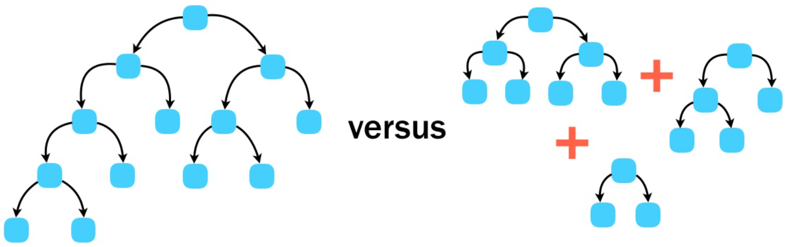
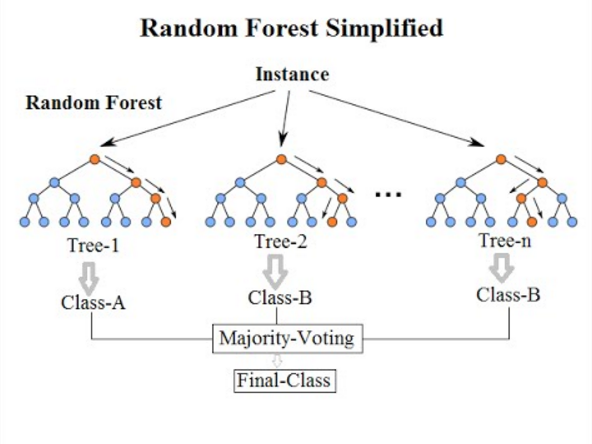

```{r setup, include=FALSE}
knitr::opts_chunk$set(warning = FALSE, message = FALSE, eval = TRUE, echo = TRUE, results = "hide", fig.show="hide")

library(tidyverse)
library(dlookr)
#setwd("/home/albarran/Dropbox/MAD/00.TEC")
library(rmarkdown)
#render("filename.Rmd")     
#browseURL("filename.html")
```


## Árboles de decisión

<!-- 
* Los métodos basados en árboles implican la estratificación o la segmentación del espacio de predicción en una serie de regiones simples


* El conjunto de reglas de división usada para segmentar puede resumirse en un árbol

* árbol de decisión es un diagrama de flujo en forma de árbol que clasifica observaciones -->

* Un árbol de decisión es un diagrama de flujo con reglas para segmentar el espacio de regresores en regiones más simples y clasificar observaciones

* Los árboles de decisión suelen estar dibujados al revés:
    + las hojas o los nodos terminales en la parte inferior del árbol
    
    +  los puntos del árbol en los que se divide el espacio de predicción se denominan nodos internos. 

    + los nodos se conectan por ramas.

* Cada rama del árbol separa las observaciones en subconjuntos cada vez homogéneos ("puros"): es más probable que compartan la misma  clase o valor.

<!--
Un ejemplo de árbol con dos variables numéricas $X_1$ y $X_2$ sería
-->


## Árboles de decisión (cont.)

<center>
{width=95%}
</center>


## Árboles de Regresión

* ¿Cómo construimos estos árboles para una variable cuantitativa? 

  1. Dividir el espacio de predicción, $\small x_1, x_2, \dots, x_p$ en regiones $\small J$ distintas y no superpuestas, $\small R_1, R_2, \dots, R_J$

  2. Cada observación que caiga en la región $\small R_j$ tiene el mismo valor predicho: la media de $\small y$ para las observaciones de entrenamiento en $\small R_j$

* ¿Cómo determinar las regiones apropiadas $\small R_1, R_2, \dots, R_J$?

  * Por simplicidad y por interpretabilidad, se divide el espacio de predicción en rectángulos de p-dimensiones o cajas

  * El objetivo es encontrar regiones que minimicen la SCR <!--suma cuadrática de los residuos-->

\[\small
\sum_j \sum_{i\in R_j} (y_i-\widehat{y}_{R_j})^2
\]

<!--
donde y^Rj
es la respuesta media para las observaciones de entrenamiento en el cuadro j --> 

## ¿Cómo encontrar el árbol óptimo?

* NO podemos: es computacionalmente inviable considerar cada posible partición del espacio de características en $\small J$ regiones. 

* Existen allternativas heurísticas para construir árboles de decisión que emplean estrategias denominadas "voraces" (*greedy*)

* Un algoritmo "voraz" elige una opción localmente óptima en cada paso con la esperanza de llegar a una solución general óptima  

    + en lugar de <!--mirar adelante y --> elegir la mejor partición para un paso futuro
    
## Partición binaria recursiva 

<!--
* Sigue un enfoque de arriba a abajo
-->

1. En la parte alta, todas las observaciones pertenecen a una sola región
  
2. Se divide sucesivamente cada región en dos ramas: $\small R_1(j,s) = \{X|X_j < s\}$ y  $\small R_2(j,s) = \{X|X_j \geq s\}$
  
    * En cada nodo, se consideran *todos* los regresores $\small X_j$ y *todos* los umbrales $s$
    
    * Se calcula $\small SCR_{j,s} = \sum_{i\in R_1(j,s)}(y_i-\widehat{y}_{R_1})^2 + \sum_{i\in R_2(j,s)}(y_i-\widehat{y}_{R_2})^2$

    * SOLO una partición en cada iteración: se elige $\small j$ y $\small s$ con menor $\small SCR_{j,s}$ <!--en esa iteración -->
    
3. Repetimos el proceso particionando cada región de la iteración anterior 
<!-- NO el conjunto entero -->

4. Se continua hasta que se cumpla un criterio de parada; p.e., ninguna región contiene más de $5$ observaciones


## Podar un árbol (*pruning*)

<!--
* El proceso anterior lleva, en general, a árboles complejos: "overfitting"

* Alternativa 1: hacer crecer el árbol sólo si la disminución en SCR en cada división excede un umbral para obtener árboles más pequeños
    
* PERO es poco previsora: una división "inútil" al principio del árbol podría implicar gran reducción de la SCR futura.
-->

* Para evitar árboles demasiados complejos ("overfitting"), se podría hacer crecer el árbol solo si la SCR excede un umbral

* PERO esto es poco previsor: una división inicial "inútil" <!--al principio del árbol--> podría implicar gran reducción de la SCR futura.


* Alternativa: hacer crecer un árbol "grande" con $\small T_0$ nodos terminales y **podarlo** para quedarnos con un sub-árbol con $\small T$ nodos terminales
\[\small
min \sum_{m=1}^T \sum_{i \in R_m} (y_i-\widehat{y}_{R_m})^2 + \alpha |T|
\]
  + donde $\small R_m$ es la región de $\small m$-nodo terminal

*  $\small \alpha$ es el hiperparametro de **coste de complejidad** de la poda (elegido por validación cruzada)

## Árboles de clasificación

* Para un árbol de clasificación, se predice que cada observación pertenece a la clase más común en la región a la que pertenece en entrenamiento

* También se pueden obtener la proporción de una clase $\small k$ dentro de una región particular $\small m$ de nodos terminales: $\small \widehat{p}_{mk}$

* La métrica usada para hacer crecer los árboles NO puede ser SCR

<!--
1. Tasa de error de clasificación (fracción de observaciones que no pertenecen a la clase más común)
\[
\small
E=1 - max_k (\widehat{p}_{mk}$)
\]

no es lo suficientemente sensible para el cultivo de árboles y son preferibles otros criterios.
-->

2. Índice de Gini: medida de la varianza entre clases $\small
G=\sum_{k=1}^{K}\widehat{p}_{mk}(1-\widehat{p}_{mk})$

3. Entropía (cruzada) $\small
D=\sum_{k=1}^{K}\widehat{p}_{mk}log(\widehat{p}_{mk})$

* Ambos son medidas de "pureza" del nodo: un valor pequeño indica que la región contiene en su mayoría observaciones de una sola clase.

## Ventajas y desventajas

(+) Funcionan mejor que modelos lineales para relaciones no lineales y complejas <!-- (y peor en caso contrario)-->

<!-- son alternativas a interacciones en modelo de regresión lineal -->

(+) Fáciles de explicar (más que la regresión lineal)

(+) Reflejan los procesos de toma de decisiones de los humanos

(+) Visualizables gráficamente: fáciles de interpretar por no expertos

(+) No requieren dummies para modelizar las variables cualitativas.

(-) No son robustos a cambios en los datos (grandes cambios en  árbol final)

(-) Menor poder de predicción

* PERO **agregar** muchos árboles de decisión mejorar el rendimiento predictivo y mitigar algunas desventajas


## Ejemplo de clasificación

```{r}
censo <- read_csv("https://www.dropbox.com/s/6bqyjnkd2c638rm/census.csv?dl=1") %>% 
          mutate(income=as.factor(income))

library("tidymodels")

set.seed(7482)
censo_part <- censo %>% initial_split(prop = .8)

censo_receta_arbol <- training(censo_part) %>%
  recipe(income ~ age + education_1 + sex + capital_gain + capital_loss + hours_per_week) 

censo_modelo_arbol  <- decision_tree(mode = "classification", 
                                     cost_complexity = .01) %>% 
                          set_engine("rpart") 

censo_flujo_arbol <- workflow() %>% 
                      add_recipe(censo_receta_arbol) %>% 
                      add_model(censo_modelo_arbol)

```

## Ejemplo de clasificación (cont.)

```{r}
censo_flujo_arbol_est  <- censo_flujo_arbol %>% 
                            fit(data = censo_part %>% training()) 

censo_flujo_arbol_est %>% 
  predict(testing(censo_part)) %>% 
  bind_cols(testing(censo_part)) %>%  
  accuracy(income, .pred_class) 

library(rpart.plot)
arbol <- censo_flujo_arbol_est %>% pull_workflow_fit() 
rpart.plot(arbol$fit)   
```

## Algoritmos para árboles e hiperparámetros

* Existen tres  bibliotecas ("motores") que implementan algoritmos para árboles en `tidymodels`: `rpart` (por defecto), `spark` y `C5.0` (solo clasificación)

* Cada algoritmo depende de varios hiperparámetros que deben elegirse mediante validación cruzada (proceso de ajuste o *tuning*)

  + `min_n`: El número mínimo de observaciones en un nodo requeridos para que se divida más.

  + Profundidad del árbol (`tree_depth`): máximo número de niveles del árbol, en `rpart` y `spark`

  + Coste de complejidad (`cost_complexity`), solo en `rpart` 


## *Bagging*

* La agregación de Bootstrap, o *bagging*, es un procedimiento general para reducir la varianza de un método de aprendizaje estadístico

* Idea: promediar un conjunto de observaciones reduce la varianza: $$\small \{x_i\}_{i=1}^n iid \sim (\mu, \sigma^2) \Rightarrow \bar{x} \sim (\mu, \sigma^2/n)$$


* No disponemos de múltiples muestras de entrenamiento, PERO podemos tomar $B$ re-muestras del **único** conjunto de entrenamiento 

    * en cada remuestra $\small b$, entrenar y obtener una predicción: $\small \widehat{f}^b(x)$
    * promediar las predicciones $\small \widehat{f}_{bag}(x) = \frac{1}{B}\sum_{b=1}^B\widehat{f}^b(x)$

    * o predecir por voto mayoritario: clase más común en $\small B$ remuestras

## Agregando árboles

+ *Bagging* es útil y habitual en el contexto de los árboles de decisión

<!--
* Una aplicación popular consiste en un "bosque" de árboles de decisión 
-->

* En lugar de un único árbol complejo, se combinan muchos 
      árboles diversos que pueden reflejar patrones sutiles 
      
* Variación en las condiciones de "entrenamiento" mediante "bootstrap"

<center>      
{width=55%}
</center>

* El número de árboles, B, no es un parámetro crítico: B no implica "overfitting"


<!--
Out of Bag Error Estimation

It can be shown that, on average, each bagging tree makes use of around two-thirds of the training observations. The remaining third of the observations that are not used to fit a given bagged tree are referred to as the out-of-bag observations. An approximation of the test error of the bagged model can be obtained by taking each of the out-of-bag observations, evaluating the B/3
predictions from those trees that did not use the given out-of-bag prediction, taking the mean/mode of those predictions, and comparing it to the value predicted by the bagged model, yielding the out-of-bag error. When B is sufficiently large, out-of-bag error is nearly equivalent to leave-one-out cross validation.
-->

<!--
## Agregando árboles (cont.)

<center>      
{width=40%}
</center>      


-->

## "Random forest"

* Es un algoritmo específico de agregación de árboles que introduce aleatorización para eliminar correlación entre los árboles.

<!--
* Esto reduce la correlación entre los árboles y reduce la varianza
-->

* Se construyen varios árboles en muestras de entrenamiento de bootstrap

* Cada vez que se considera una división en un árbol, se elige una selección aleatoria de $\small m \approx \sqrt{p}$ regresores del total de $\small p$ para realizar la partición

    + cada división sólo considera una minoría de los regresores disponibles
      
* Este proceso mitiga la influencia de regresores muy fuertes, permitiendo una mayor diversidad en los árboles agregados

<!--
En presencia de un predictor demasiado fuerte, bagging puede no superar a un solo árbol. Random Forest tendrá un mejor rendimiento en tal escenario.
-->


## "Random forest": importancia

* *Bagging* mejora la precisión de la predicción a expensas de la interpretación

* Medidas de importancia variable

  * promedio de la reducción en SCR para un regresor en los $\small B$  árboles
  
  * disminución del índice de Gini 

+  <!--Con la noción de **importancia**, se --> Se determina qué variables parecen ser las más influyentes de manera consistente en los distintos árboles

* La importancia tiene un papel análogo al de los p-valores (sin una inferencia estadística formal), 
en el sentido de que puede ayudar a generar hipótesis.


## Algoritmos para RF e hiperparámetros

* Existen tres algoritmos principales para RF en R: `ranger`, `randomForest` y `spark`

* En todos los casos depende del números de árboles a considerar en total y de  dos hiperpárametros, con distintos nombres y valores por defecto

<!-- ver descripción en ayuda -->

* Afortunadamente, la interfaz unifica de `tidymodels` nos evita complicaciones

  * `mtry`: número de variables a considerar en cada partición

  * `min_n`: igual que en árboles

  * `trees`: número de árboles a considerar en la agregación (no es un hiperparámetro)


## "Random forest": ejemplo de regresión
```{r}
#install.packages("ranger")
library(mosaicData)
set.seed(9753)
RailTrail_part <- RailTrail %>% initial_split(prop = .8)

RailTrail_receta_RF <- training(RailTrail_part) %>%
  recipe(volume ~ cloudcover + precip + avgtemp + weekday) 

RailTrail_modelo_RF  <- rand_forest(mode = "regression",
                                       mtry = 3, trees = 100) %>% 
                          set_engine("ranger", importance = "impurity")

RailTrail_flujo_RF <- workflow() %>% add_recipe(RailTrail_receta_RF) %>% 
                      add_model(RailTrail_modelo_RF)

```

## "Random forest": ejemplo de regresión (cont.)

```{r}

RailTrail_flujo_RF_est  <- RailTrail_flujo_RF %>% fit(training(RailTrail_part))

RailTrail_flujo_RF_est %>% predict(testing(RailTrail_part)) %>% 
  bind_cols(testing(RailTrail_part)) %>% metrics(volume, .pred) 


RailTrail_flujo_RF_est_pull <- pull_workflow_fit(RailTrail_flujo_RF_est)$fit

RailTrail_flujo_RF_est_pull$variable.importance


library("vip")
pull_workflow_fit(RailTrail_flujo_RF_est) %>% vip()
```


## "Random forest": ejemplo de clasificacion


```{r}
library(tidymodels)
set.seed(7482)
censo_part <- censo %>% initial_split(prop = .8)

censo_receta_RF <- training(censo_part) %>%
  recipe(income ~ age + education_1 +  capital_gain + capital_loss + hours_per_week)

censo_modelo_RF  <- rand_forest(mode = "classification",
                                       mtry = 3, min_n=10, trees = 100) %>% 
                          set_engine("ranger", importance = "impurity") 

censo_flujo_RF <- workflow() %>% add_recipe(censo_receta_RF) %>% 
                      add_model(censo_modelo_RF)

censo_flujo_RF_est  <- censo_flujo_RF %>% fit(data = censo_part %>% training()) 

censo_flujo_RF_est %>% predict(testing(censo_part)) %>% 
  bind_cols(testing(censo_part)) %>%  accuracy(income, .pred_class) 
```


