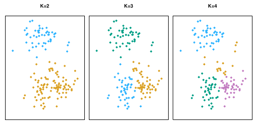
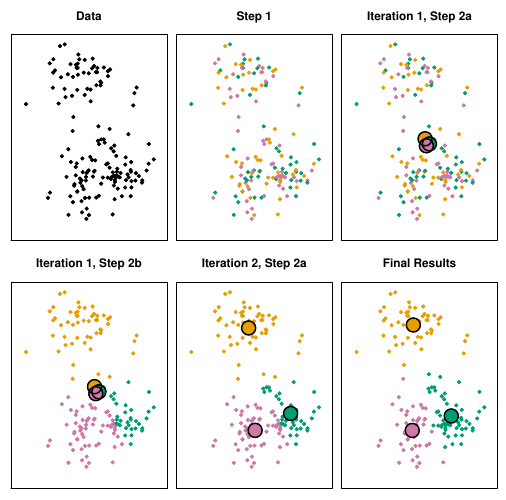
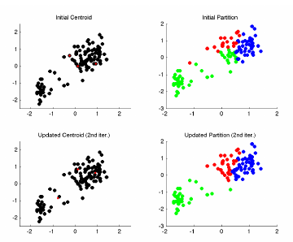
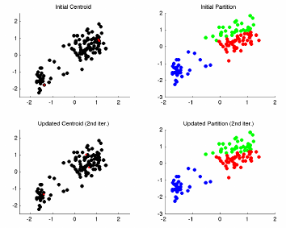
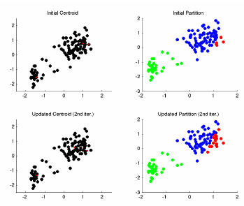
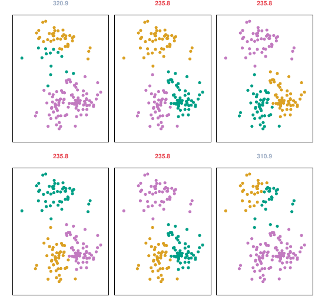

```{r setup, include=FALSE}
knitr::opts_chunk$set(warning = FALSE, message = FALSE, eval = TRUE, echo = TRUE, results = "hide", fig.show="hide")

library(tidyverse)
library(dlookr)
#setwd("/home/albarran/Dropbox/MAD/00.TEC")
library(rmarkdown)
#render("filename.Rmd")     
#browseURL("filename.html")
```

## Aprendizaje no supervisado 

* Objetivo: buscar patrones o relaciones en los datos sin una meta clara <!--(p.e. predecir y de X)-->

  - Ej.: compradores con historias de navegación y compra similares

* A menudo parte del análisis exploratorio de datos. 

* Resultados más subjetivos: sin objetivos claros y sin mecanismos para validar los resultados (no hay respuesta correcta para comparar las predicciones)

* Dos técnicas populares:

  - análisis de componentes principales (reducción de la dimensionalidad)
      
  - "clustering" (agrupación)

## *Clustering*  

<!-- (Agrupamiento/Particionamiento) -->

* Conjunto de técnicas para identificar subgrupos homogéneos de observaciones a partir de sus características observadas.

  - La estructura o patrón a descubrir no se conoce de antemano. 

  - Qué es similar o diferente depende del contexto
  

* Por ejemplo, la segmentación de mercado pretende identificar subgrupos más receptivos a cierta publicidad, o más propensos a comprar un producto
  
  - a partir de información de renta, edad, género, dónde viven, etc.

* Métodos de "clustering"

  1. Métodos de partición (K-means, K-medoids)

  2. Agrupación jerárquica 
  <!-- (*Hierarchical clustering*, que puede ser "agglomerative" o "divisive") -->

<!--
  3. Modelos de mixtura gausiana (basados en modelos)
-->

##  K-Means Clustering

<center>

</center>

* Para K dado, se divide el conjunto de datos en K grupos distintos $\small C_1,\dots,C_K$

  1. Cada observación pertenece a un grupo: $\small i\in C_k$ tal que $\small C_{1} \cup C_{2} \cup \dots \cup C_{K} = \{1,\dots,n\}$
  
  2. Los grupos no se solapan (una observación no pertenece a más de un grupo): $\small C_{k} \cap C_{k^{\prime}} = \emptyset \mathrm{\ for\ all\ k,}\ k \neq k^{\prime}$

##  K-Means Clustering (cont.)

* Buena partición = grupos diferentes entre ellos y homogéneos (observaciones similares) dentro del grupo 

<!--
* En una buena partición,
  + cada grupo es homogéneo (observaciones dentro tan similares entre sí como sea posible)
  + las observaciones  tan diferentes entre grupos como sea posible
-->

* La variación dentro (*within*) de un cluster es una medida de cuánto difieren las observaciones de un cluster entre sí

* Por ejemplo, usando la norma L2, definimos la suma cuadrática total dentro del grupo (*within-cluster sum of squares* o *wss*) <!--distancia euclediana-->

\[\small W(C_{k}) = \frac{1}{|C_{k}|}\sum_{i,i^{\prime} \in C_{k}} \sum_{j=1}^{p}(x_{ij} - x_{i^{\prime}j})^{2}
\]

* La partición óptima minimiza la siguiente función objetivo (suma total de la variación *within* o *total wss*): $\small \mathrm{min}_{C_{1},\ \dots,\ C_{K}} \bigg \{\sum_{k=1}^{K} W(C_{k}) \bigg \}$

<!--
\[
\small \mathrm{min}_{C_{1},\ \dots,\ C_{K}} \bigg \{\sum_{k=1}^{K}\frac{1}{|C_{k}|}\sum_{i,i^{\prime} \in C_{k}}
\sum_{j=1}^{p}(x_{ij} - x_{i^{\prime}j})^{2} \bigg \}
\]
-->

##  Algoritmo de K-Means

* La solución óptima es computacionalmente inviable: existen $\small K^n$ maneras de dividir n observaciones en K grupos

* PERO existe un algoritmo (sencillo) para encontrar un mínimo local

1. Conjetura inicial: asignar (aleatoriamente) cada observación a un grupo de 1 a K

2. Iterar hasta las asignaciones dejen de cambiar:

    a. Calcular el centroide $\small m_k$ de cada grupo, es decir, el vector de medias de las observaciones del grupo $\small k$

    b. Asignar cada observación al grupo cuyo centroide es el más cercano (distancia según la norma L2).

##  Algoritmo de K-Means (cont.)

* Este algoritmo garantiza que la función objetivo disminuye en cada paso

  - las observaciones se reubican basadas en la minimización de la suma total de desviaciones al cuadrado

* Cuando la asignación ya no cambia, se ha encontrado un óptimo local

* El resultado depende de la asignación aleatoria inicial

* Se DEBE ejecutar el algoritmo con varias asignaciones iniciales y seleccionar la solución con menor valor de la función objetivo

##  Algoritmo de K-Means: proceso

<center>

</center>

<!--
## K-means: diferentes asignaciones

<center>
:::: {style="display: flex;"}

::: {}




:::

::: {}



:::

::::


</center>
-->

##  Algoritmo de K-Means: diferentes mínimos

<center>

</center>


## Número óptimo de *clusters*

<!--
* ¿Cómo elegir el número correcto de *clusters*? Lamentablemente, no hay una respuesta definitiva a esta pregunta. 
-->

* La agrupación óptima es relativamente "subjetiva": depende de cómo se miden las similitudes, qué parámetros se utilizan para la partición, etc.

* Entre los muchos métodos existentes el "método del codo" (*elbow method*) es relativamente sencillo

<!-- el método de $K-means$ minimizando la variación total dentro del clúster. -->

1. Calcular el algoritmo de *clustering* para diferentes valores de $\small k$. 

2. Para cada $\small k$, obtener la suma cuadrática total dentro del grupo (*total wss*)

3. Dibujar un gráfico de la *total wss* en función de $\small k$ 
<!--(Este gráfico se denomina gráfico del acantilado o del despeñamiento,  *scree plot*.)
-->

4. Un cambio de curvatura se considera como un indicador de $\small k$ óptimo


## Ejemplo de *clustering*


```{r}
faithful.clustered <- 
  faithful %>% 
  mutate(cluster = 
           factor(kmeans(x = ., centers = 2)$cluster)
         )

faithful.clustered %>% 
  ggplot(aes(y = eruptions, x = waiting)) + 
  geom_point(aes(color = cluster))
```


## Ejemplo de *clustering* (cont.)

```{r}
iris.data <- iris[-5]
```


<!--
```{r}
set.seed(123)
k.max <- 15 
iris.data <- iris[-5]
```

```{r}
wss <- lapply(1:k.max, function(k){kmeans(iris.data, k)$tot.withinss}) %>% unlist()

plot.data <- tibble(k=1:k.max, wss)

ggplot(data=plot.data, aes(x=k, y=wss)) +
    geom_point() +
    geom_line() +
    xlab("Número de grupos, K") +
    ylab("Suma Cuadrática Total dentro del grupo") +
    geom_vline(aes(xintercept=3, color="red"))
```

En este caso, el método del codo sugiere tres grupos.
-->

* El método del codo se implementa con la función `fviz_nbclust()`:

```{r}
iris.data <- iris[-5]
#install.packages("factoextra")
library(factoextra)
fviz_nbclust(iris.data, kmeans, method = "wss") +
    geom_vline(xintercept = 3)
```
